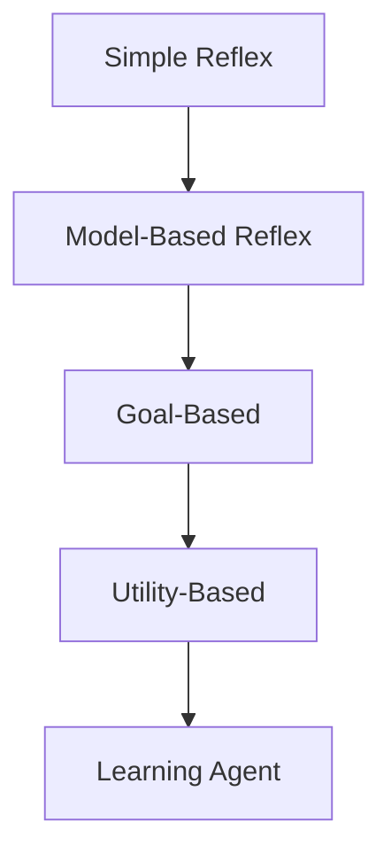

## What is Artificial Intelligence?

:::eli10

Imagine you want to build a robot that can do things on its own -- like play chess or drive a car. AI is the science of making computers smart enough to figure out the best thing to do, just like how you figure out the best move in a board game.

:::

:::eli15

Artificial Intelligence is the field of computer science focused on creating systems that can perceive their surroundings and make decisions to achieve goals. There are different approaches -- some try to mimic how humans think, while others focus on making optimal decisions mathematically. Modern AI focuses on "rational agents" that always try to take the best possible action given what they know.

:::

:::eli20

AI is the study of agents that perceive their environment and take actions to maximise their chances of achieving goals.

### Four Approaches to AI

| Approach | Human-centred | Ideal (Rational) |
|----------|--------------|-------------------|
| **Thinking** | Think like humans (cognitive modelling) | Think rationally (laws of thought) |
| **Acting** | Act like humans (Turing Test) | Act rationally (rational agents) |

Modern AI focuses on **rational agents** — systems that act to achieve the best expected outcome.

### The Turing Test

A machine passes if a human interrogator cannot distinguish it from a real human through text-based conversation. Requires:
- Natural language processing
- Knowledge representation
- Automated reasoning
- Machine learning

:::

---

## Intelligent Agents

:::eli10

An agent is like a little creature that can see things around it (using sensors, like eyes) and do things (using actuators, like hands). Think of a robot vacuum: it sees dirt with sensors and cleans with its motor. We describe agents by what they are trying to do, where they live, how they act, and how they sense.

:::

:::eli15

An agent is anything that takes in information from its environment (through sensors) and performs actions (through actuators). We formally describe agents using PEAS: Performance measure (how we judge success), Environment (the world it operates in), Actuators (how it acts), and Sensors (how it perceives). The agent function maps everything it has perceived so far to an action.

:::

:::eli20

An **agent** is anything that perceives its environment through **sensors** and acts upon it through **actuators**.

$$\text{Agent function: } f: \mathcal{P}^* \rightarrow \mathcal{A}$$

Maps percept sequences to actions.

### PEAS Description

Use PEAS to specify the task environment:

| Component | Meaning | Example (Self-driving car) |
|-----------|---------|---------------------------|
| **P**erformance | How success is measured | Safety, time, comfort, legality |
| **E**nvironment | The external world | Roads, traffic, pedestrians, weather |
| **A**ctuators | How the agent acts | Steering, brakes, accelerator, signals |
| **S**ensors | How the agent perceives | Cameras, LIDAR, GPS, speedometer |

Practice: Define PEAS for a chess-playing agent

| Component | Description |
|-----------|-------------|
| **Performance** | Win/loss/draw, style of play |
| **Environment** | Chess board, opponent, clock |
| **Actuators** | Move pieces (or display moves) |
| **Sensors** | Board state (camera or digital input) |

:::

---

## Environment Properties

:::eli10

Environments are like different types of game boards. Some let you see everything (like chess), others hide information (like card games). Some change while you are thinking, others wait for your turn. These differences tell us how hard the problem is for the agent.

:::

:::eli15

The environment an agent operates in has several key properties that determine how difficult it is to act in. Can the agent see everything (fully observable vs partially)? Is the outcome of an action certain (deterministic vs stochastic)? Does the world change while the agent thinks (static vs dynamic)? Are there a fixed number of possible states (discrete vs continuous)? Understanding these properties helps us choose the right approach.

:::

:::eli20

| Property | Description | Example |
|----------|-------------|---------|
| **Observable** | Fully vs Partially — can agent see entire state? | Chess (full) vs Poker (partial) |
| **Deterministic** | Is next state fully determined by current state + action? | Chess (yes) vs Backgammon (no — dice) |
| **Episodic** | Are decisions independent episodes? | Image classification (yes) vs Chess (no — sequential) |
| **Static** | Does environment change while agent deliberates? | Chess (semi-static) vs Driving (dynamic) |
| **Discrete** | Finite number of states/actions? | Chess (yes) vs Self-driving (continuous) |
| **Single-agent** | One agent or multiple? | Crossword (single) vs Chess (multi) |

:::

---

## Agent Types

:::eli10

There are different levels of "smart" agents, like levelling up in a video game. The simplest just follows rules ("if dirty, clean"). Smarter ones remember things, plan for the future, or even learn from their mistakes to get better over time.

:::

:::eli15

Agents range from simple to complex. A simple reflex agent just reacts to what it sees right now (like an automatic door). A model-based agent keeps track of things it cannot currently see. A goal-based agent plans ahead to reach a target. A utility-based agent picks the best action by scoring outcomes. A learning agent improves itself over time from experience. Each level adds capability but also complexity.

:::

:::eli20

Ordered by increasing capability:

| Agent Type | Mechanism | Limitation |
|------------|-----------|------------|
| **Simple reflex** | Condition-action rules on current percept | Cannot handle partial observability |
| **Model-based reflex** | Maintains internal state of unseen world | Needs accurate transition model |
| **Goal-based** | Considers future states to achieve goals | No preference between goals |
| **Utility-based** | Maximises a utility function | Computationally expensive |
| **Learning** | Improves performance over time | All above + learning element |

### Learning Agent Architecture

| Component | Role |
|-----------|------|
| **Learning element** | Makes improvements based on feedback |
| **Performance element** | Selects actions (the "agent" itself) |
| **Critic** | Provides feedback on how well agent is doing |
| **Problem generator** | Suggests exploratory actions |

:::

---

## Rationality

:::eli10

A rational agent is one that always tries to make the best choice it can, given what it knows. It is not about being perfect or knowing everything -- it is about making the smartest decision possible with the information you have, like choosing the best move you can see in a board game even if you cannot predict the future.

:::

:::eli15

Rationality means selecting the action that is expected to give the best result based on what you know. A rational agent does not need to be all-knowing (omniscient) or always achieve the perfect outcome. It just needs to make the best decision given its performance measure, knowledge of the environment, available actions, and everything it has perceived so far. Rationality is relative to these four factors.

:::

:::eli20

A **rational agent** selects the action that maximises its **expected performance**, given:
1. The performance measure
2. Prior knowledge of the environment
3. Actions available
4. The percept sequence to date

> Rationality $\neq$ omniscience (knowing everything) and $\neq$ perfection (best possible outcome always).

Practice: Is a vacuum cleaner that always moves right rational?

It depends on the environment:
- If the environment is a two-square room and dirt appears randomly, always moving right is NOT rational (it ignores the left square).
- A rational vacuum agent would check if the current square is dirty (clean it) and then move to the other square.
- Rationality depends on the **performance measure**, **environment**, and **percept sequence**.

:::
