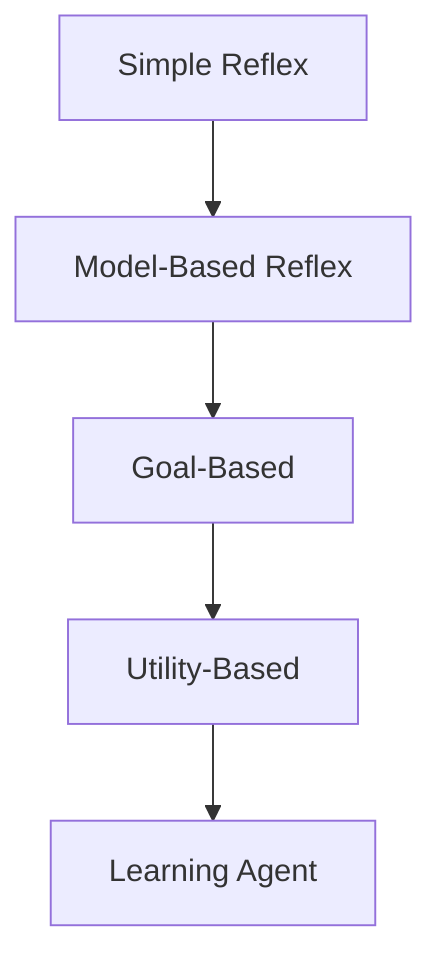

## What is Artificial Intelligence?

AI is the study of agents that perceive their environment and take actions to maximise their chances of achieving goals.

### Four Approaches to AI

| Approach | Human-centred | Ideal (Rational) |
|----------|--------------|-------------------|
| **Thinking** | Think like humans (cognitive modelling) | Think rationally (laws of thought) |
| **Acting** | Act like humans (Turing Test) | Act rationally (rational agents) |

Modern AI focuses on **rational agents** — systems that act to achieve the best expected outcome.

### The Turing Test

A machine passes if a human interrogator cannot distinguish it from a real human through text-based conversation. Requires:
- Natural language processing
- Knowledge representation
- Automated reasoning
- Machine learning

---

## Intelligent Agents

An **agent** is anything that perceives its environment through **sensors** and acts upon it through **actuators**.

$$\text{Agent function: } f: \mathcal{P}^* \rightarrow \mathcal{A}$$

Maps percept sequences to actions.

### PEAS Description

Use PEAS to specify the task environment:

| Component | Meaning | Example (Self-driving car) |
|-----------|---------|---------------------------|
| **P**erformance | How success is measured | Safety, time, comfort, legality |
| **E**nvironment | The external world | Roads, traffic, pedestrians, weather |
| **A**ctuators | How the agent acts | Steering, brakes, accelerator, signals |
| **S**ensors | How the agent perceives | Cameras, LIDAR, GPS, speedometer |

Practice: Define PEAS for a chess-playing agent

| Component | Description |
|-----------|-------------|
| **Performance** | Win/loss/draw, style of play |
| **Environment** | Chess board, opponent, clock |
| **Actuators** | Move pieces (or display moves) |
| **Sensors** | Board state (camera or digital input) |

---

## Environment Properties

| Property | Description | Example |
|----------|-------------|---------|
| **Observable** | Fully vs Partially — can agent see entire state? | Chess (full) vs Poker (partial) |
| **Deterministic** | Is next state fully determined by current state + action? | Chess (yes) vs Backgammon (no — dice) |
| **Episodic** | Are decisions independent episodes? | Image classification (yes) vs Chess (no — sequential) |
| **Static** | Does environment change while agent deliberates? | Chess (semi-static) vs Driving (dynamic) |
| **Discrete** | Finite number of states/actions? | Chess (yes) vs Self-driving (continuous) |
| **Single-agent** | One agent or multiple? | Crossword (single) vs Chess (multi) |

---

## Agent Types

Ordered by increasing capability:

| Agent Type | Mechanism | Limitation |
|------------|-----------|------------|
| **Simple reflex** | Condition-action rules on current percept | Cannot handle partial observability |
| **Model-based reflex** | Maintains internal state of unseen world | Needs accurate transition model |
| **Goal-based** | Considers future states to achieve goals | No preference between goals |
| **Utility-based** | Maximises a utility function | Computationally expensive |
| **Learning** | Improves performance over time | All above + learning element |

### Learning Agent Architecture

| Component | Role |
|-----------|------|
| **Learning element** | Makes improvements based on feedback |
| **Performance element** | Selects actions (the "agent" itself) |
| **Critic** | Provides feedback on how well agent is doing |
| **Problem generator** | Suggests exploratory actions |

---

## Rationality

A **rational agent** selects the action that maximises its **expected performance**, given:
1. The performance measure
2. Prior knowledge of the environment
3. Actions available
4. The percept sequence to date

> Rationality $\neq$ omniscience (knowing everything) and $\neq$ perfection (best possible outcome always).

Practice: Is a vacuum cleaner that always moves right rational?

It depends on the environment:
- If the environment is a two-square room and dirt appears randomly, always moving right is NOT rational (it ignores the left square).
- A rational vacuum agent would check if the current square is dirty (clean it) and then move to the other square.
- Rationality depends on the **performance measure**, **environment**, and **percept sequence**.

