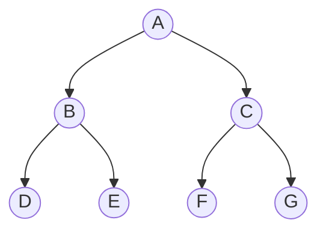

## Search Problem Formulation

A search problem is defined by:

| Component | Description | Example (Romania) |
|-----------|-------------|-------------------|
| **Initial state** | Starting configuration | In(Arad) |
| **Actions** | Available moves from a state | Go(Sibiu), Go(Timisoara), ... |
| **Transition model** | Result of an action | Result(In(Arad), Go(Sibiu)) = In(Sibiu) |
| **Goal test** | Is this a goal state? | In(Bucharest)? |
| **Path cost** | Cost of a sequence of actions | Sum of edge weights |

The **state space** is the set of all states reachable from the initial state.

### Search Tree vs Search Graph

| Search Tree | Search Graph |
|-------------|--------------|
| May revisit states (infinite loops possible) | Tracks visited states (no re-expansion) |
| Lower memory per node | Needs a `visited` set |
| Can be infinite even for finite state spaces | Always finite for finite state spaces |

---

## General Tree Search Algorithm

```
function TREE-SEARCH(problem, frontier):
    frontier ← {initial state}
    while frontier is not empty:
        node ← remove from frontier
        if goal-test(node): return solution
        expand node, add children to frontier
    return failure
```

The **frontier** (fringe) strategy determines the search algorithm.

---

## Breadth-First Search (BFS)

**Strategy**: Expand shallowest unexpanded node first (FIFO queue).



Expansion order: A, B, C, D, E, F, G

| Property | Value |
|----------|-------|
| **Complete?** | Yes (if branching factor $b$ is finite) |
| **Optimal?** | Yes, if all step costs are equal |
| **Time** | $O(b^d)$ |
| **Space** | $O(b^d)$ — stores entire frontier |

Where $b$ = branching factor, $d$ = depth of shallowest goal.

> BFS is **not optimal** for non-uniform costs. Use Uniform-Cost Search instead.

---

## Depth-First Search (DFS)

**Strategy**: Expand deepest unexpanded node first (LIFO stack / recursion).

| Property | Value |
|----------|-------|
| **Complete?** | No (can loop in infinite spaces); Yes with graph search on finite spaces |
| **Optimal?** | No |
| **Time** | $O(b^m)$ where $m$ = maximum depth |
| **Space** | $O(bm)$ — only stores current path + siblings |

**Advantage**: Very low memory usage — $O(bm)$ vs $O(b^d)$ for BFS.

---

## Depth-Limited Search

DFS with a depth limit $l$ — nodes at depth $l$ are treated as leaves (not expanded).

| Property | Value |
|----------|-------|
| **Complete?** | No (if $l < d$, goal unreachable) |
| **Optimal?** | No |
| **Time** | $O(b^l)$ |
| **Space** | $O(bl)$ |

---

## Iterative Deepening Depth-First Search (IDDFS)

Repeatedly runs depth-limited search with increasing limits: $l = 0, 1, 2, \ldots$

```
function IDDFS(problem):
    for depth = 0, 1, 2, ...:
        result ← DLS(problem, depth)
        if result ≠ cutoff: return result
```

| Property | Value |
|----------|-------|
| **Complete?** | Yes (like BFS) |
| **Optimal?** | Yes, if step costs are uniform |
| **Time** | $O(b^d)$ — same order as BFS |
| **Space** | $O(bd)$ — same as DFS! |

**Why the re-expansion overhead is acceptable:**

Total nodes expanded: $(d)b + (d-1)b^2 + \ldots + (1)b^d$

For $b = 10, d = 5$: IDDFS expands ~123,456 vs BFS's 111,111 — only 11% overhead.

> IDDFS combines the optimality/completeness of BFS with the space efficiency of DFS. It is the **preferred uninformed search** for large state spaces.

---

## Uniform-Cost Search (UCS)

**Strategy**: Expand the node with the lowest path cost $g(n)$ (priority queue).

| Property | Value |
|----------|-------|
| **Complete?** | Yes (if step cost $\geq \varepsilon > 0$) |
| **Optimal?** | Yes |
| **Time** | $O(b^{1+\lfloor C^*/\varepsilon \rfloor})$ |
| **Space** | $O(b^{1+\lfloor C^*/\varepsilon \rfloor})$ |

Where $C^*$ = cost of optimal solution, $\varepsilon$ = minimum step cost.

**Key difference from BFS**: UCS does NOT use depth; it uses cumulative path cost.

<details>
<summary>Practice: Trace UCS on this graph</summary>

```
A --1--> B --3--> D (goal)
A --4--> C --1--> D (goal)
```

| Step | Frontier (node: cost) | Expand |
|------|----------------------|--------|
| 0 | A:0 | A |
| 1 | B:1, C:4 | B |
| 2 | C:4, D:4 | C (or D — tie) |
| 3 | D:4, D:5 | D:4 |

Optimal path: A → B → D (cost 4) **or** A → C → D (cost 5)? 

Answer: A → B → D with cost 4.

Note: If we expand D:4 first (via B), that gives cost 4. The path A→C→D has cost 5. So UCS correctly finds the cheapest path.
</details>

---

## Bidirectional Search

Run two simultaneous searches:
- **Forward** from initial state
- **Backward** from goal state

Stop when the two frontiers meet.

| Property | Value |
|----------|-------|
| **Time** | $O(b^{d/2})$ — much better than $O(b^d)$ |
| **Space** | $O(b^{d/2})$ |
| **Requirement** | Must be able to enumerate predecessors |

---

## Summary Comparison

| Algorithm | Complete | Optimal | Time | Space |
|-----------|----------|---------|------|-------|
| BFS | Yes | Yes* | $O(b^d)$ | $O(b^d)$ |
| DFS | No | No | $O(b^m)$ | $O(bm)$ |
| Depth-Limited | No | No | $O(b^l)$ | $O(bl)$ |
| IDDFS | Yes | Yes* | $O(b^d)$ | $O(bd)$ |
| UCS | Yes | Yes | $O(b^{1+\lfloor C^*/\varepsilon \rfloor})$ | $O(b^{1+\lfloor C^*/\varepsilon \rfloor})$ |
| Bidirectional | Yes | Yes* | $O(b^{d/2})$ | $O(b^{d/2})$ |

*When all step costs are equal.

<details>
<summary>Practice: Which search algorithm should you use if memory is limited but you need optimality with uniform costs?</summary>

**Iterative Deepening DFS (IDDFS)** — it gives $O(bd)$ space (like DFS) but is complete and optimal (like BFS) when step costs are uniform.
</details>
