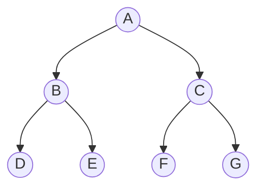

## Search Problem Formulation

:::eli10

Imagine you want to find the shortest route from your house to school. You know the starting point, the destination, and which roads connect which places. A search problem is exactly this: you define where you start, where you want to go, what moves are available, and how to measure the cost (like distance or time).

:::

:::eli15

A search problem is a formal way to describe "how do I get from A to B?" You specify an initial state, the actions you can take at each state, what each action leads to (transition model), a test to know when you have reached the goal, and a way to measure path cost. The state space is all possible configurations reachable from the start. The computer then systematically explores this space to find a solution.

:::

:::eli20

A search problem is defined by:

| Component | Description | Example (Romania) |
|-----------|-------------|-------------------|
| **Initial state** | Starting configuration | In(Arad) |
| **Actions** | Available moves from a state | Go(Sibiu), Go(Timisoara), ... |
| **Transition model** | Result of an action | Result(In(Arad), Go(Sibiu)) = In(Sibiu) |
| **Goal test** | Is this a goal state? | In(Bucharest)? |
| **Path cost** | Cost of a sequence of actions | Sum of edge weights |

The **state space** is the set of all states reachable from the initial state.

### Search Tree vs Search Graph

| Search Tree | Search Graph |
|-------------|--------------|
| May revisit states (infinite loops possible) | Tracks visited states (no re-expansion) |
| Lower memory per node | Needs a `visited` set |
| Can be infinite even for finite state spaces | Always finite for finite state spaces |

:::

---

## General Tree Search Algorithm

:::eli10

The computer keeps a list of places it could visit next (called the frontier). It picks one, checks if it is the goal, and if not, it looks at all the places it can reach from there and adds them to the list. It keeps doing this until it finds the goal or runs out of options.

:::

:::eli15

Tree search works by maintaining a "frontier" -- a collection of nodes waiting to be explored. The algorithm removes a node from the frontier, checks if it is the goal, and if not, expands it (generates its children) and adds them to the frontier. The key difference between search algorithms is how they decide which node to pick from the frontier next.

:::

:::eli20

```
function TREE-SEARCH(problem, frontier):
    frontier ← {initial state}
    while frontier is not empty:
        node ← remove from frontier
        if goal-test(node): return solution
        expand node, add children to frontier
    return failure
```

The **frontier** (fringe) strategy determines the search algorithm.

:::

---

## Breadth-First Search (BFS)

:::eli10

BFS is like exploring a maze level by level. First you check all rooms one step away, then all rooms two steps away, and so on. It always finds the shortest path (in terms of number of steps), but it needs to remember every room it has discovered.

:::

:::eli15

BFS explores nodes in order of their depth -- shallowest first. It uses a FIFO queue (first in, first out) as the frontier. This guarantees finding the shallowest goal (optimal if all steps cost the same). The downside is memory: BFS must store the entire frontier, which grows exponentially with depth. For branching factor b and depth d, both time and space are O(b^d).

:::

:::eli20

**Strategy**: Expand shallowest unexpanded node first (FIFO queue).



Expansion order: A, B, C, D, E, F, G

| Property | Value |
|----------|-------|
| **Complete?** | Yes (if branching factor $b$ is finite) |
| **Optimal?** | Yes, if all step costs are equal |
| **Time** | $O(b^d)$ |
| **Space** | $O(b^d)$ — stores entire frontier |

Where $b$ = branching factor, $d$ = depth of shallowest goal.

> BFS is **not optimal** for non-uniform costs. Use Uniform-Cost Search instead.

:::

---

## Depth-First Search (DFS)

:::eli10

DFS is like exploring a maze by always going as deep as possible down one path before coming back and trying another. It uses very little memory because it only remembers the current path, but it might go down a very long dead end and miss a shorter solution.

:::

:::eli15

DFS always expands the deepest node first, using a stack (last in, first out). It goes all the way down one branch before backtracking. The big advantage is memory -- it only needs to store the current path and unexplored siblings, giving O(bm) space. However, it is not complete (can loop forever) and not optimal (might find a deep solution before a shallow one).

:::

:::eli20

**Strategy**: Expand deepest unexpanded node first (LIFO stack / recursion).

| Property | Value |
|----------|-------|
| **Complete?** | No (can loop in infinite spaces); Yes with graph search on finite spaces |
| **Optimal?** | No |
| **Time** | $O(b^m)$ where $m$ = maximum depth |
| **Space** | $O(bm)$ — only stores current path + siblings |

**Advantage**: Very low memory usage — $O(bm)$ vs $O(b^d)$ for BFS.

:::

---

## Depth-Limited Search

:::eli10

This is DFS but with a rule: "never go deeper than a certain number of steps." It prevents getting lost down endless paths, but if the goal is deeper than your limit, you will never find it.

:::

:::eli15

Depth-limited search is DFS with a maximum depth cutoff. Nodes at the depth limit are treated as leaves and not expanded further. This prevents infinite loops but introduces a new problem: if the limit is set too low (below the goal depth), the algorithm will fail to find a solution. Choosing the right limit requires domain knowledge.

:::

:::eli20

DFS with a depth limit $l$ — nodes at depth $l$ are treated as leaves (not expanded).

| Property | Value |
|----------|-------|
| **Complete?** | No (if $l < d$, goal unreachable) |
| **Optimal?** | No |
| **Time** | $O(b^l)$ |
| **Space** | $O(bl)$ |

:::

---

## Iterative Deepening Depth-First Search (IDDFS)

:::eli10

Imagine doing DFS with a limit of 1, then 2, then 3, and so on, until you find the goal. It seems wasteful to redo earlier levels, but it actually combines the best of both worlds: the low memory of DFS and the guarantee of finding the shortest path like BFS.

:::

:::eli15

IDDFS repeatedly runs depth-limited search with increasing limits (0, 1, 2, ...). It may seem inefficient because it re-explores shallow nodes multiple times, but the overhead is minimal (around 11% for typical branching factors). It achieves the completeness and optimality of BFS with the O(bd) space efficiency of DFS. It is the preferred uninformed strategy when the search space is large and the solution depth is unknown.

:::

:::eli20

Repeatedly runs depth-limited search with increasing limits: $l = 0, 1, 2, \ldots$

```
function IDDFS(problem):
    for depth = 0, 1, 2, ...:
        result ← DLS(problem, depth)
        if result ≠ cutoff: return result
```

| Property | Value |
|----------|-------|
| **Complete?** | Yes (like BFS) |
| **Optimal?** | Yes, if step costs are uniform |
| **Time** | $O(b^d)$ — same order as BFS |
| **Space** | $O(bd)$ — same as DFS! |

**Why the re-expansion overhead is acceptable:**

Total nodes expanded: $(d)b + (d-1)b^2 + \ldots + (1)b^d$

For $b = 10, d = 5$: IDDFS expands ~123,456 vs BFS's 111,111 — only 11% overhead.

> IDDFS combines the optimality/completeness of BFS with the space efficiency of DFS. It is the **preferred uninformed search** for large state spaces.

:::

---

## Uniform-Cost Search (UCS)

:::eli10

UCS is like always choosing the cheapest option first. Imagine you are picking bus routes and each route has a different fare. UCS always expands the route with the lowest total fare so far, guaranteeing you find the cheapest overall journey.

:::

:::eli15

Uniform-Cost Search expands the node with the lowest cumulative path cost (using a priority queue). Unlike BFS which goes by depth, UCS considers actual costs. This makes it optimal for any non-negative step costs. It is essentially BFS generalized to handle varying costs. The trade-off is that it can explore many cheap nodes before reaching the goal if there are lots of low-cost dead ends.

:::

:::eli20

**Strategy**: Expand the node with the lowest path cost $g(n)$ (priority queue).

| Property | Value |
|----------|-------|
| **Complete?** | Yes (if step cost $\geq \varepsilon > 0$) |
| **Optimal?** | Yes |
| **Time** | $O(b^{1+\lfloor C^*/\varepsilon \rfloor})$ |
| **Space** | $O(b^{1+\lfloor C^*/\varepsilon \rfloor})$ |

Where $C^*$ = cost of optimal solution, $\varepsilon$ = minimum step cost.

**Key difference from BFS**: UCS does NOT use depth; it uses cumulative path cost.

<details>
<summary>Practice: Trace UCS on this graph</summary>

```
A --1--> B --3--> D (goal)
A --4--> C --1--> D (goal)
```

| Step | Frontier (node: cost) | Expand |
|------|----------------------|--------|
| 0 | A:0 | A |
| 1 | B:1, C:4 | B |
| 2 | C:4, D:4 | C (or D — tie) |
| 3 | D:4, D:5 | D:4 |

Optimal path: A → B → D (cost 4) **or** A → C → D (cost 5)? 

Answer: A → B → D with cost 4.

Note: If we expand D:4 first (via B), that gives cost 4. The path A→C→D has cost 5. So UCS correctly finds the cheapest path.
</details>

:::

---

## Bidirectional Search

:::eli10

Instead of searching only from the start, you also search backwards from the goal at the same time. When the two searches meet in the middle, you have found a path. This is much faster because searching halfway from both ends explores far fewer possibilities than searching the full distance from one end.

:::

:::eli15

Bidirectional search runs two simultaneous searches: one forward from the start and one backward from the goal. They stop when their frontiers overlap. This dramatically reduces the search space from O(b^d) to O(b^(d/2)) because each search only needs to go half the depth. The catch is that you need to be able to generate predecessor states (search backward), which is not always possible.

:::

:::eli20

Run two simultaneous searches:
- **Forward** from initial state
- **Backward** from goal state

Stop when the two frontiers meet.

| Property | Value |
|----------|-------|
| **Time** | $O(b^{d/2})$ — much better than $O(b^d)$ |
| **Space** | $O(b^{d/2})$ |
| **Requirement** | Must be able to enumerate predecessors |

:::

---

## Summary Comparison

:::eli10

Each search method has trade-offs -- some are good at finding the shortest path, some use less memory, and some are faster. IDDFS is often the best all-rounder for uninformed search because it finds the shortest path without using much memory.

:::

:::eli15

Here is a quick comparison of all uninformed search algorithms. BFS and IDDFS guarantee the shortest path with uniform costs. DFS is memory-efficient but may not find optimal solutions. UCS handles varying costs optimally. Bidirectional search offers dramatic speed improvements when applicable. Choose based on your constraints: limited memory favours IDDFS, non-uniform costs require UCS.

:::

:::eli20

| Algorithm | Complete | Optimal | Time | Space |
|-----------|----------|---------|------|-------|
| BFS | Yes | Yes* | $O(b^d)$ | $O(b^d)$ |
| DFS | No | No | $O(b^m)$ | $O(bm)$ |
| Depth-Limited | No | No | $O(b^l)$ | $O(bl)$ |
| IDDFS | Yes | Yes* | $O(b^d)$ | $O(bd)$ |
| UCS | Yes | Yes | $O(b^{1+\lfloor C^*/\varepsilon \rfloor})$ | $O(b^{1+\lfloor C^*/\varepsilon \rfloor})$ |
| Bidirectional | Yes | Yes* | $O(b^{d/2})$ | $O(b^{d/2})$ |

*When all step costs are equal.

<details>
<summary>Practice: Which search algorithm should you use if memory is limited but you need optimality with uniform costs?</summary>

**Iterative Deepening DFS (IDDFS)** — it gives $O(bd)$ space (like DFS) but is complete and optimal (like BFS) when step costs are uniform.
</details>

:::
