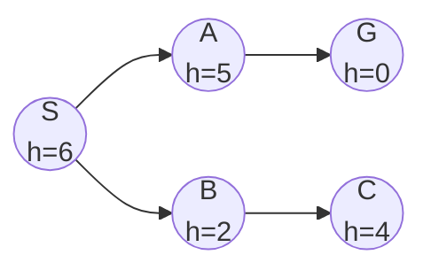
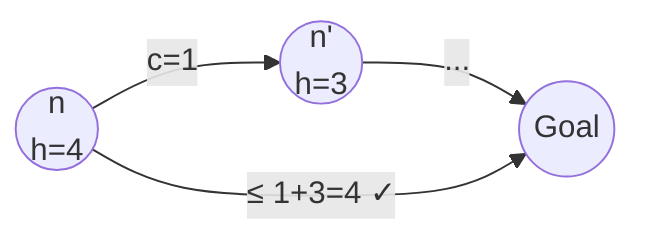

## Heuristic Functions

A **heuristic** $h(n)$ is an estimate of the cost from node $n$ to the nearest goal.

$$h(n) \geq 0 \quad \text{and} \quad h(\text{goal}) = 0$$

### Common Heuristics

| Problem | Heuristic | Name |
|---------|-----------|------|
| Route-finding | Straight-line distance | Euclidean distance |
| 8-puzzle | Number of misplaced tiles | Misplaced tiles |
| 8-puzzle | Sum of Manhattan distances | Manhattan distance |
| Grid navigation | $|x_1 - x_2| + |y_1 - y_2|$ | Manhattan distance |

---

## Greedy Best-First Search

**Strategy**: Expand the node that appears closest to goal — use $f(n) = h(n)$.

| Property | Value |
|----------|-------|
| **Complete?** | No (can loop in infinite spaces) |
| **Optimal?** | No |
| **Time** | $O(b^m)$ worst case |
| **Space** | $O(b^m)$ |

Greedy best-first heads directly toward the goal but can be misled by heuristics.



Greedy expands: S → B (h=2) → C (h=4) ... misses the shorter path S → A → G!

---

## A* Search

**Strategy**: Minimise total estimated cost $f(n) = g(n) + h(n)$.

| Component | Meaning |
|-----------|---------|
| $g(n)$ | Actual cost from start to $n$ |
| $h(n)$ | Estimated cost from $n$ to goal |
| $f(n)$ | Estimated total cost of path through $n$ |

| Property | Value |
|----------|-------|
| **Complete?** | Yes (if $b$ is finite and step costs $\geq \varepsilon > 0$) |
| **Optimal?** | Yes, if $h(n)$ is **admissible** (tree search) or **consistent** (graph search) |
| **Time** | $O(b^d)$ worst case (exponential) |
| **Space** | $O(b^d)$ — keeps all nodes in memory |

> A* is **optimally efficient** — no other optimal algorithm using the same heuristic is guaranteed to expand fewer nodes.

---

## Admissibility

A heuristic $h(n)$ is **admissible** if it **never overestimates** the true cost to the goal:

$$h(n) \leq h^*(n) \quad \forall n$$

where $h^*(n)$ is the true optimal cost from $n$ to the goal.

**Theorem**: A* with an admissible heuristic is optimal (for tree search).

### Examples

| Heuristic | Admissible? | Why |
|-----------|-------------|-----|
| $h(n) = 0$ | Yes | Never overestimates (trivially) |
| Straight-line distance | Yes | Shortest path $\geq$ straight line |
| Manhattan distance (grid) | Yes | Assumes no obstacles |
| Actual cost | Yes | Perfect estimate, never overestimates |
| $2 \times$ Manhattan | No | Can overestimate |

---

## Consistency (Monotonicity)

A heuristic is **consistent** if for every node $n$ and successor $n'$ generated by action $a$:

$$h(n) \leq c(n, a, n') + h(n')$$

This is the **triangle inequality** applied to heuristics.



**Key facts:**
- Consistency $\Rightarrow$ Admissibility (but not vice versa)
- With a consistent heuristic, A* on a **graph search** is optimal
- $f(n)$ values along any path are **non-decreasing** if $h$ is consistent

---

## A* Trace Example

<details>
<summary>Trace A* on this graph (Start: S, Goal: G)</summary>

```
S --1--> A (h=3)
S --4--> B (h=1)  
A --2--> B (h=1)
A --5--> G (h=0)
B --3--> G (h=0)
h(S) = 5
```

| Step | Expand | Frontier: node [g + h = f] |
|------|--------|---------------------------|
| 0 | — | S[0+5=5] |
| 1 | S | A[1+3=4], B[4+1=5] |
| 2 | A | B[3+1=4]*, B[4+1=5], G[6+0=6] |
| 3 | B(via A) | G[6+0=6], G[6+0=6] |
| 4 | G | **Goal found!** Cost = 6 |

*B via A has g=1+2=3, so f=3+1=4 < previous B with f=5.

Optimal path: S → A → B → G (cost = 1+2+3 = 6)

Check: S → A → G = 1+5 = 6 (also optimal, tie).
</details>

---

## Dominance

Heuristic $h_2$ **dominates** $h_1$ if:

$$h_2(n) \geq h_1(n) \quad \forall n$$

(both admissible)

A dominant heuristic is **always better or equal** — A* with $h_2$ expands fewer or equal nodes than with $h_1$.

### 8-Puzzle Example

| Heuristic | Average nodes expanded (d=12) |
|-----------|-------------------------------|
| $h_1$ = misplaced tiles | ~227 |
| $h_2$ = Manhattan distance | ~73 |

$h_2$ dominates $h_1$ because every tile's Manhattan distance $\geq$ 1 if misplaced, and often more.

---

## Relaxed Problems

A heuristic can be derived from a **relaxed problem** (fewer constraints):

| Original constraint | Relaxation | Resulting heuristic |
|-------------------|------------|---------------------|
| Tiles can only slide to adjacent empty space | Tile can move anywhere | Misplaced tiles |
| Tiles can only slide to adjacent empty space | Tile can move to any adjacent space | Manhattan distance |
| Roads have specific connections | Can fly directly | Straight-line distance |

---

## Memory-Bounded Search

| Algorithm | Description | Trade-off |
|-----------|-------------|-----------|
| IDA* | Iterative deepening with $f$-cost cutoff | $O(bd)$ space, may re-expand |
| RBFS | Recursive best-first search | $O(bd)$ space, backs up $f$ values |
| SMA* | Simplified memory-bounded A* | Uses all available memory |

### IDA* (Iterative Deepening A*)

Like IDDFS but uses $f$-cost limit instead of depth limit:
1. Set limit = $f(\text{start}) = h(\text{start})$
2. DFS, pruning nodes where $f(n) >$ limit
3. New limit = minimum $f$-value that exceeded previous limit
4. Repeat

<details>
<summary>Practice: Is h(n) = 2 * straight-line distance admissible?</summary>

**No.** If the actual optimal cost equals the straight-line distance (e.g., a direct road exists), then $h(n) = 2 \times \text{SLD} > h^*(n)$, violating admissibility. An inadmissible heuristic means A* may return a suboptimal path.
</details>

<details>
<summary>Practice: Can A* with a consistent heuristic re-expand a node in graph search?</summary>

**No.** With a consistent heuristic, the first time A* reaches a node via graph search, it has found the optimal path to that node. This is because $f$-values are non-decreasing along any path, so the first expansion is guaranteed to be via the cheapest route.
</details>
