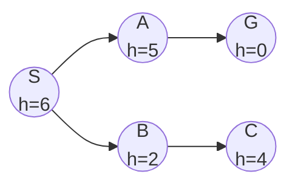
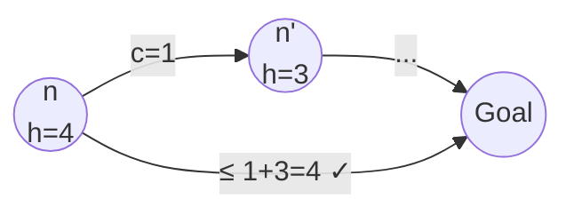

## Heuristic Functions

:::eli10

A heuristic is like an educated guess about how far you are from your goal. If you are navigating to a city, the straight-line distance to it is a heuristic -- it will not be perfectly accurate (roads curve), but it gives you a useful hint about which direction to go.

:::

:::eli15

A heuristic function h(n) estimates the cost from a given node n to the goal. It helps the search algorithm prioritize which paths to explore first, so it does not have to try everything blindly. Good heuristics make search much faster by guiding it toward the goal. The key requirement is that the heuristic should never overestimate the true cost (this is called admissibility).

:::

:::eli20

A **heuristic** $h(n)$ is an estimate of the cost from node $n$ to the nearest goal.

$$h(n) \geq 0 \quad \text{and} \quad h(\text{goal}) = 0$$

### Common Heuristics

| Problem | Heuristic | Name |
|---------|-----------|------|
| Route-finding | Straight-line distance | Euclidean distance |
| 8-puzzle | Number of misplaced tiles | Misplaced tiles |
| 8-puzzle | Sum of Manhattan distances | Manhattan distance |
| Grid navigation | $|x_1 - x_2| + |y_1 - y_2|$ | Manhattan distance |

:::

---

## Greedy Best-First Search

:::eli10

Greedy best-first search is like always walking toward the direction that looks closest to your destination. It is fast but can be tricked -- imagine a wall blocking the direct path. You would walk right up to the wall and then have to backtrack, missing a shorter route around.

:::

:::eli15

Greedy best-first search always expands the node that appears closest to the goal according to the heuristic (it uses f(n) = h(n) only). It is fast when the heuristic is accurate but can be led astray because it ignores how far it has already travelled. It is neither complete (can loop) nor optimal (may miss shorter paths that initially head away from the goal).

:::

:::eli20

**Strategy**: Expand the node that appears closest to goal — use $f(n) = h(n)$.

| Property | Value |
|----------|-------|
| **Complete?** | No (can loop in infinite spaces) |
| **Optimal?** | No |
| **Time** | $O(b^m)$ worst case |
| **Space** | $O(b^m)$ |

Greedy best-first heads directly toward the goal but can be misled by heuristics.



Greedy expands: S → B (h=2) → C (h=4) ... misses the shorter path S → A → G!

:::

---

## A* Search

:::eli10

A* is the gold standard of search. It combines two pieces of information: how much it cost to get where you are now, and how far you estimate you still have to go. By adding these together, it always picks the path that seems cheapest overall. If your estimate never over-guesses, A* will always find the cheapest path.

:::

:::eli15

A* search uses f(n) = g(n) + h(n), where g(n) is the actual cost from the start to n, and h(n) is the estimated cost from n to the goal. This combines the accuracy of UCS (which uses only g) with the speed of greedy search (which uses only h). A* is guaranteed optimal when the heuristic is admissible (never overestimates). It is also optimally efficient -- no other algorithm with the same heuristic can guarantee expanding fewer nodes.

:::

:::eli20

**Strategy**: Minimise total estimated cost $f(n) = g(n) + h(n)$.

| Component | Meaning |
|-----------|---------|
| $g(n)$ | Actual cost from start to $n$ |
| $h(n)$ | Estimated cost from $n$ to goal |
| $f(n)$ | Estimated total cost of path through $n$ |

| Property | Value |
|----------|-------|
| **Complete?** | Yes (if $b$ is finite and step costs $\geq \varepsilon > 0$) |
| **Optimal?** | Yes, if $h(n)$ is **admissible** (tree search) or **consistent** (graph search) |
| **Time** | $O(b^d)$ worst case (exponential) |
| **Space** | $O(b^d)$ — keeps all nodes in memory |

> A* is **optimally efficient** — no other optimal algorithm using the same heuristic is guaranteed to expand fewer nodes.

:::

---

## Admissibility

:::eli10

An admissible heuristic is one that never says "it is farther than it really is." It is always optimistic. Think of straight-line distance: the real driving distance is always longer than flying in a straight line, so straight-line distance is an admissible heuristic.

:::

:::eli15

A heuristic is admissible if it never overestimates the true cost to reach the goal. Formally, h(n) must always be less than or equal to the actual optimal cost h*(n). This property guarantees that A* will find the optimal path. Examples include straight-line distance (always shorter than any road) and Manhattan distance for grid puzzles (assumes no obstacles).

:::

:::eli20

A heuristic $h(n)$ is **admissible** if it **never overestimates** the true cost to the goal:

$$h(n) \leq h^*(n) \quad \forall n$$

where $h^*(n)$ is the true optimal cost from $n$ to the goal.

**Theorem**: A* with an admissible heuristic is optimal (for tree search).

### Examples

| Heuristic | Admissible? | Why |
|-----------|-------------|-----|
| $h(n) = 0$ | Yes | Never overestimates (trivially) |
| Straight-line distance | Yes | Shortest path $\geq$ straight line |
| Manhattan distance (grid) | Yes | Assumes no obstacles |
| Actual cost | Yes | Perfect estimate, never overestimates |
| $2 \times$ Manhattan | No | Can overestimate |

:::

---

## Consistency (Monotonicity)

:::eli10

Consistency is a stronger rule than admissibility. It means your guess about the remaining distance always makes sense step-by-step: the decrease in your estimate between two neighbouring nodes should never be bigger than the actual cost of that step. It is like a triangle rule -- no shortcuts in your estimates.

:::

:::eli15

A heuristic is consistent (or monotone) if for every node n and its successor n' via action a, the estimated cost at n is at most the step cost plus the estimate at n'. This is the triangle inequality applied to heuristics. Consistency implies admissibility (but not vice versa) and ensures that A* on graph search (with a visited set) is optimal. It also guarantees that f-values are non-decreasing along any path.

:::

:::eli20

A heuristic is **consistent** if for every node $n$ and successor $n'$ generated by action $a$:

$$h(n) \leq c(n, a, n') + h(n')$$

This is the **triangle inequality** applied to heuristics.



**Key facts:**
- Consistency $\Rightarrow$ Admissibility (but not vice versa)
- With a consistent heuristic, A* on a **graph search** is optimal
- $f(n)$ values along any path are **non-decreasing** if $h$ is consistent

:::

---

## A* Trace Example

:::eli10

To see how A* works, you can trace through a small example: at each step, the algorithm picks the node with the lowest f = g + h value from the frontier, expands it, and updates the frontier until the goal is reached.

:::

:::eli15

An A* trace shows the step-by-step process: start with the initial node in the frontier, then repeatedly pick the node with the lowest f(n) = g(n) + h(n), expand it, add its children to the frontier with updated g-values, and continue until the goal is popped from the frontier. Tracing helps you verify that A* correctly finds the optimal path.

:::

:::eli20

<details>
<summary>Trace A* on this graph (Start: S, Goal: G)</summary>

```
S --1--> A (h=3)
S --4--> B (h=1)  
A --2--> B (h=1)
A --5--> G (h=0)
B --3--> G (h=0)
h(S) = 5
```

| Step | Expand | Frontier: node [g + h = f] |
|------|--------|---------------------------|
| 0 | — | S[0+5=5] |
| 1 | S | A[1+3=4], B[4+1=5] |
| 2 | A | B[3+1=4]*, B[4+1=5], G[6+0=6] |
| 3 | B(via A) | G[6+0=6], G[6+0=6] |
| 4 | G | **Goal found!** Cost = 6 |

*B via A has g=1+2=3, so f=3+1=4 < previous B with f=5.

Optimal path: S → A → B → G (cost = 1+2+3 = 6)

Check: S → A → G = 1+5 = 6 (also optimal, tie).
</details>

:::

---

## Dominance

:::eli10

If you have two heuristics and one always gives a higher (but still safe) estimate than the other, the higher one is "better" because it gives A* more useful information, so it explores fewer wrong paths.

:::

:::eli15

Heuristic h2 dominates h1 if h2(n) >= h1(n) for all nodes, with both being admissible. A dominant heuristic is always at least as good for A* -- it provides more information so fewer nodes need to be expanded. For the 8-puzzle, Manhattan distance dominates misplaced tiles and leads to much faster searches.

:::

:::eli20

Heuristic $h_2$ **dominates** $h_1$ if:

$$h_2(n) \geq h_1(n) \quad \forall n$$

(both admissible)

A dominant heuristic is **always better or equal** — A* with $h_2$ expands fewer or equal nodes than with $h_1$.

### 8-Puzzle Example

| Heuristic | Average nodes expanded (d=12) |
|-----------|-------------------------------|
| $h_1$ = misplaced tiles | ~227 |
| $h_2$ = Manhattan distance | ~73 |

$h_2$ dominates $h_1$ because every tile's Manhattan distance $\geq$ 1 if misplaced, and often more.

:::

---

## Relaxed Problems

:::eli10

A relaxed problem is like making a puzzle easier by removing some rules. If you figure out the cost of solving the easier version, that gives you a good (and safe) estimate for the harder original puzzle. For example, if puzzle tiles could teleport to any adjacent spot (instead of only sliding into the empty space), the Manhattan distance tells you the minimum moves needed.

:::

:::eli15

You can derive admissible heuristics by solving a "relaxed" version of the problem where some constraints are removed. The optimal cost of the relaxed problem is always a lower bound on the real cost (since the original is harder), making it a valid admissible heuristic. This is a systematic way to invent good heuristics for any problem.

:::

:::eli20

A heuristic can be derived from a **relaxed problem** (fewer constraints):

| Original constraint | Relaxation | Resulting heuristic |
|-------------------|------------|---------------------|
| Tiles can only slide to adjacent empty space | Tile can move anywhere | Misplaced tiles |
| Tiles can only slide to adjacent empty space | Tile can move to any adjacent space | Manhattan distance |
| Roads have specific connections | Can fly directly | Straight-line distance |

:::

---

## Memory-Bounded Search

:::eli10

A* can run out of memory because it remembers everything. Memory-bounded versions work within a memory limit by cleverly forgetting and re-exploring paths, trading a bit of speed for the ability to solve bigger problems.

:::

:::eli15

Standard A* keeps all nodes in memory, which can be too expensive for large problems. Memory-bounded variants like IDA* (iterative deepening A*), RBFS, and SMA* use limited memory by re-exploring parts of the search space. IDA* uses an f-cost cutoff that increases each iteration (like IDDFS but with f-costs instead of depth). These algorithms trade time for space while maintaining optimality.

:::

:::eli20

| Algorithm | Description | Trade-off |
|-----------|-------------|-----------|
| IDA* | Iterative deepening with $f$-cost cutoff | $O(bd)$ space, may re-expand |
| RBFS | Recursive best-first search | $O(bd)$ space, backs up $f$ values |
| SMA* | Simplified memory-bounded A* | Uses all available memory |

### IDA* (Iterative Deepening A*)

Like IDDFS but uses $f$-cost limit instead of depth limit:
1. Set limit = $f(\text{start}) = h(\text{start})$
2. DFS, pruning nodes where $f(n) >$ limit
3. New limit = minimum $f$-value that exceeded previous limit
4. Repeat

<details>
<summary>Practice: Is h(n) = 2 * straight-line distance admissible?</summary>

**No.** If the actual optimal cost equals the straight-line distance (e.g., a direct road exists), then $h(n) = 2 \times \text{SLD} > h^*(n)$, violating admissibility. An inadmissible heuristic means A* may return a suboptimal path.
</details>

<details>
<summary>Practice: Can A* with a consistent heuristic re-expand a node in graph search?</summary>

**No.** With a consistent heuristic, the first time A* reaches a node via graph search, it has found the optimal path to that node. This is because $f$-values are non-decreasing along any path, so the first expansion is guaranteed to be via the cheapest route.
</details>

:::
