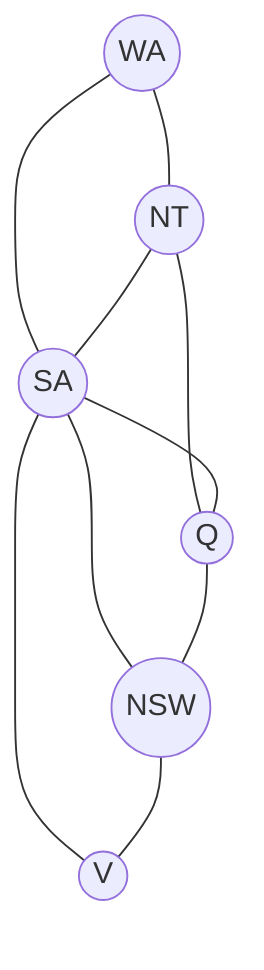

## CSP Formulation

:::eli10

Imagine colouring a map so that no two neighbouring countries have the same colour. You have variables (the countries), possible colours for each, and rules (neighbours must differ). A CSP is any puzzle where you assign values to things while following rules like this.

:::

:::eli15

A Constraint Satisfaction Problem has three parts: variables (things to assign values to), domains (the possible values for each variable), and constraints (rules about which combinations are allowed). Unlike regular search where states are "black boxes," CSPs have structured states that allow clever techniques to detect dead ends early and prune the search space dramatically.

:::

:::eli20

A **Constraint Satisfaction Problem** is defined by:

| Component | Description | Example (Map Colouring) |
|-----------|-------------|------------------------|
| **Variables** $X$ | Set $\{X_1, X_2, \ldots, X_n\}$ | Regions: WA, NT, Q, NSW, V, SA, T |
| **Domains** $D$ | Possible values for each $X_i$ | $D_i = \{\text{red, green, blue}\}$ |
| **Constraints** $C$ | Restrictions on variable assignments | Adjacent regions must differ |

A **solution** is an assignment of values to all variables that satisfies every constraint.

### Types of Constraints

| Type | Scope | Example |
|------|-------|---------|
| **Unary** | 1 variable | SA $\neq$ green |
| **Binary** | 2 variables | SA $\neq$ WA |
| **Higher-order** | 3+ variables | All-different(X, Y, Z) |
| **Global** | All/many variables | All-diff constraint |

### Constraint Graph

Nodes = variables, edges = constraints between pairs.



:::

---

## Why CSP? (vs Standard Search)

:::eli10

CSPs are special because the computer can look at the rules and figure out early when something will not work, instead of blindly trying everything. It is like realising you cannot finish a jigsaw puzzle piece's area before placing every single piece.

:::

:::eli15

Compared to standard search where states are opaque, CSPs expose structure that enables powerful general-purpose strategies. The system can detect constraint violations early (fail fast), use the constraint structure to guide variable and value selection, and propagate constraints to eliminate impossible values before trying them. This often makes CSPs dramatically more efficient than brute-force search.

:::

:::eli20

| Standard Search | CSP |
|----------------|-----|
| States are "black boxes" | States have structure (variable assignments) |
| Domain-specific heuristics | General-purpose heuristics (from structure) |
| Goal test is opaque | Can detect failure **early** (constraint violation) |

:::

---

## Backtracking Search

:::eli10

Backtracking is like filling in a crossword puzzle: you write in a letter, and if it leads to a contradiction later, you erase it and try another letter. You assign one variable at a time and undo choices that break the rules.

:::

:::eli15

Backtracking is the basic algorithm for solving CSPs. It assigns values to one variable at a time, checking constraints at each step. When it finds that the current partial assignment violates a constraint, it immediately backtracks (undoes the last assignment and tries the next value). Several heuristics improve its efficiency: choosing the most constrained variable first (MRV), choosing the least constraining value first (LCV), and looking ahead to detect failures early (forward checking, arc consistency).

:::

:::eli20

Standard DFS for CSPs — assigns one variable at a time and backtracks when a constraint is violated.

```
function BACKTRACK(assignment, csp):
    if assignment is complete: return assignment
    var ← SELECT-UNASSIGNED-VARIABLE(csp)
    for value in ORDER-DOMAIN-VALUES(var, assignment, csp):
        if value is consistent with assignment:
            add {var = value} to assignment
            result ← BACKTRACK(assignment, csp)
            if result ≠ failure: return result
            remove {var = value} from assignment
    return failure
```

### Improving Backtracking

| Strategy | Type | Description |
|----------|------|-------------|
| MRV | Variable ordering | Choose variable with **fewest legal values** |
| Degree heuristic | Variable ordering | Choose variable involved in most constraints |
| LCV | Value ordering | Choose value that rules out fewest choices for neighbours |
| Forward checking | Inference | Remove inconsistent values from neighbours |
| Arc consistency | Inference | Enforce consistency on all arcs |

:::

---

## Variable Ordering: MRV

:::eli10

MRV means "pick the hardest variable first." If a country on your map only has one colour left that works, colour it now! If it has zero options, you know immediately that this path fails, saving time.

:::

:::eli15

The Minimum Remaining Values heuristic selects the variable with the fewest legal values left in its domain. This is a "fail-first" strategy: by tackling the most constrained variable first, you either solve it quickly or detect failure early without wasting time on easier variables. If any variable has zero remaining values, you backtrack immediately.

:::

:::eli20

**Minimum Remaining Values** (most constrained variable / fail-first):

> Choose the variable with the fewest legal values remaining in its domain.

**Why it works**: If a variable has only 1 value left, we must assign it now. If it has 0, we fail immediately (pruning early).

<details>
<summary>Practice: Given domains WA={R,G,B}, NT={R,G}, SA={R}, which to assign next?</summary>

**SA** — it has only 1 remaining value (MRV = 1). If it leads to conflict, we detect failure immediately without wasting time on WA or NT.
</details>

:::

---

## Value Ordering: LCV

:::eli10

When choosing a colour for a country, pick the one that leaves the most options open for its neighbours. That way, you are less likely to paint yourself into a corner.

:::

:::eli15

The Least Constraining Value heuristic picks the value that eliminates the fewest choices from neighbouring variables' domains. The idea is to maximize flexibility for future assignments -- try the value that is least likely to cause problems down the road. While MRV helps you fail fast, LCV helps you succeed fast.

:::

:::eli20

**Least Constraining Value**: Choose the value that eliminates the fewest values from neighbouring variables' domains.

> Maximises future flexibility — try the value that leaves the most options open.

:::

---

## Forward Checking

:::eli10

After you colour one country, forward checking immediately looks at its neighbours and crosses out that colour from their lists. If any neighbour has no colours left, you know right away that you need to backtrack.

:::

:::eli15

Forward checking is a form of look-ahead. After assigning a value to a variable, it immediately removes inconsistent values from all neighbouring unassigned variables. If any domain becomes empty, the algorithm backtracks immediately without going deeper. This catches failures one step ahead rather than waiting until the empty-domain variable is selected.

:::

:::eli20

After assigning $X_i = v$:
- For every unassigned neighbour $X_j$ of $X_i$:
  - Remove values from $D_j$ that are inconsistent with $X_i = v$

If any domain becomes **empty**, backtrack immediately.

### Example: Map Colouring

| Step | Assignment | WA | NT | Q | NSW | V | SA |
|------|-----------|----|----|---|-----|---|----|
| Initial | — | RGB | RGB | RGB | RGB | RGB | RGB |
| WA=R | WA=R | R | GB | RGB | RGB | RGB | GB |
| Q=G | WA=R, Q=G | R | B | G | RB | RGB | B |
| V=B | WA=R, Q=G, V=B | R | B | G | R | B | ∅ |

SA's domain is empty → **backtrack!**

:::

---

## Arc Consistency (AC-3)

:::eli10

Arc consistency goes further than forward checking. It checks every pair of connected variables and removes any value that has no compatible partner on the other side. It keeps doing this until no more values can be removed. Think of it as a chain reaction of elimination.

:::

:::eli15

An arc (Xi, Xj) is arc-consistent if for every value in Xi's domain, there exists at least one compatible value in Xj's domain. AC-3 enforces this for all arcs: when it removes a value from a domain, it re-checks all arcs pointing to that variable (since their consistency might be affected). This provides stronger pruning than forward checking but takes more time per step.

:::

:::eli20

An arc $(X_i, X_j)$ is **arc-consistent** if for every value $x \in D_i$, there exists some value $y \in D_j$ that satisfies the constraint between $X_i$ and $X_j$.

### AC-3 Algorithm

```
function AC-3(csp):
    queue ← all arcs in csp
    while queue is not empty:
        (Xi, Xj) ← REMOVE-FIRST(queue)
        if REVISE(csp, Xi, Xj):
            if Di is empty: return false
            for each Xk in NEIGHBOURS(Xi) - {Xj}:
                add (Xk, Xi) to queue
    return true

function REVISE(csp, Xi, Xj):
    revised ← false
    for each x in Di:
        if no y in Dj satisfies constraint(Xi, Xj):
            remove x from Di
            revised ← true
    return revised
```

**Time complexity**: $O(ed^3)$ where $e$ = number of arcs, $d$ = maximum domain size.

<details>
<summary>Practice: Apply AC-3 to X ≠ Y with D(X)={1,2,3}, D(Y)={1,2,3}</summary>

Arc (X, Y): For each value in D(X), is there a value in D(Y) satisfying X ≠ Y?
- X=1: Y can be 2 or 3. OK.
- X=2: Y can be 1 or 3. OK.
- X=3: Y can be 1 or 2. OK.

No values removed. Similarly for arc (Y, X). The CSP is already arc-consistent.

Now if D(Y) = {1}: 
- Arc (X, Y): X=1 requires Y ≠ 1, but D(Y)={1}. Remove X=1.
- D(X) = {2, 3}. Changed, so add neighbours of X back to queue.
</details>

:::

---

## Backtracking + Inference

:::eli10

Combining backtracking with forward checking or arc consistency is like having a partner who helps you spot dead ends ahead of time. The more your partner checks, the fewer wrong paths you go down.

:::

:::eli15

You can combine backtracking with different levels of inference. Plain backtracking is naive and hits many dead ends. Adding forward checking detects failures one step ahead. Adding full arc consistency (called MAC -- Maintaining Arc Consistency) provides the strongest pruning, catching problems that ripple through the constraint network. MAC is more expensive per step but typically reduces the total search dramatically.

:::

:::eli20

| Combination | Effect |
|-------------|--------|
| Backtracking alone | Naive, lots of dead ends |
| BT + Forward Checking | Detects failure one step ahead |
| BT + AC-3 (MAC) | Maintaining Arc Consistency — strongest pruning |

**MAC** (Maintaining Arc Consistency): After each assignment, run AC-3 on affected arcs. More expensive per step but prunes far more.

:::

---

## Local Search for CSPs

:::eli10

Instead of building up a solution from scratch, local search starts with a complete (possibly wrong) guess and keeps fixing the worst problems. It is like fixing a jigsaw puzzle by swapping pieces that do not fit rather than starting over. Amazingly, this works very well for huge puzzles.

:::

:::eli15

The Min-Conflicts heuristic takes a different approach: start with a complete assignment (possibly violating some constraints), then iteratively fix violations by changing the value of a conflicted variable to the one that minimizes total conflicts. This works remarkably well for many CSPs -- for example, it can solve the million-queens problem in about 50 steps, whereas backtracking would be completely infeasible.

:::

:::eli20

**Min-Conflicts** heuristic:
1. Start with a complete (possibly inconsistent) assignment
2. Randomly select a conflicted variable
3. Assign it the value that minimises constraint violations
4. Repeat until solution or max iterations

Works surprisingly well for many CSPs (e.g., $n$-queens for large $n$).

| $n$-Queens | Backtracking | Min-Conflicts |
|-----------|-------------|---------------|
| $n = 8$ | Feasible | Instant |
| $n = 1{,}000{,}000$ | Infeasible | ~50 steps! |

<details>
<summary>Practice: Formulate 4-Queens as a CSP</summary>

- **Variables**: $Q_1, Q_2, Q_3, Q_4$ (one per column)
- **Domains**: $D_i = \{1, 2, 3, 4\}$ (row positions)
- **Constraints**: For all $i \neq j$:
  - $Q_i \neq Q_j$ (not same row)
  - $|Q_i - Q_j| \neq |i - j|$ (not same diagonal)

Solution: $Q_1=2, Q_2=4, Q_3=1, Q_4=3$ (one of two solutions).
</details>

:::
