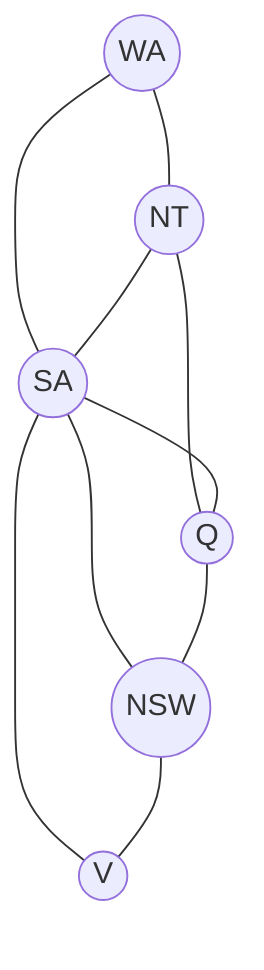

## CSP Formulation

A **Constraint Satisfaction Problem** is defined by:

| Component | Description | Example (Map Colouring) |
|-----------|-------------|------------------------|
| **Variables** $X$ | Set $\{X_1, X_2, \ldots, X_n\}$ | Regions: WA, NT, Q, NSW, V, SA, T |
| **Domains** $D$ | Possible values for each $X_i$ | $D_i = \{\text{red, green, blue}\}$ |
| **Constraints** $C$ | Restrictions on variable assignments | Adjacent regions must differ |

A **solution** is an assignment of values to all variables that satisfies every constraint.

### Types of Constraints

| Type | Scope | Example |
|------|-------|---------|
| **Unary** | 1 variable | SA $\neq$ green |
| **Binary** | 2 variables | SA $\neq$ WA |
| **Higher-order** | 3+ variables | All-different(X, Y, Z) |
| **Global** | All/many variables | All-diff constraint |

### Constraint Graph

Nodes = variables, edges = constraints between pairs.



---

## Why CSP? (vs Standard Search)

| Standard Search | CSP |
|----------------|-----|
| States are "black boxes" | States have structure (variable assignments) |
| Domain-specific heuristics | General-purpose heuristics (from structure) |
| Goal test is opaque | Can detect failure **early** (constraint violation) |

---

## Backtracking Search

Standard DFS for CSPs — assigns one variable at a time and backtracks when a constraint is violated.

```
function BACKTRACK(assignment, csp):
    if assignment is complete: return assignment
    var ← SELECT-UNASSIGNED-VARIABLE(csp)
    for value in ORDER-DOMAIN-VALUES(var, assignment, csp):
        if value is consistent with assignment:
            add {var = value} to assignment
            result ← BACKTRACK(assignment, csp)
            if result ≠ failure: return result
            remove {var = value} from assignment
    return failure
```

### Improving Backtracking

| Strategy | Type | Description |
|----------|------|-------------|
| MRV | Variable ordering | Choose variable with **fewest legal values** |
| Degree heuristic | Variable ordering | Choose variable involved in most constraints |
| LCV | Value ordering | Choose value that rules out fewest choices for neighbours |
| Forward checking | Inference | Remove inconsistent values from neighbours |
| Arc consistency | Inference | Enforce consistency on all arcs |

---

## Variable Ordering: MRV

**Minimum Remaining Values** (most constrained variable / fail-first):

> Choose the variable with the fewest legal values remaining in its domain.

**Why it works**: If a variable has only 1 value left, we must assign it now. If it has 0, we fail immediately (pruning early).

<details>
<summary>Practice: Given domains WA={R,G,B}, NT={R,G}, SA={R}, which to assign next?</summary>

**SA** — it has only 1 remaining value (MRV = 1). If it leads to conflict, we detect failure immediately without wasting time on WA or NT.
</details>

---

## Value Ordering: LCV

**Least Constraining Value**: Choose the value that eliminates the fewest values from neighbouring variables' domains.

> Maximises future flexibility — try the value that leaves the most options open.

---

## Forward Checking

After assigning $X_i = v$:
- For every unassigned neighbour $X_j$ of $X_i$:
  - Remove values from $D_j$ that are inconsistent with $X_i = v$

If any domain becomes **empty**, backtrack immediately.

### Example: Map Colouring

| Step | Assignment | WA | NT | Q | NSW | V | SA |
|------|-----------|----|----|---|-----|---|----|
| Initial | — | RGB | RGB | RGB | RGB | RGB | RGB |
| WA=R | WA=R | R | GB | RGB | RGB | RGB | GB |
| Q=G | WA=R, Q=G | R | B | G | RB | RGB | B |
| V=B | WA=R, Q=G, V=B | R | B | G | R | B | ∅ |

SA's domain is empty → **backtrack!**

---

## Arc Consistency (AC-3)

An arc $(X_i, X_j)$ is **arc-consistent** if for every value $x \in D_i$, there exists some value $y \in D_j$ that satisfies the constraint between $X_i$ and $X_j$.

### AC-3 Algorithm

```
function AC-3(csp):
    queue ← all arcs in csp
    while queue is not empty:
        (Xi, Xj) ← REMOVE-FIRST(queue)
        if REVISE(csp, Xi, Xj):
            if Di is empty: return false
            for each Xk in NEIGHBOURS(Xi) - {Xj}:
                add (Xk, Xi) to queue
    return true

function REVISE(csp, Xi, Xj):
    revised ← false
    for each x in Di:
        if no y in Dj satisfies constraint(Xi, Xj):
            remove x from Di
            revised ← true
    return revised
```

**Time complexity**: $O(ed^3)$ where $e$ = number of arcs, $d$ = maximum domain size.

<details>
<summary>Practice: Apply AC-3 to X ≠ Y with D(X)={1,2,3}, D(Y)={1,2,3}</summary>

Arc (X, Y): For each value in D(X), is there a value in D(Y) satisfying X ≠ Y?
- X=1: Y can be 2 or 3. OK.
- X=2: Y can be 1 or 3. OK.
- X=3: Y can be 1 or 2. OK.

No values removed. Similarly for arc (Y, X). The CSP is already arc-consistent.

Now if D(Y) = {1}: 
- Arc (X, Y): X=1 requires Y ≠ 1, but D(Y)={1}. Remove X=1.
- D(X) = {2, 3}. Changed, so add neighbours of X back to queue.
</details>

---

## Backtracking + Inference

| Combination | Effect |
|-------------|--------|
| Backtracking alone | Naive, lots of dead ends |
| BT + Forward Checking | Detects failure one step ahead |
| BT + AC-3 (MAC) | Maintaining Arc Consistency — strongest pruning |

**MAC** (Maintaining Arc Consistency): After each assignment, run AC-3 on affected arcs. More expensive per step but prunes far more.

---

## Local Search for CSPs

**Min-Conflicts** heuristic:
1. Start with a complete (possibly inconsistent) assignment
2. Randomly select a conflicted variable
3. Assign it the value that minimises constraint violations
4. Repeat until solution or max iterations

Works surprisingly well for many CSPs (e.g., $n$-queens for large $n$).

| $n$-Queens | Backtracking | Min-Conflicts |
|-----------|-------------|---------------|
| $n = 8$ | Feasible | Instant |
| $n = 1{,}000{,}000$ | Infeasible | ~50 steps! |

<details>
<summary>Practice: Formulate 4-Queens as a CSP</summary>

- **Variables**: $Q_1, Q_2, Q_3, Q_4$ (one per column)
- **Domains**: $D_i = \{1, 2, 3, 4\}$ (row positions)
- **Constraints**: For all $i \neq j$:
  - $Q_i \neq Q_j$ (not same row)
  - $|Q_i - Q_j| \neq |i - j|$ (not same diagonal)

Solution: $Q_1=2, Q_2=4, Q_3=1, Q_4=3$ (one of two solutions).
</details>
