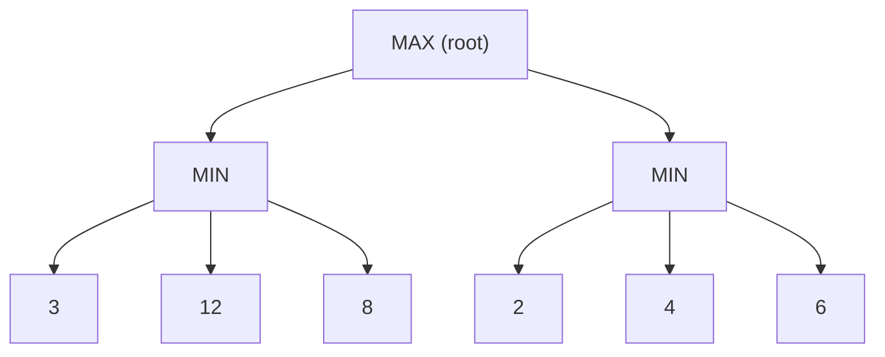
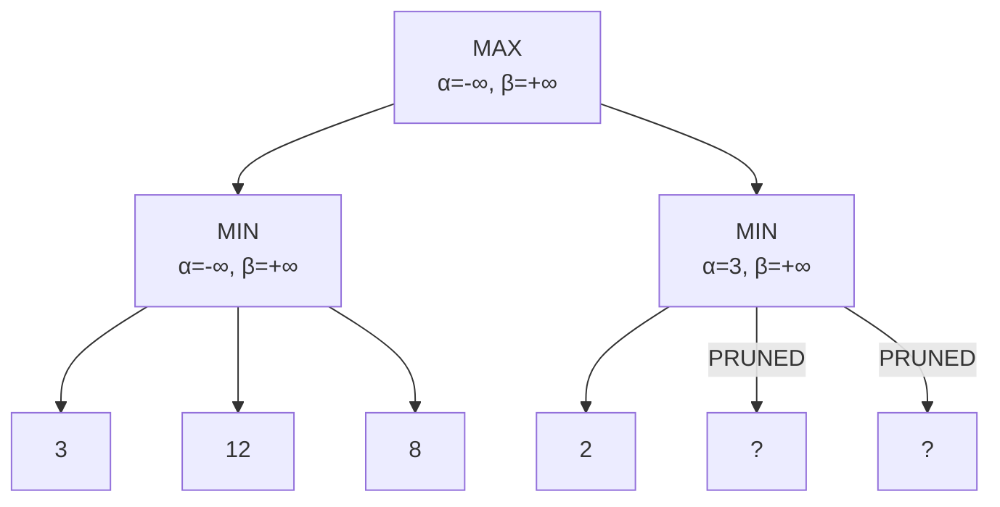

## Game Formulation

Games are modelled as search problems with an **adversary**:

| Component | Description |
|-----------|-------------|
| **Initial state** | Board position + who moves |
| **Players** | MAX (us) and MIN (opponent) |
| **Actions** | Legal moves in current state |
| **Terminal test** | Is the game over? |
| **Utility function** | Numeric value for terminal states (e.g., +1, 0, -1) |

### Game Tree



---

## Minimax Algorithm

**Strategy**: MAX chooses the move that maximises the minimum value that MIN can achieve.

$$\text{minimax}(n) = \begin{cases} \text{Utility}(n) & \text{if } n \text{ is terminal} \\ \max_{a} \text{minimax}(\text{Result}(n,a)) & \text{if } n \text{ is MAX node} \\ \min_{a} \text{minimax}(\text{Result}(n,a)) & \text{if } n \text{ is MIN node} \end{cases}$$

### Properties

| Property | Value |
|----------|-------|
| **Complete?** | Yes (if tree is finite) |
| **Optimal?** | Yes (against optimal opponent) |
| **Time** | $O(b^m)$ |
| **Space** | $O(bm)$ (DFS) |

Where $b$ = branching factor, $m$ = maximum depth of tree.

### Minimax Trace Example

<details>
<summary>Compute minimax value for this tree</summary>

```
        MAX
       /    \
     MIN     MIN
    / | \   / | \
   3  12 8  2  4  6
```

**Step 1** — MIN nodes choose minimum:
- Left MIN: min(3, 12, 8) = **3**
- Right MIN: min(2, 4, 6) = **2**

**Step 2** — MAX node chooses maximum:
- MAX: max(3, 2) = **3**

**Minimax value = 3**, MAX chooses left branch.
</details>

---

## Alpha-Beta Pruning

Optimisation of minimax that **prunes branches** that cannot affect the final decision.

### Key Idea

- $\alpha$ = best value MAX can guarantee (lower bound) — initially $-\infty$
- $\beta$ = best value MIN can guarantee (upper bound) — initially $+\infty$
- **Prune** when $\alpha \geq \beta$

### Algorithm

```
function ALPHA-BETA(node, α, β, maximisingPlayer):
    if node is terminal: return utility(node)
    
    if maximisingPlayer:
        value ← -∞
        for each child:
            value ← max(value, ALPHA-BETA(child, α, β, FALSE))
            α ← max(α, value)
            if α ≥ β: break    ← β cutoff (prune)
        return value
    
    else:  // minimising
        value ← +∞
        for each child:
            value ← min(value, ALPHA-BETA(child, α, β, TRUE))
            β ← min(β, value)
            if α ≥ β: break    ← α cutoff (prune)
        return value
```

### Pruning Example



After evaluating left subtree: MAX knows it can get at least 3 ($\alpha = 3$).

At right MIN node: first child returns 2. MIN will choose $\leq 2$. Since $2 < 3 = \alpha$, MAX will never choose this branch. **Prune remaining children.**

### Effectiveness

| Ordering | Nodes examined | Effective branching factor |
|----------|---------------|---------------------------|
| Worst case (no pruning) | $O(b^m)$ | $b$ |
| Random ordering | $O(b^{3m/4})$ | $b^{3/4}$ |
| **Perfect ordering** | $O(b^{m/2})$ | $\sqrt{b}$ |

With perfect move ordering, alpha-beta can search **twice as deep** in the same time as minimax!

---

## Evaluation Functions

For games too deep to search completely, use a **cutoff test** + **evaluation function** $\text{Eval}(s)$:

$$\text{Eval}(s) = w_1 f_1(s) + w_2 f_2(s) + \ldots + w_n f_n(s)$$

### Requirements

| Requirement | Reason |
|-------------|--------|
| Agree with utility at terminal states | Must be correct at game end |
| Fast to compute | Called millions of times |
| Correlate with actual winning chances | Must be informative |

### Chess Evaluation Features

| Feature $f_i$ | Typical weight $w_i$ |
|---------------|---------------------|
| Material (pawn=1, knight=3, bishop=3, rook=5, queen=9) | High |
| King safety | Medium |
| Pawn structure | Medium |
| Mobility (number of legal moves) | Low-Medium |
| Centre control | Low |

---

## Depth-Limited Minimax with Evaluation

```
function MINIMAX-CUTOFF(node, depth, α, β, maximisingPlayer):
    if node is terminal: return utility(node)
    if depth = 0: return Eval(node)     ← evaluation function
    
    // ... same as alpha-beta ...
```

**Quiescence search**: Don't evaluate "unstable" positions (e.g., mid-capture in chess). Extend search at those nodes.

---

## Move Ordering Heuristics

Good ordering improves alpha-beta dramatically:

| Technique | Description |
|-----------|-------------|
| Killer moves | Moves that caused cutoffs at same depth |
| History heuristic | Moves that have been good in other branches |
| Iterative deepening | Use shallow search to order moves for deeper search |
| Transposition table | Cache positions seen before (avoids re-search) |

---

## Game Types

| Type | Example | Method |
|------|---------|--------|
| Deterministic, perfect info | Chess, Go | Minimax + alpha-beta |
| Deterministic, imperfect info | Battleship | Belief states |
| Stochastic, perfect info | Backgammon | Expectiminimax |
| Stochastic, imperfect info | Poker | Monte Carlo methods |

### Expectiminimax (Stochastic Games)

Add **chance nodes** for random events (dice rolls):

$$\text{expectiminimax}(n) = \begin{cases} \text{Utility}(n) & \text{terminal} \\ \max_a \text{expectiminimax}(\text{Result}(n,a)) & \text{MAX} \\ \min_a \text{expectiminimax}(\text{Result}(n,a)) & \text{MIN} \\ \sum_r P(r) \cdot \text{expectiminimax}(\text{Result}(n,r)) & \text{CHANCE} \end{cases}$$

<details>
<summary>Practice: Alpha-Beta pruning — which nodes get pruned?</summary>

```
         MAX
       /      \
     MIN       MIN
    /   \     /   \
   3     5   2     ?
```

1. Left MIN: evaluates 3, then 5. MIN returns min(3,5) = **3**.
2. MAX updates α = 3.
3. Right MIN: evaluates 2. Since min so far is 2 < α = 3, MAX will never pick this branch.
4. The node marked **?** is **pruned** (β cutoff: α=3 ≥ β=2).

</details>

<details>
<summary>Practice: Why can't alpha-beta pruning be applied to expectiminimax?</summary>

Alpha-beta requires that a bound found in one branch definitively eliminates another. With chance nodes, the expected value is a **weighted average** of children — knowing one child's value doesn't bound the average without knowing all children. Pruning is unsafe because an unpruned high-value sibling could raise the expectation above the bound.
</details>
