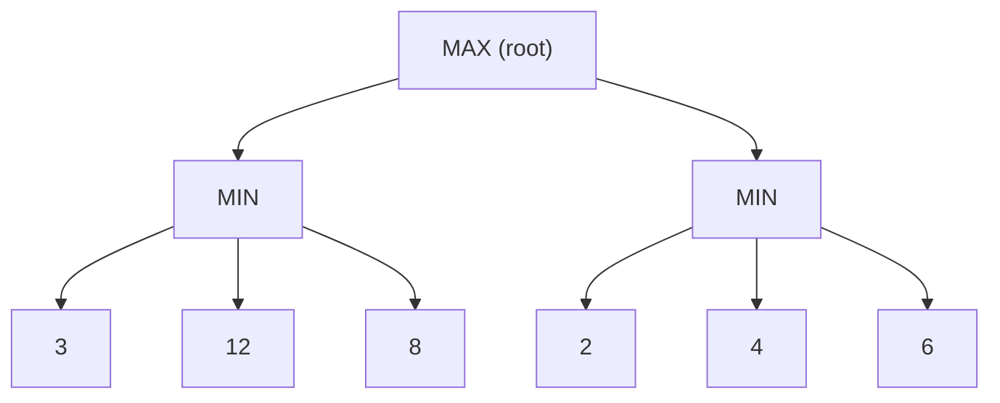
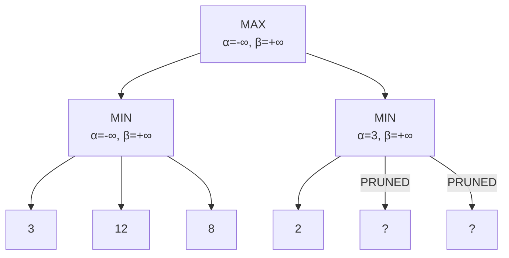

## Game Formulation

:::eli10

Games with opponents are different from normal puzzles because someone is actively trying to stop you from winning. We model games as trees where you and your opponent take turns, and your goal is to find the best move assuming the opponent also plays their best.

:::

:::eli15

Games are formalized as search problems with an adversary. We have two players: MAX (us, trying to maximize the score) and MIN (opponent, trying to minimize it). The game is represented as a tree of alternating moves, ending at terminal states with utility values (like +1 for win, -1 for loss). The challenge is choosing the best move knowing the opponent will also play optimally.

:::

:::eli20

Games are modelled as search problems with an **adversary**:

| Component | Description |
|-----------|-------------|
| **Initial state** | Board position + who moves |
| **Players** | MAX (us) and MIN (opponent) |
| **Actions** | Legal moves in current state |
| **Terminal test** | Is the game over? |
| **Utility function** | Numeric value for terminal states (e.g., +1, 0, -1) |

### Game Tree



:::

---

## Minimax Algorithm

:::eli10

Minimax is how you think ahead in a game: "If I go here, my opponent will do their best move, and then I will do my best move..." You imagine the whole game tree and pick the move that gives you the best guaranteed outcome, even if your opponent plays perfectly.

:::

:::eli15

The minimax algorithm works by recursively evaluating the game tree. At MAX nodes (your turn), you pick the child with the highest value. At MIN nodes (opponent's turn), they pick the child with the lowest value (worst for you). This gives the optimal strategy assuming perfect play from both sides. The value backed up to the root tells you the best guaranteed outcome. It is complete and optimal but has exponential time complexity O(b^m).

:::

:::eli20

**Strategy**: MAX chooses the move that maximises the minimum value that MIN can achieve.

$$\text{minimax}(n) = \begin{cases} \text{Utility}(n) & \text{if } n \text{ is terminal} \\ \max_{a} \text{minimax}(\text{Result}(n,a)) & \text{if } n \text{ is MAX node} \\ \min_{a} \text{minimax}(\text{Result}(n,a)) & \text{if } n \text{ is MIN node} \end{cases}$$

### Properties

| Property | Value |
|----------|-------|
| **Complete?** | Yes (if tree is finite) |
| **Optimal?** | Yes (against optimal opponent) |
| **Time** | $O(b^m)$ |
| **Space** | $O(bm)$ (DFS) |

Where $b$ = branching factor, $m$ = maximum depth of tree.

### Minimax Trace Example

<details>
<summary>Compute minimax value for this tree</summary>

```
        MAX
       /    \
     MIN     MIN
    / | \   / | \
   3  12 8  2  4  6
```

**Step 1** — MIN nodes choose minimum:
- Left MIN: min(3, 12, 8) = **3**
- Right MIN: min(2, 4, 6) = **2**

**Step 2** — MAX node chooses maximum:
- MAX: max(3, 2) = **3**

**Minimax value = 3**, MAX chooses left branch.
</details>

:::

---

## Alpha-Beta Pruning

:::eli10

Alpha-beta pruning is a clever shortcut for minimax. If you already know you can get a score of 3 from one branch, and you start exploring another branch where the opponent can force a score of 2 or less, you can stop looking at that branch -- you will never choose it anyway. It is like skipping a path you know is worse.

:::

:::eli15

Alpha-beta pruning is an optimization that eliminates branches of the game tree that cannot affect the final decision. It maintains two values: alpha (the best score MAX can guarantee so far) and beta (the best score MIN can guarantee). When alpha >= beta, the current branch is pruned because one player already has a better option elsewhere. With perfect move ordering, it can effectively double the search depth in the same time.

:::

:::eli20

Optimisation of minimax that **prunes branches** that cannot affect the final decision.

### Key Idea

- $\alpha$ = best value MAX can guarantee (lower bound) — initially $-\infty$
- $\beta$ = best value MIN can guarantee (upper bound) — initially $+\infty$
- **Prune** when $\alpha \geq \beta$

### Algorithm

```
function ALPHA-BETA(node, α, β, maximisingPlayer):
    if node is terminal: return utility(node)
    
    if maximisingPlayer:
        value ← -∞
        for each child:
            value ← max(value, ALPHA-BETA(child, α, β, FALSE))
            α ← max(α, value)
            if α ≥ β: break    ← β cutoff (prune)
        return value
    
    else:  // minimising
        value ← +∞
        for each child:
            value ← min(value, ALPHA-BETA(child, α, β, TRUE))
            β ← min(β, value)
            if α ≥ β: break    ← α cutoff (prune)
        return value
```

### Pruning Example



After evaluating left subtree: MAX knows it can get at least 3 ($\alpha = 3$).

At right MIN node: first child returns 2. MIN will choose $\leq 2$. Since $2 < 3 = \alpha$, MAX will never choose this branch. **Prune remaining children.**

### Effectiveness

| Ordering | Nodes examined | Effective branching factor |
|----------|---------------|---------------------------|
| Worst case (no pruning) | $O(b^m)$ | $b$ |
| Random ordering | $O(b^{3m/4})$ | $b^{3/4}$ |
| **Perfect ordering** | $O(b^{m/2})$ | $\sqrt{b}$ |

With perfect move ordering, alpha-beta can search **twice as deep** in the same time as minimax!

:::

---

## Evaluation Functions

:::eli10

In complex games like chess, you cannot search all the way to the end. Instead, you look a few moves ahead and then use a scoring function to estimate who is winning -- like counting up the value of pieces on the board. The better your scoring function, the better the AI plays.

:::

:::eli15

Since most real games are too deep to search to completion, we use a depth cutoff and an evaluation function that estimates how good a position is. The evaluation function is typically a weighted sum of features (like material advantage, piece mobility, king safety in chess). It must be fast to compute, agree with the utility at terminal states, and correlate with the actual probability of winning.

:::

:::eli20

For games too deep to search completely, use a **cutoff test** + **evaluation function** $\text{Eval}(s)$:

$$\text{Eval}(s) = w_1 f_1(s) + w_2 f_2(s) + \ldots + w_n f_n(s)$$

### Requirements

| Requirement | Reason |
|-------------|--------|
| Agree with utility at terminal states | Must be correct at game end |
| Fast to compute | Called millions of times |
| Correlate with actual winning chances | Must be informative |

### Chess Evaluation Features

| Feature $f_i$ | Typical weight $w_i$ |
|---------------|---------------------|
| Material (pawn=1, knight=3, bishop=3, rook=5, queen=9) | High |
| King safety | Medium |
| Pawn structure | Medium |
| Mobility (number of legal moves) | Low-Medium |
| Centre control | Low |

:::

---

## Depth-Limited Minimax with Evaluation

:::eli10

Instead of searching until the game ends, you look a fixed number of moves ahead and then use your scoring function. You also try to avoid stopping in the middle of an exciting exchange (like mid-capture in chess) because the score would be misleading.

:::

:::eli15

In practice, minimax is run to a fixed depth and the evaluation function is applied at the cutoff. One important refinement is quiescence search: do not evaluate positions where a major change is in progress (like a sequence of captures in chess). Instead, extend the search at those "unstable" nodes until the position calms down, giving a more reliable evaluation.

:::

:::eli20

```
function MINIMAX-CUTOFF(node, depth, α, β, maximisingPlayer):
    if node is terminal: return utility(node)
    if depth = 0: return Eval(node)     ← evaluation function
    
    // ... same as alpha-beta ...
```

**Quiescence search**: Don't evaluate "unstable" positions (e.g., mid-capture in chess). Extend search at those nodes.

:::

---

## Move Ordering Heuristics

:::eli10

Alpha-beta pruning works much better if you try the best moves first. Techniques like "killer moves" (moves that worked well before) and iterative deepening (do a quick shallow search first to rank moves) help you get closer to perfect ordering.

:::

:::eli15

The effectiveness of alpha-beta pruning depends heavily on the order in which moves are tried. Good ordering means more pruning. Killer moves remember which moves caused cutoffs at the same depth. The history heuristic tracks which moves have been good globally. Iterative deepening uses results from shallower searches to order moves for deeper searches. Transposition tables cache positions to avoid re-searching the same state.

:::

:::eli20

Good ordering improves alpha-beta dramatically:

| Technique | Description |
|-----------|-------------|
| Killer moves | Moves that caused cutoffs at same depth |
| History heuristic | Moves that have been good in other branches |
| Iterative deepening | Use shallow search to order moves for deeper search |
| Transposition table | Cache positions seen before (avoids re-search) |

:::

---

## Game Types

:::eli10

Not all games are like chess. Some involve dice or hidden cards. For games with randomness, you need to consider all possible dice rolls and average the results. For games with hidden information, you need to track what the opponent might be hiding.

:::

:::eli15

Games vary in whether they have randomness and whether information is fully visible. Deterministic perfect-information games (chess, Go) use minimax. Stochastic games (backgammon with dice) use expectiminimax, which adds "chance nodes" that compute expected values over random outcomes. Games with hidden information (poker) require more sophisticated approaches like Monte Carlo methods. Alpha-beta pruning cannot be applied to expectiminimax because chance nodes compute averages rather than min/max.

:::

:::eli20

| Type | Example | Method |
|------|---------|--------|
| Deterministic, perfect info | Chess, Go | Minimax + alpha-beta |
| Deterministic, imperfect info | Battleship | Belief states |
| Stochastic, perfect info | Backgammon | Expectiminimax |
| Stochastic, imperfect info | Poker | Monte Carlo methods |

### Expectiminimax (Stochastic Games)

Add **chance nodes** for random events (dice rolls):

$$\text{expectiminimax}(n) = \begin{cases} \text{Utility}(n) & \text{terminal} \\ \max_a \text{expectiminimax}(\text{Result}(n,a)) & \text{MAX} \\ \min_a \text{expectiminimax}(\text{Result}(n,a)) & \text{MIN} \\ \sum_r P(r) \cdot \text{expectiminimax}(\text{Result}(n,r)) & \text{CHANCE} \end{cases}$$

<details>
<summary>Practice: Alpha-Beta pruning — which nodes get pruned?</summary>

```
         MAX
       /      \
     MIN       MIN
    /   \     /   \
   3     5   2     ?
```

1. Left MIN: evaluates 3, then 5. MIN returns min(3,5) = **3**.
2. MAX updates α = 3.
3. Right MIN: evaluates 2. Since min so far is 2 < α = 3, MAX will never pick this branch.
4. The node marked **?** is **pruned** (β cutoff: α=3 ≥ β=2).

</details>

<details>
<summary>Practice: Why can't alpha-beta pruning be applied to expectiminimax?</summary>

Alpha-beta requires that a bound found in one branch definitively eliminates another. With chance nodes, the expected value is a **weighted average** of children — knowing one child's value doesn't bound the average without knowing all children. Pruning is unsafe because an unpruned high-value sibling could raise the expectation above the bound.
</details>

:::
