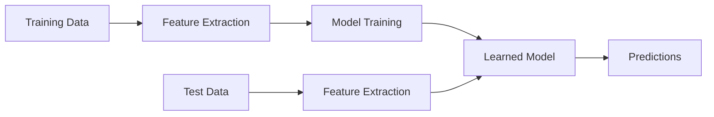
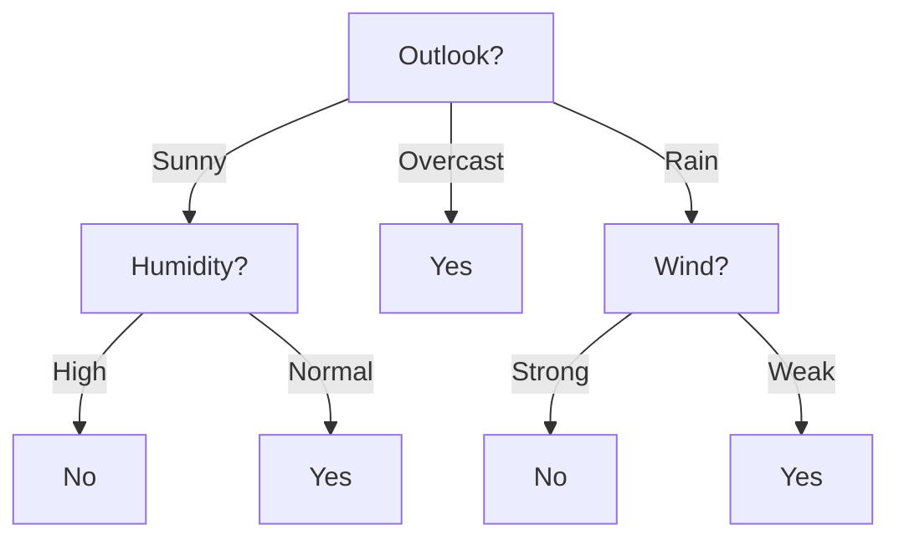
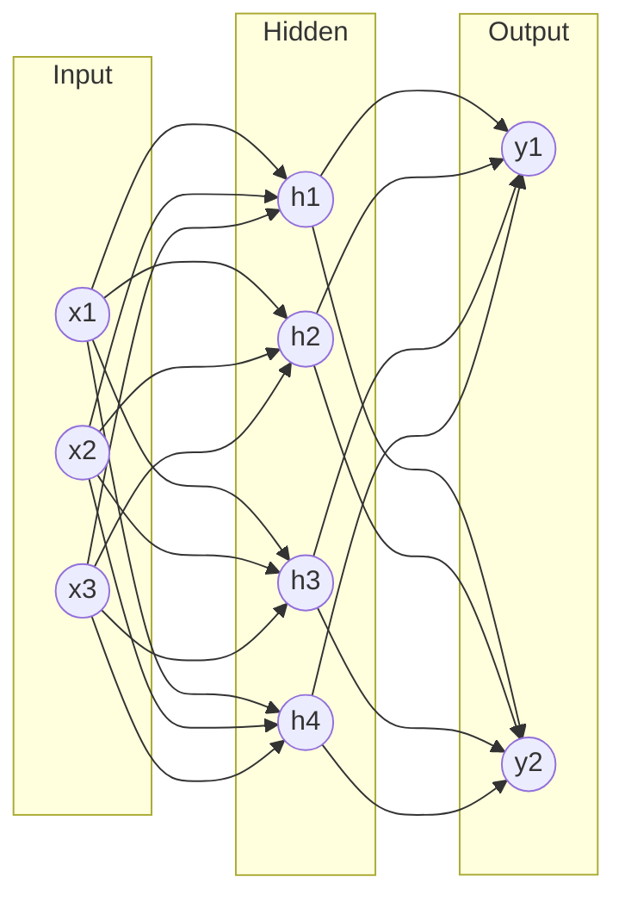

## What is Machine Learning?

> "A computer program is said to **learn** from experience $E$ with respect to task $T$ and performance measure $P$, if its performance at $T$, as measured by $P$, improves with experience $E$." — Tom Mitchell

### Learning Paradigms

| Paradigm | Input | Goal | Examples |
|----------|-------|------|----------|
| **Supervised** | Labelled data $(x_i, y_i)$ | Learn mapping $f: X \rightarrow Y$ | Classification, regression |
| **Unsupervised** | Unlabelled data $x_i$ | Find structure/patterns | Clustering, dimensionality reduction |
| **Reinforcement** | States, actions, rewards | Learn policy $\pi: S \rightarrow A$ | Game playing, robotics |

---

## Supervised Learning

### Classification vs Regression

| Task | Output | Example |
|------|--------|---------|
| **Classification** | Discrete label | Spam/Not-spam, digit recognition |
| **Regression** | Continuous value | House price prediction, temperature |

### Training Pipeline

---

## Decision Trees

A tree where:
- **Internal nodes** = tests on attributes
- **Branches** = attribute values
- **Leaves** = class labels

### Example: Play Tennis?

### Attribute Selection: Information Gain

**Entropy** measures impurity:

$$H(S) = -\sum_{c} p_c \log_2 p_c$$

where $p_c$ = proportion of class $c$ in set $S$.

| Set composition | Entropy |
|----------------|---------|
| All same class (pure) | 0 |
| 50/50 split (binary) | 1 |
| Uniform over $k$ classes | $\log_2 k$ |

**Information Gain** for attribute $A$:

$$\text{Gain}(S, A) = H(S) - \sum_{v \in \text{Values}(A)} \frac{|S_v|}{|S|} H(S_v)$$

Choose the attribute with **highest information gain** (biggest entropy reduction).

Practice: Compute entropy for a set with 9 positive and 5 negative examples

$$H(S) = -\frac{9}{14}\log_2\frac{9}{14} - \frac{5}{14}\log_2\frac{5}{14}$$

$$= -0.643 \times (-0.637) - 0.357 \times (-1.486)$$

$$= 0.410 + 0.531 = 0.940 \text{ bits}$$

### Overfitting

A tree that fits training data perfectly but generalises poorly.

| Strategy | Description |
|----------|-------------|
| **Pre-pruning** | Stop growing when info gain is below threshold |
| **Post-pruning** | Grow full tree, then remove branches that don't improve validation |
| **Minimum samples** | Require minimum examples per leaf |

---

## k-Nearest Neighbours (k-NN)

**Idea**: Classify a new point by majority vote of its $k$ nearest neighbours.

### Algorithm

1. Store all training examples
2. For a new query point $x$:
   - Compute distance to all training points
   - Find $k$ closest neighbours
   - Return majority class (classification) or average (regression)

### Distance Metrics

| Metric | Formula | Use case |
|--------|---------|----------|
| Euclidean | $d = \sqrt{\sum_i (x_i - y_i)^2}$ | Continuous, isotropic |
| Manhattan | $d = \sum_i |x_i - y_i|$ | Grid-based, sparse |
| Minkowski | $d = \left(\sum_i |x_i - y_i|^p\right)^{1/p}$ | General (p=1: Manhattan, p=2: Euclidean) |

### Choosing $k$

| $k$ | Bias | Variance | Effect |
|-----|------|----------|--------|
| Small (e.g., 1) | Low | High | Noisy, overfits |
| Large (e.g., $n$) | High | Low | Underfits (always predicts majority) |
| Typical | Moderate | Moderate | Use cross-validation to select |

> **Tip**: Use odd $k$ for binary classification to avoid ties.

### Properties

| Property | Value |
|----------|-------|
| Training time | $O(1)$ (just store data) |
| Prediction time | $O(nd)$ where $n$ = training size, $d$ = dimensions |
| Memory | $O(nd)$ |
| Curse of dimensionality | Performance degrades in high dimensions |

---

## Neural Networks (Introduction)

### The Perceptron

A single artificial neuron:

$$y = \sigma\left(\sum_{i=1}^{n} w_i x_i + b\right) = \sigma(\mathbf{w}^T \mathbf{x} + b)$$

| Component | Role |
|-----------|------|
| $x_i$ | Inputs |
| $w_i$ | Weights (learned) |
| $b$ | Bias term |
| $\sigma$ | Activation function |
| $y$ | Output |

### Activation Functions

| Function | Formula | Range | Use |
|----------|---------|-------|-----|
| Step | $\sigma(z) = \begin{cases} 1 & z \geq 0 \\ 0 & z < 0 \end{cases}$ | {0, 1} | Original perceptron |
| Sigmoid | $\sigma(z) = \frac{1}{1+e^{-z}}$ | (0, 1) | Output (probability) |
| ReLU | $\sigma(z) = \max(0, z)$ | $[0, \infty)$ | Hidden layers (modern) |
| Tanh | $\sigma(z) = \tanh(z)$ | (-1, 1) | Hidden layers |

### Multi-Layer Perceptron (MLP)

| Layer | Role |
|-------|------|
| Input | Receives raw features |
| Hidden | Learns internal representations |
| Output | Produces final prediction |

### Learning: Backpropagation

1. **Forward pass**: Compute output from inputs
2. **Compute loss**: Compare output to target (e.g., MSE, cross-entropy)
3. **Backward pass**: Compute gradients via chain rule
4. **Update weights**: $w \leftarrow w - \eta \frac{\partial L}{\partial w}$

Where $\eta$ = learning rate.

### Key Limitation of Perceptrons

A single perceptron can only learn **linearly separable** functions.

| Function | Linearly separable? | Perceptron? |
|----------|-------------------|-------------|
| AND | Yes | ✓ |
| OR | Yes | ✓ |
| XOR | **No** | ✗ (need hidden layer) |

---

## Unsupervised Learning

### k-Means Clustering

**Goal**: Partition $n$ data points into $k$ clusters.

**Algorithm:**
1. Randomly initialise $k$ centroids
2. **Assign** each point to nearest centroid
3. **Update** each centroid to mean of its assigned points
4. Repeat steps 2-3 until convergence

| Property | Value |
|----------|-------|
| Guaranteed to converge? | Yes (but to local optimum) |
| Optimal solution? | Not guaranteed |
| Time complexity | $O(nkdi)$ where $i$ = iterations |
| Choosing $k$? | Elbow method, silhouette score |

Practice: One iteration of k-Means

Points: (1,1), (2,1), (4,3), (5,4). Initial centroids: $\mu_1=(1,1)$, $\mu_2=(5,4)$.

**Assignment** (by Euclidean distance):
- (1,1): $d_1=0$, $d_2=5$. → Cluster 1
- (2,1): $d_1=1$, $d_2=\sqrt{18}≈4.24$. → Cluster 1
- (4,3): $d_1=\sqrt{13}≈3.61$, $d_2=\sqrt{2}≈1.41$. → Cluster 2
- (5,4): $d_1=5$, $d_2=0$. → Cluster 2

**Update centroids:**
- $\mu_1 = \frac{(1,1)+(2,1)}{2} = (1.5, 1)$
- $\mu_2 = \frac{(4,3)+(5,4)}{2} = (4.5, 3.5)$

---

## Overfitting vs Underfitting

| Problem | Symptom | Solution |
|---------|---------|----------|
| **Overfitting** | Low training error, high test error | More data, regularisation, simpler model |
| **Underfitting** | High training error, high test error | More complex model, better features |

### Bias-Variance Trade-off

$$\text{Error} = \text{Bias}^2 + \text{Variance} + \text{Irreducible Noise}$$

| | High Bias | Low Bias |
|--|-----------|----------|
| **High Variance** | — | Overfitting |
| **Low Variance** | Underfitting | Good fit |

---

## Evaluation

| Metric | Formula | Use |
|--------|---------|-----|
| Accuracy | $\frac{TP + TN}{TP + TN + FP + FN}$ | Balanced classes |
| Precision | $\frac{TP}{TP + FP}$ | Minimise false positives |
| Recall | $\frac{TP}{TP + FN}$ | Minimise false negatives |
| F1 Score | $\frac{2 \cdot P \cdot R}{P + R}$ | Balance precision/recall |

### Cross-Validation

Split data into $k$ folds; train on $k-1$, test on 1. Rotate and average results. Reduces variance of performance estimate.

Practice: A spam filter has TP=80, FP=10, FN=20, TN=890. Compute precision and recall.

**Precision** = $\frac{TP}{TP+FP} = \frac{80}{80+10} = \frac{80}{90} \approx 0.889$

**Recall** = $\frac{TP}{TP+FN} = \frac{80}{80+20} = \frac{80}{100} = 0.800$

**F1** = $\frac{2 \times 0.889 \times 0.800}{0.889 + 0.800} = \frac{1.422}{1.689} \approx 0.842$

