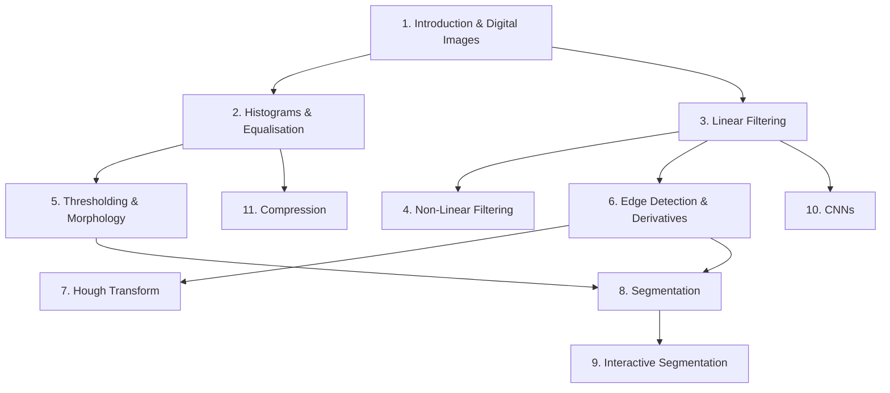

## Topic Dependency Map

## Recommended Study Order

| Phase | Topics | Why this order |
|-------|--------|---------------|
| 1 — Foundations | 1, 2 | Everything builds on image representation and histograms |
| 2 — Filtering | 3, 4 | Convolution is the core operation; non-linear extends it |
| 3 — Binary & Edges | 5, 6 | Thresholding produces binary images; derivatives detect edges |
| 4 — Shape Finding | 7 | Hough uses edge output; geometric approach |
| 5 — Segmentation | 8, 9 | Combines all prior concepts (thresholding, edges, regions) |
| 6 — Deep & Compression | 10, 11 | CNNs use convolution concept; compression uses histograms/DCT |

## Time Allocation (Revision)

| Topic | Suggested Time | Priority |
|-------|---------------|----------|
| Histogram Equalisation | 2h | High (always examined) |
| Convolution/Filtering | 2h | High (computational Qs) |
| Edge Detection (Canny) | 1.5h | High |
| Morphology | 1h | Medium |
| Hough Transform | 1.5h | High (computational Qs) |
| Segmentation | 1h | Medium |
| CNN | 1h | Medium (conceptual) |
| Compression/Huffman | 1.5h | High (computational Qs) |
