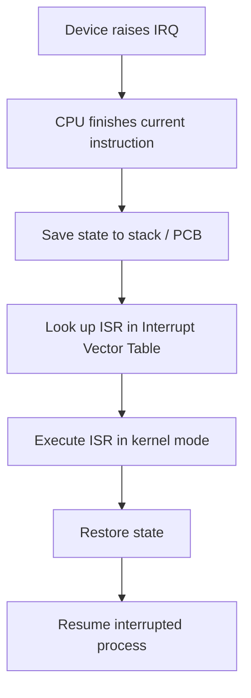

# OS Fundamentals

## What is an Operating System?

An OS is a layer of software between hardware and user applications that manages resources and provides abstractions.

| Role | Description |
|------|-------------|
| Resource Manager | Allocates CPU, memory, I/O to processes |
| Abstraction Provider | Hides hardware complexity (files, processes, sockets) |
| Protection | Isolates processes from each other and from the kernel |

## Kernel Modes

| Mode | Privilege | Access | Example |
|------|-----------|--------|---------|
| **Kernel Mode** (Ring 0) | Full | All hardware, all memory | Interrupt handlers, device drivers |
| **User Mode** (Ring 3) | Restricted | Own address space only | Application code |

Transition from user to kernel mode occurs via:
- System calls (software interrupt / trap)
- Hardware interrupts
- Exceptions (e.g., page fault, division by zero)

## System Calls

A system call is the programmatic interface between user programs and the OS kernel.

```
User Program  -->  trap instruction  -->  Kernel handler  -->  return to user
```

| Category | Examples |
|----------|----------|
| Process | `fork()`, `exec()`, `wait()`, `exit()` |
| File | `open()`, `read()`, `write()`, `close()` |
| Memory | `mmap()`, `brk()` |
| IPC | `pipe()`, `shmget()`, `msgget()` |

### System Call Mechanism

1. Program places syscall number in register (e.g., `eax`)
2. Parameters placed in registers or on stack
3. Execute `int 0x80` or `syscall` instruction (trap)
4. CPU switches to kernel mode, jumps to syscall dispatch table
5. Kernel executes handler, places return value in register
6. Returns to user mode via `iret` / `sysret`

## Interrupts

| Type | Trigger | Example |
|------|---------|---------|
| **Hardware interrupt** | External device signal | Keyboard press, disk I/O complete, timer tick |
| **Software interrupt (trap)** | Explicit instruction | System call (`int 0x80`) |
| **Exception** | Error condition | Page fault, divide-by-zero, segfault |

### Interrupt Handling Flow



### Interrupt Priority

Interrupts have priorities. Higher-priority interrupts can preempt lower-priority ISRs. The **Programmable Interrupt Controller (PIC)** or **APIC** manages prioritisation.

## OS Structures

| Structure | Description | Example |
|-----------|-------------|---------|
| Monolithic | All services in kernel space | Linux |
| Microkernel | Minimal kernel; services in user space | Minix, seL4 |
| Hybrid | Mix of monolithic + microkernel | Windows NT, macOS |
| Layered | OS divided into hierarchical layers | THE system |

## Key Formulas

$$\text{System Call Overhead} = T_{\text{trap}} + T_{\text{handler}} + T_{\text{return}}$$

<details>
<summary><strong>Practice: Identify the mode transition</strong></summary>

**Q:** A program calls `read(fd, buf, n)`. Trace the mode transitions.

**A:**
1. User mode: program invokes `read()` wrapper in C library
2. Library places syscall number in `eax`, params in registers
3. Executes `syscall` instruction -> **transition to kernel mode**
4. Kernel validates fd, initiates I/O, may block process
5. When data ready, copies to `buf` in user space
6. Returns result in `eax` -> **transition back to user mode**

</details>

<details>
<summary><strong>Practice: Monolithic vs Microkernel</strong></summary>

**Q:** Compare monolithic and microkernel designs.

| Criterion | Monolithic | Microkernel |
|-----------|-----------|-------------|
| Performance | Faster (no IPC overhead) | Slower (message passing) |
| Reliability | One bug can crash whole OS | Faulty service can be restarted |
| Security | Larger attack surface | Smaller trusted computing base |
| Development | Harder to maintain | Easier to extend |

</details>
