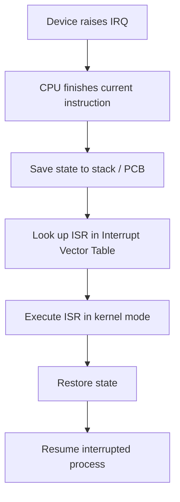

# OS Fundamentals

## What is an Operating System?

:::eli10

An operating system (OS) is like the manager of a computer. Just like a school principal decides which teacher gets which classroom and when, the OS decides which program gets to use the processor, memory, and other resources. It also hides complicated hardware details so programs don't need to worry about them.

:::

:::eli15

An operating system is the core software layer that sits between hardware and applications. It has three main roles: resource management (deciding how CPU time, memory, and devices are shared among running programs), abstraction (providing simpler interfaces like files and processes instead of raw hardware), and protection (preventing one program from interfering with another or crashing the system). Without an OS, every program would need to directly manage hardware — which would be impractical and insecure.

:::

:::eli20

An OS is a layer of software between hardware and user applications that manages resources and provides abstractions.

| Role | Description |
|------|-------------|
| Resource Manager | Allocates CPU, memory, I/O to processes |
| Abstraction Provider | Hides hardware complexity (files, processes, sockets) |
| Protection | Isolates processes from each other and from the kernel |

:::

## Kernel Modes

:::eli10

The computer has two "power levels" for running code. Kernel mode is like being an admin — you can do anything, including accessing all hardware. User mode is like being a regular student — you can only use your own stuff. Programs run in user mode for safety; only the OS runs in kernel mode.

:::

:::eli15

CPUs have at least two privilege levels. Kernel mode (Ring 0) has unrestricted access to all hardware and memory — the OS runs here. User mode (Ring 3) is restricted to the process's own address space — applications run here. This separation prevents buggy or malicious programs from damaging the system. Transitions from user to kernel mode happen via system calls (the program asks the OS for help), hardware interrupts (devices need attention), or exceptions (something went wrong, like dividing by zero).

:::

:::eli20

| Mode | Privilege | Access | Example |
|------|-----------|--------|---------|
| **Kernel Mode** (Ring 0) | Full | All hardware, all memory | Interrupt handlers, device drivers |
| **User Mode** (Ring 3) | Restricted | Own address space only | Application code |

Transition from user to kernel mode occurs via:
- System calls (software interrupt / trap)
- Hardware interrupts
- Exceptions (e.g., page fault, division by zero)

:::

## System Calls

:::eli10

When a program needs the OS to do something it can't do itself (like reading a file from disk or creating a new program), it makes a "system call." It's like raising your hand in class to ask the teacher for help — the student (program) can't leave the room (user mode) without permission.

:::

:::eli15

System calls are the interface for user programs to request OS services. When a program needs to read a file, create a process, or allocate memory, it cannot do so directly (it lacks permission). Instead, it triggers a trap instruction that switches to kernel mode, where the OS performs the operation on the program's behalf and returns the result. System calls are categorised by function: process management (fork, exec), file operations (open, read, write), memory management (mmap), and inter-process communication (pipe, shared memory).

:::

:::eli20

A system call is the programmatic interface between user programs and the OS kernel.

```
User Program  -->  trap instruction  -->  Kernel handler  -->  return to user
```

| Category | Examples |
|----------|----------|
| Process | `fork()`, `exec()`, `wait()`, `exit()` |
| File | `open()`, `read()`, `write()`, `close()` |
| Memory | `mmap()`, `brk()` |
| IPC | `pipe()`, `shmget()`, `msgget()` |

### System Call Mechanism

1. Program places syscall number in register (e.g., `eax`)
2. Parameters placed in registers or on stack
3. Execute `int 0x80` or `syscall` instruction (trap)
4. CPU switches to kernel mode, jumps to syscall dispatch table
5. Kernel executes handler, places return value in register
6. Returns to user mode via `iret` / `sysret`

:::

## Interrupts

:::eli10

Interrupts are like someone tapping the computer on the shoulder to get its attention. A keyboard press, a timer going off, or a disk finishing its work all send interrupts. The computer pauses what it's doing, handles the interruption, then goes back to what it was doing before — like pausing a video game to answer the door.

:::

:::eli15

Interrupts are signals that cause the CPU to stop its current work and handle an event. Hardware interrupts come from devices (keyboard, disk, timer). Software interrupts (traps) are triggered intentionally by programs for system calls. Exceptions are caused by error conditions like page faults or divide-by-zero. When an interrupt arrives, the CPU saves its current state, looks up the appropriate handler in the Interrupt Vector Table, executes it in kernel mode, then restores the saved state and resumes. Interrupts have priorities — more urgent ones can preempt less urgent handlers.

:::

:::eli20

| Type | Trigger | Example |
|------|---------|---------|
| **Hardware interrupt** | External device signal | Keyboard press, disk I/O complete, timer tick |
| **Software interrupt (trap)** | Explicit instruction | System call (`int 0x80`) |
| **Exception** | Error condition | Page fault, divide-by-zero, segfault |

### Interrupt Handling Flow



### Interrupt Priority

Interrupts have priorities. Higher-priority interrupts can preempt lower-priority ISRs. The **Programmable Interrupt Controller (PIC)** or **APIC** manages prioritisation.

:::

## OS Structures

:::eli10

Operating systems can be built in different ways. A monolithic OS puts everything in one big block (fast but if one part breaks, everything might crash). A microkernel keeps only the essentials in the core and runs other services separately (safer but slower because parts have to talk to each other). Most real OSes mix both approaches.

:::

:::eli15

There are several architectural approaches to OS design. Monolithic kernels (like Linux) run all OS services in kernel space — fast due to direct function calls, but a bug anywhere can crash the system. Microkernels (like seL4) keep only the bare minimum in kernel space (scheduling, IPC, memory protection) and run services like file systems and drivers as user-space processes — more reliable and secure, but slower due to message-passing overhead. Hybrid designs (Windows, macOS) combine both philosophies for a practical balance. Layered approaches organise the OS into strict hierarchical levels.

:::

:::eli20

| Structure | Description | Example |
|-----------|-------------|---------|
| Monolithic | All services in kernel space | Linux |
| Microkernel | Minimal kernel; services in user space | Minix, seL4 |
| Hybrid | Mix of monolithic + microkernel | Windows NT, macOS |
| Layered | OS divided into hierarchical layers | THE system |

:::

## Key Formulas

:::eli10

Every time a program asks the OS for help, there's a small time cost for switching between user mode and kernel mode and back. This is called system call overhead — like the time it takes to raise your hand, wait for the teacher, get help, and go back to your work.

:::

:::eli15

System call overhead is the time penalty for transitioning from user mode to kernel mode and back. It consists of the trap time (switching to kernel mode), the handler execution time, and the return time. This overhead is why very frequent system calls can hurt performance — each one incurs these fixed costs regardless of how much work the call actually does.

:::

:::eli20

$$\text{System Call Overhead} = T_{\text{trap}} + T_{\text{handler}} + T_{\text{return}}$$

<details>
<summary><strong>Practice: Identify the mode transition</strong></summary>

**Q:** A program calls `read(fd, buf, n)`. Trace the mode transitions.

**A:**
1. User mode: program invokes `read()` wrapper in C library
2. Library places syscall number in `eax`, params in registers
3. Executes `syscall` instruction -> **transition to kernel mode**
4. Kernel validates fd, initiates I/O, may block process
5. When data ready, copies to `buf` in user space
6. Returns result in `eax` -> **transition back to user mode**

</details>

<details>
<summary><strong>Practice: Monolithic vs Microkernel</strong></summary>

**Q:** Compare monolithic and microkernel designs.

| Criterion | Monolithic | Microkernel |
|-----------|-----------|-------------|
| Performance | Faster (no IPC overhead) | Slower (message passing) |
| Reliability | One bug can crash whole OS | Faulty service can be restarted |
| Security | Larger attack surface | Smaller trusted computing base |
| Development | Harder to maintain | Easier to extend |

</details>

:::
