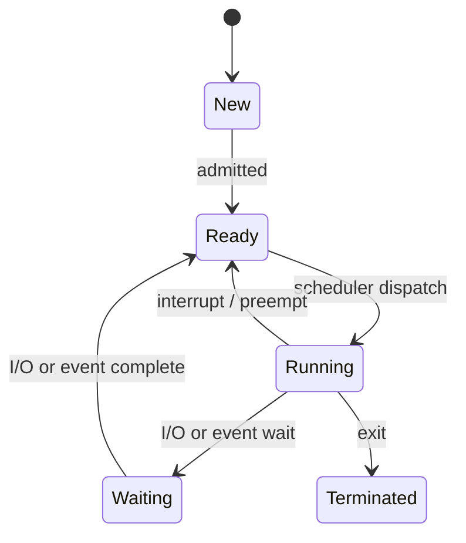
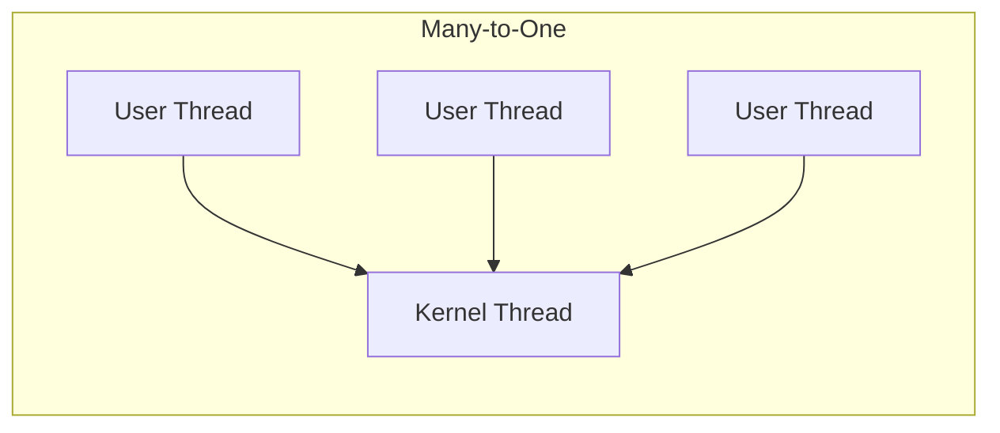

# Processes & Threads

## Process Model

A **process** is a program in execution. It includes:
- Code (text section)
- Program counter & registers
- Stack (local variables, function calls)
- Heap (dynamically allocated memory)
- Data section (global variables)

### Process States



| State | Description |
|-------|-------------|
| New | Being created |
| Ready | Waiting for CPU |
| Running | Instructions executing |
| Waiting (Blocked) | Waiting for I/O or event |
| Terminated | Finished execution |

## Process Control Block (PCB)

| Field | Purpose |
|-------|---------|
| PID | Unique process identifier |
| State | Current process state |
| Program Counter | Address of next instruction |
| CPU Registers | Saved register contents |
| Memory Management | Page table base, segment table |
| Scheduling Info | Priority, time quantum used |
| I/O Status | Open files, allocated devices |
| Accounting | CPU time used, time limits |

## Context Switch

A context switch saves the state of the current process and loads the state of the next.

$$T_{\text{context switch}} \approx 1\text{-}10 \ \mu s \text{ (modern hardware)}$$

**Steps:**
1. Save registers & PC of current process into its PCB
2. Update process state (Running -> Ready/Waiting)
3. Select next process (scheduler)
4. Load registers & PC from new process's PCB
5. Flush TLB (if no ASID support)
6. Resume execution

> Context switches are **pure overhead** -- no useful work is done.

## Process Creation

| Operation | UNIX | Windows |
|-----------|------|---------|
| Create | `fork()` | `CreateProcess()` |
| Replace image | `exec()` | (part of CreateProcess) |
| Wait for child | `wait()` / `waitpid()` | `WaitForSingleObject()` |
| Terminate | `exit()` | `ExitProcess()` |

### fork() Semantics

- Creates an exact copy of the parent process
- Returns 0 to child, child PID to parent
- Copy-on-Write (COW): pages shared until modified

## Threads

A thread is a lightweight unit of execution within a process. Threads share:
- Code, data, heap
- Open files, signals

Threads have their own:
- Thread ID, program counter, registers
- Stack

| Aspect | Process | Thread |
|--------|---------|--------|
| Address space | Own | Shared with other threads |
| Creation cost | High (copy page tables) | Low (just stack + registers) |
| Context switch | Expensive (TLB flush) | Cheap (same address space) |
| Communication | IPC (pipes, sockets, shared mem) | Direct memory access |
| Fault isolation | Crash isolated | One crash kills all threads |

## User-Level vs Kernel-Level Threads

| Feature | User-Level Threads | Kernel-Level Threads |
|---------|-------------------|---------------------|
| Managed by | User-space library | OS kernel |
| Scheduling | Library scheduler | OS scheduler |
| Context switch | Fast (no kernel trap) | Slower (kernel involvement) |
| Blocking I/O | Blocks entire process | Only blocks that thread |
| Multicore | Cannot run in parallel | True parallelism |
| Example | Green threads, goroutines (partially) | pthreads, Windows threads |

## Threading Models

| Model | Description |
|-------|-------------|
| Many-to-One | Many user threads -> 1 kernel thread. No parallelism. |
| One-to-One | Each user thread -> 1 kernel thread. Full parallelism. |
| Many-to-Many | M user threads -> N kernel threads ($M \geq N$). Best of both. |



## Amdahl's Law

The theoretical speedup with $N$ processors and fraction $P$ that is parallelisable:

$$S(N) = \frac{1}{(1 - P) + \frac{P}{N}}$$

As $N \to \infty$: $S_{\max} = \frac{1}{1 - P}$

<details>
<summary><strong>Practice: Amdahl's Law calculation</strong></summary>

**Q:** If 75% of a program is parallelisable, what is the max speedup with 8 cores?

**A:**
$$S(8) = \frac{1}{(1 - 0.75) + \frac{0.75}{8}} = \frac{1}{0.25 + 0.09375} = \frac{1}{0.34375} \approx 2.91$$

Max speedup (infinite cores): $S_{\max} = \frac{1}{0.25} = 4$

</details>

<details>
<summary><strong>Practice: fork() output</strong></summary>

**Q:** What does this print?
```c
int main() {
    fork();
    fork();
    printf("hello\n");
    return 0;
}
```

**A:** "hello" is printed **4 times**.
- First `fork()` creates 2 processes.
- Each calls second `fork()`, creating 4 processes total.
- Each prints "hello".

</details>
