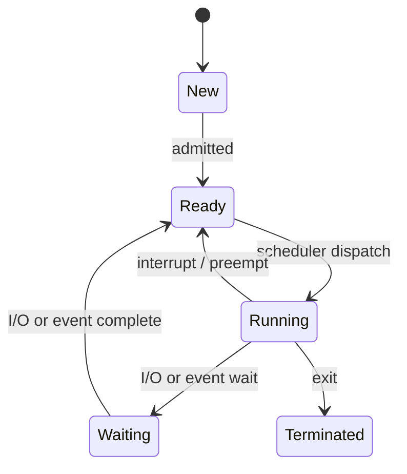
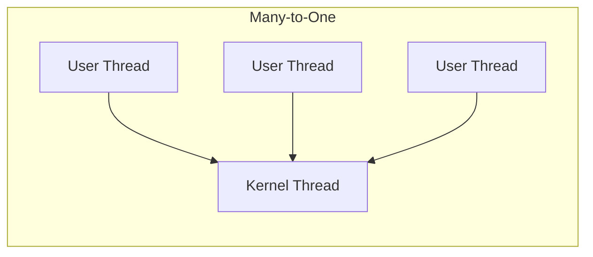

# Processes & Threads

## Process Model

:::eli10

A process is a running program. It's like a recipe being cooked — the recipe itself (code) is just instructions on paper, but the process is someone actually cooking it with ingredients (memory), a current step (program counter), and workspace (stack). Each process gets its own workspace so it can't accidentally mess up someone else's cooking.

:::

:::eli15

A process is an instance of a program being executed. It includes the program code, a program counter (tracking which instruction to execute next), CPU registers, a stack (for function calls and local variables), a heap (for dynamically allocated memory), and a data section (for globals). Processes go through states: new (being created), ready (waiting for CPU time), running (actively executing), waiting/blocked (paused for I/O), and terminated (done). The OS tracks all this information for each process.

:::

:::eli20

A **process** is a program in execution. It includes:
- Code (text section)
- Program counter & registers
- Stack (local variables, function calls)
- Heap (dynamically allocated memory)
- Data section (global variables)

### Process States



| State | Description |
|-------|-------------|
| New | Being created |
| Ready | Waiting for CPU |
| Running | Instructions executing |
| Waiting (Blocked) | Waiting for I/O or event |
| Terminated | Finished execution |

:::

## Process Control Block (PCB)

:::eli10

The PCB is like a bookmark for a process. When the OS needs to pause one process and start another, it saves everything about where the first process was (which instruction it was on, what numbers it was working with, etc.) into its PCB card. Later, it can reload that card and pick up exactly where it left off.

:::

:::eli15

The Process Control Block (PCB) is a data structure the OS maintains for every process. It stores everything needed to pause and later resume that process: its unique ID, current state, program counter, saved CPU registers, memory management info (page table pointer), scheduling priority, open files, and accounting data. When the OS switches between processes, it saves the running process's state into its PCB and loads the next process's state from its PCB.

:::

:::eli20

| Field | Purpose |
|-------|---------|
| PID | Unique process identifier |
| State | Current process state |
| Program Counter | Address of next instruction |
| CPU Registers | Saved register contents |
| Memory Management | Page table base, segment table |
| Scheduling Info | Priority, time quantum used |
| I/O Status | Open files, allocated devices |
| Accounting | CPU time used, time limits |

:::

## Context Switch

:::eli10

A context switch is when the computer pauses one program and starts running another — like a teacher switching from helping one student to another. It takes a tiny bit of time (a few microseconds) and during that time no useful work gets done. It's necessary for multitasking but is pure overhead.

:::

:::eli15

A context switch occurs when the CPU stops running one process and starts running another. The OS saves all CPU state (registers, program counter) of the current process into its PCB, selects the next process to run (via the scheduler), and loads that process's saved state. This takes roughly 1-10 microseconds on modern hardware and is pure overhead — no useful application work happens during the switch. Frequent context switches (many short processes) increase overhead; infrequent ones reduce responsiveness.

:::

:::eli20

A context switch saves the state of the current process and loads the state of the next.

$$T_{\text{context switch}} \approx 1\text{-}10 \ \mu s \text{ (modern hardware)}$$

**Steps:**
1. Save registers & PC of current process into its PCB
2. Update process state (Running -> Ready/Waiting)
3. Select next process (scheduler)
4. Load registers & PC from new process's PCB
5. Flush TLB (if no ASID support)
6. Resume execution

> Context switches are **pure overhead** -- no useful work is done.

:::

## Process Creation

:::eli10

In Unix/Linux, creating a new process is done with fork() — it makes a clone of the current program. It's like photocopying yourself: the copy (child) is nearly identical to the original (parent), but they're now separate and can do different things. Usually the child immediately loads a different program using exec().

:::

:::eli15

Process creation in Unix uses fork(), which creates an almost identical copy of the calling process. The child gets the same code, data, and open files but has its own PID. Fork returns 0 to the child and the child's PID to the parent — this is how each knows its role. Copy-on-Write (COW) optimisation means memory pages are shared until one process modifies them, making fork() fast. Typically, the child calls exec() immediately to replace itself with a different program. Windows uses a single CreateProcess() call that combines both creation and program loading.

:::

:::eli20

| Operation | UNIX | Windows |
|-----------|------|---------|
| Create | `fork()` | `CreateProcess()` |
| Replace image | `exec()` | (part of CreateProcess) |
| Wait for child | `wait()` / `waitpid()` | `WaitForSingleObject()` |
| Terminate | `exit()` | `ExitProcess()` |

### fork() Semantics

- Creates an exact copy of the parent process
- Returns 0 to child, child PID to parent
- Copy-on-Write (COW): pages shared until modified

:::

## Threads

:::eli10

Threads are like workers sharing an office. They all have access to the same files and resources (shared memory), but each has their own desk (stack) and task list (program counter). Using threads instead of separate processes is faster because they don't need to copy the whole office — they just share it.

:::

:::eli15

A thread is a lightweight unit of execution within a process. Multiple threads in the same process share code, data, heap memory, and open files — but each has its own stack, program counter, and registers. This makes threads cheaper to create and switch between compared to processes (no need to duplicate address spaces or flush TLBs). The downside is that a bug in one thread (like a crash) kills all threads in the process, and shared memory requires careful synchronisation to avoid data corruption.

:::

:::eli20

A thread is a lightweight unit of execution within a process. Threads share:
- Code, data, heap
- Open files, signals

Threads have their own:
- Thread ID, program counter, registers
- Stack

| Aspect | Process | Thread |
|--------|---------|--------|
| Address space | Own | Shared with other threads |
| Creation cost | High (copy page tables) | Low (just stack + registers) |
| Context switch | Expensive (TLB flush) | Cheap (same address space) |
| Communication | IPC (pipes, sockets, shared mem) | Direct memory access |
| Fault isolation | Crash isolated | One crash kills all threads |

:::

## User-Level vs Kernel-Level Threads

:::eli10

User-level threads are managed by the program itself without the OS knowing — they're super fast to switch between, but if one gets stuck waiting for something, they all get stuck. Kernel-level threads are managed by the OS — slightly slower to switch but they can truly run at the same time on different CPU cores.

:::

:::eli15

User-level threads are managed entirely by a library in user space. The OS doesn't know they exist — it only sees one kernel thread. This makes creation and switching very fast (no system call needed), but if any user thread blocks on I/O, the entire process blocks because the OS blocks the single kernel thread. Kernel-level threads are known to and scheduled by the OS, enabling true parallelism on multiple cores and independent blocking, but with higher overhead for creation and switching since every operation involves the kernel.

:::

:::eli20

| Feature | User-Level Threads | Kernel-Level Threads |
|---------|-------------------|---------------------|
| Managed by | User-space library | OS kernel |
| Scheduling | Library scheduler | OS scheduler |
| Context switch | Fast (no kernel trap) | Slower (kernel involvement) |
| Blocking I/O | Blocks entire process | Only blocks that thread |
| Multicore | Cannot run in parallel | True parallelism |
| Example | Green threads, goroutines (partially) | pthreads, Windows threads |

:::

## Threading Models

:::eli10

Threading models describe how user threads connect to kernel threads. Many-to-one means many lightweight threads share one real thread (no parallelism). One-to-one gives each user thread its own kernel thread (full parallelism but more expensive). Many-to-many maps several user threads to several kernel threads (best balance).

:::

:::eli15

Threading models define the relationship between user-level and kernel-level threads. Many-to-One maps all user threads to a single kernel thread — fast context switching but no parallelism and one blocking call blocks all. One-to-One maps each user thread to its own kernel thread — true parallelism but creating too many threads is expensive (Linux pthreads uses this). Many-to-Many maps M user threads to N kernel threads (M >= N) — it can multiplex threads efficiently while still exploiting multiple cores, but is complex to implement.

:::

:::eli20

| Model | Description |
|-------|-------------|
| Many-to-One | Many user threads -> 1 kernel thread. No parallelism. |
| One-to-One | Each user thread -> 1 kernel thread. Full parallelism. |
| Many-to-Many | M user threads -> N kernel threads ($M \geq N$). Best of both. |



:::

## Amdahl's Law

:::eli10

Amdahl's Law says that even if you add more workers (CPU cores), the job won't finish proportionally faster because some parts can only be done by one person at a time. If 50% of a task must be done sequentially, you can never get more than a 2x speedup no matter how many cores you add.

:::

:::eli15

Amdahl's Law calculates the maximum speedup achievable by parallelising a program. If fraction P of the work can be parallelised across N processors, the speedup is 1 / ((1-P) + P/N). The serial fraction (1-P) creates a hard ceiling: as N approaches infinity, speedup maxes out at 1/(1-P). For example, if only 75% is parallelisable, the maximum possible speedup is 4x, regardless of how many cores you throw at it. This highlights that optimising the serial portion is often more impactful than adding cores.

:::

:::eli20

The theoretical speedup with $N$ processors and fraction $P$ that is parallelisable:

$$S(N) = \frac{1}{(1 - P) + \frac{P}{N}}$$

As $N \to \infty$: $S_{\max} = \frac{1}{1 - P}$

<details>
<summary><strong>Practice: Amdahl's Law calculation</strong></summary>

**Q:** If 75% of a program is parallelisable, what is the max speedup with 8 cores?

**A:**
$$S(8) = \frac{1}{(1 - 0.75) + \frac{0.75}{8}} = \frac{1}{0.25 + 0.09375} = \frac{1}{0.34375} \approx 2.91$$

Max speedup (infinite cores): $S_{\max} = \frac{1}{0.25} = 4$

</details>

<details>
<summary><strong>Practice: fork() output</strong></summary>

**Q:** What does this print?
```c
int main() {
    fork();
    fork();
    printf("hello\n");
    return 0;
}
```

**A:** "hello" is printed **4 times**.
- First `fork()` creates 2 processes.
- Each calls second `fork()`, creating 4 processes total.
- Each prints "hello".

</details>

:::
