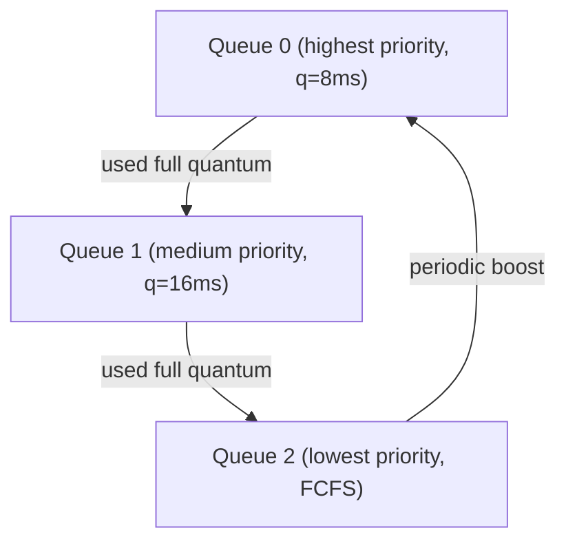

# CPU Scheduling

## Scheduling Metrics

:::eli10

Scheduling metrics are ways to measure how well the OS is doing at sharing the CPU. Turnaround time is how long it takes from when you submit a job to when it's done. Waiting time is how long you spent just sitting in the queue. Response time is how quickly the system first reacts to your request. We want to minimise waits and maximise the number of jobs completed.

:::

:::eli15

Scheduling performance is evaluated using several metrics. Turnaround time measures total time from arrival to completion (includes waiting + execution). Waiting time is the time spent in the ready queue (turnaround minus actual CPU burst). Response time is how quickly a process first gets the CPU after arriving — crucial for interactive systems. Throughput counts jobs completed per time unit. CPU utilisation measures what percentage of time the CPU is doing useful work. Different algorithms optimise different metrics, and there are inherent trade-offs between them.

:::

:::eli20

| Metric | Formula | Goal |
|--------|---------|------|
| **Turnaround Time** | $T_{\text{turnaround}} = T_{\text{completion}} - T_{\text{arrival}}$ | Minimise |
| **Waiting Time** | $T_{\text{waiting}} = T_{\text{turnaround}} - T_{\text{burst}}$ | Minimise |
| **Response Time** | $T_{\text{response}} = T_{\text{first run}} - T_{\text{arrival}}$ | Minimise |
| **Throughput** | $\frac{\text{jobs completed}}{\text{time unit}}$ | Maximise |
| **CPU Utilisation** | $\frac{T_{\text{busy}}}{T_{\text{total}}} \times 100\%$ | Maximise |

:::

## Scheduling Algorithms Comparison

:::eli10

There are many ways to decide who goes next on the CPU, just like there are many ways to organise a queue. You could serve in arrival order (FCFS), let the quickest job go next (SJF), give everyone equal short turns (Round Robin), or use a priority system. Each has pros and cons — no single approach is perfect for everything.

:::

:::eli15

The major scheduling algorithms each have distinct trade-offs. FCFS is simple but suffers from the convoy effect (short jobs stuck behind long ones). SJF/SRTF minimise average wait but can starve long jobs and require predicting burst lengths. Priority scheduling handles prioritised workloads but needs aging to prevent starvation. Round Robin provides fair response time but increases turnaround with small quanta. MLFQ combines these ideas: it uses multiple priority queues, demotes CPU-heavy processes, and periodically boosts all processes to prevent starvation.

:::

:::eli20

| Algorithm | Preemptive? | Starvation? | Optimal for | Weakness |
|-----------|:-----------:|:-----------:|-------------|----------|
| **FCFS** | No | No | Simplicity | Convoy effect |
| **SJF** | No | Yes (long jobs) | Min avg turnaround (non-preemptive) | Needs burst prediction |
| **SRTF** (preemptive SJF) | Yes | Yes | Min avg turnaround | Needs burst prediction |
| **Priority** | Both | Yes (low priority) | Prioritised workloads | Starvation without aging |
| **Round Robin** | Yes | No | Fairness / response time | High turnaround if quantum too small |
| **MLFQ** | Yes | No (with aging) | General purpose | Complex to tune |

:::

## First-Come First-Served (FCFS)

:::eli10

FCFS is like a regular queue at a shop — whoever arrives first gets served first, and nobody can cut in line. It's simple and fair, but if someone at the front takes forever, everyone behind them has to wait a really long time (the convoy effect).

:::

:::eli15

FCFS (First-Come First-Served) is the simplest scheduling algorithm: processes run in the order they arrive, each running to completion without interruption. The problem is the "convoy effect" — if a long job arrives first, all shorter jobs behind it experience very long waiting times. Average waiting time can be very poor. Despite its simplicity, FCFS is rarely used alone for CPU scheduling in interactive systems.

:::

:::eli20

- Non-preemptive: runs each process to completion
- **Convoy effect**: short processes stuck behind long ones

### Example

| Process | Arrival | Burst |
|---------|---------|-------|
| P1 | 0 | 24 |
| P2 | 0 | 3 |
| P3 | 0 | 3 |

Order: P1, P2, P3

| Process | Completion | Turnaround | Waiting |
|---------|-----------|------------|---------|
| P1 | 24 | 24 | 0 |
| P2 | 27 | 27 | 24 |
| P3 | 30 | 30 | 27 |

Avg Waiting = $(0 + 24 + 27)/3 = 17$

:::

## Shortest Job First (SJF) / Shortest Remaining Time First (SRTF)

:::eli10

SJF is like letting the person buying just one item go ahead of someone with a full trolley at the checkout. It's great for getting people through quickly on average, but someone with a full trolley might never get served if short-order people keep arriving. The big problem: you need to predict how long each job will take, which is hard.

:::

:::eli15

SJF selects the process with the shortest expected CPU burst next. Its preemptive variant, SRTF, can interrupt a running process if a new arrival has less remaining time. Both are provably optimal for minimising average waiting time, but they suffer from starvation of long processes and require predicting future burst lengths. Burst prediction typically uses exponential averaging: the next predicted burst is a weighted combination of the last actual burst and the previous prediction, controlled by parameter alpha.

:::

:::eli20

- SJF: non-preemptive, picks shortest burst next
- SRTF: preemptive, switches if new arrival has shorter remaining time
- Provably optimal for minimising average waiting time (non-preemptive case)
- Problem: future burst lengths unknown -- use exponential averaging:

$$\tau_{n+1} = \alpha \cdot t_n + (1 - \alpha) \cdot \tau_n$$

Where $t_n$ = actual burst, $\tau_n$ = predicted burst, $\alpha \in [0,1]$ (typically 0.5)

:::

## Priority Scheduling

:::eli10

Priority scheduling is like a hospital emergency room — the most critical patients get seen first, regardless of who arrived first. The problem is that someone with a minor issue might wait forever if emergencies keep coming. The fix (aging) is like gradually upgrading a waiting patient's urgency the longer they wait.

:::

:::eli15

Priority scheduling assigns each process a priority number, and the highest-priority process always runs next. It can be preemptive (a higher-priority arrival immediately interrupts the current process) or non-preemptive (waits until the current process voluntarily yields). The main problem is starvation: low-priority processes may never execute if high-priority ones keep arriving. Aging solves this by gradually increasing the priority of any process that has been waiting, ensuring everything eventually runs.

:::

:::eli20

- Each process assigned a priority (lower number = higher priority, by convention varies)
- Can be preemptive or non-preemptive
- **Starvation**: low-priority processes may never run
- **Solution -- Aging**: gradually increase priority of waiting processes

:::

## Round Robin (RR)

:::eli10

Round Robin is like taking turns in a game — everyone gets the same amount of time (a "quantum"), and when your time is up, you go to the back of the line and wait for your next turn. Nobody hogs the CPU, and everyone gets regular chances to run. The trick is choosing how long each turn should be.

:::

:::eli15

Round Robin gives each process a fixed time slice (quantum). When the quantum expires, the process is preempted and placed at the back of the ready queue. This guarantees bounded waiting time: with n processes and quantum q, the maximum wait before your next turn is (n-1) x q. If the quantum is too small, context-switch overhead dominates; if too large, it degenerates into FCFS. A good rule of thumb is that 80% of CPU bursts should be shorter than the quantum.

:::

:::eli20

- Each process gets a **time quantum** $q$
- After $q$ expires, process moves to back of ready queue
- If $n$ processes with quantum $q$: max wait = $(n-1) \times q$

### Choosing Quantum

| Quantum | Effect |
|---------|--------|
| Too small ($q \to 0$) | Excessive context switches, overhead dominates |
| Too large ($q \to \infty$) | Degenerates to FCFS |
| Rule of thumb | 80% of bursts should be < $q$ |

### Example

Processes: P1(burst=10), P2(burst=4), P3(burst=7), quantum $q=4$

```
| P1 | P2 | P3 | P1 | P3 | P1 |
0    4    8   12   16   19   21
```

:::

## Multilevel Feedback Queue (MLFQ)

:::eli10

MLFQ is like a theme park with express, normal, and slow lanes. Everyone starts in the express lane. If your ride takes too long, you get moved to the normal lane. If it takes even longer, you go to the slow lane. But periodically, everyone gets moved back to the express lane so nobody waits forever.

:::

:::eli15

The Multilevel Feedback Queue is the most sophisticated common scheduler, used in most real operating systems. It maintains multiple queues at different priority levels. New processes start at the highest priority. If a process uses its full time quantum (indicating CPU-bound behaviour), it gets demoted to a lower-priority queue with a larger quantum. If it voluntarily gives up the CPU early (indicating I/O-bound behaviour), it stays at the same level. Periodic "boosting" moves all processes back to the top queue to prevent starvation. This adaptively separates interactive processes (which stay high) from batch processes (which sink low).

:::

:::eli20

The most sophisticated common scheduler. Rules:

1. If Priority(A) > Priority(B), A runs
2. If Priority(A) = Priority(B), run in Round Robin
3. New jobs start at the highest priority queue
4. If a job uses its entire time quantum, demote it
5. If a job gives up CPU before quantum, stay at same level
6. **Periodically boost** all jobs to top queue (prevents starvation)



:::

## Gantt Chart Construction Steps

:::eli10

A Gantt chart is a timeline showing which process runs when. To make one, you just step through time, decide who runs at each moment based on the scheduling rules, and draw bars showing when each process is running. Then you calculate how long each process waited and how long it took overall.

:::

:::eli15

Constructing a Gantt chart is the standard way to trace scheduling algorithm behaviour. You list all processes with their arrival and burst times, then simulate the algorithm step by step: at each time point, determine which process the algorithm selects to run, and record the time intervals. From the completed chart, you can calculate all metrics: turnaround (completion - arrival), waiting (turnaround - burst), and response (first-run - arrival). This is essential for exam scheduling problems.

:::

:::eli20

1. List all processes with arrival time and burst time
2. At each time unit, determine which process to run based on algorithm
3. Record start and end times for each execution slice
4. Calculate metrics from the chart

<details>
<summary><strong>Practice: SRTF Scheduling</strong></summary>

**Q:** Schedule the following with SRTF:

| Process | Arrival | Burst |
|---------|---------|-------|
| P1 | 0 | 8 |
| P2 | 1 | 4 |
| P3 | 2 | 2 |
| P4 | 3 | 1 |

**A:** Gantt chart:
```
| P1 | P2 | P3 | P4 | P3 | P2 | P1 |
0    1    2    3    4    5    8   15
```

Wait -- let's be precise:
- t=0: Only P1, run P1 (remaining=8)
- t=1: P2 arrives (burst=4 < P1 remaining=7), preempt P1, run P2
- t=2: P3 arrives (burst=2 < P2 remaining=3), preempt P2, run P3
- t=3: P4 arrives (burst=1 < P3 remaining=1)... tie, P4 runs (or P3, depends on tie-breaking). Let's say P4 runs.
- t=4: P3 remaining=1, run P3
- t=5: P2 remaining=3, run P2
- t=8: P1 remaining=7, run P1
- t=15: done

| Process | Completion | Turnaround | Waiting |
|---------|-----------|------------|---------|
| P1 | 15 | 15 | 7 |
| P2 | 8 | 7 | 3 |
| P3 | 5 | 3 | 1 |
| P4 | 4 | 1 | 0 |

Avg Turnaround = $(15+7+3+1)/4 = 6.5$

</details>

<details>
<summary><strong>Practice: Round Robin</strong></summary>

**Q:** Given P1(burst=5), P2(burst=3), P3(burst=8), all arrive at t=0, quantum=3. Calculate average waiting time.

**A:** Gantt:
```
| P1 | P2 | P3 | P1 | P3 |
0    3    6    9   11   16
```

- P1: runs 0-3 (rem=2), runs 9-11. Completion=11, Waiting=11-5=6
- P2: runs 3-6. Completion=6, Waiting=6-3=3
- P3: runs 6-9 (rem=5), runs 11-16. Completion=16, Waiting=16-8=8

Avg Waiting = $(6+3+8)/3 = 5.67$

</details>

:::
