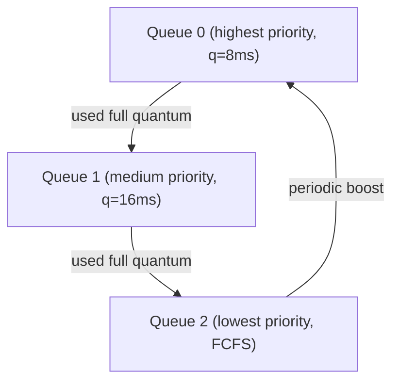

# CPU Scheduling

## Scheduling Metrics

| Metric | Formula | Goal |
|--------|---------|------|
| **Turnaround Time** | $T_{\text{turnaround}} = T_{\text{completion}} - T_{\text{arrival}}$ | Minimise |
| **Waiting Time** | $T_{\text{waiting}} = T_{\text{turnaround}} - T_{\text{burst}}$ | Minimise |
| **Response Time** | $T_{\text{response}} = T_{\text{first run}} - T_{\text{arrival}}$ | Minimise |
| **Throughput** | $\frac{\text{jobs completed}}{\text{time unit}}$ | Maximise |
| **CPU Utilisation** | $\frac{T_{\text{busy}}}{T_{\text{total}}} \times 100\%$ | Maximise |

## Scheduling Algorithms Comparison

| Algorithm | Preemptive? | Starvation? | Optimal for | Weakness |
|-----------|:-----------:|:-----------:|-------------|----------|
| **FCFS** | No | No | Simplicity | Convoy effect |
| **SJF** | No | Yes (long jobs) | Min avg turnaround (non-preemptive) | Needs burst prediction |
| **SRTF** (preemptive SJF) | Yes | Yes | Min avg turnaround | Needs burst prediction |
| **Priority** | Both | Yes (low priority) | Prioritised workloads | Starvation without aging |
| **Round Robin** | Yes | No | Fairness / response time | High turnaround if quantum too small |
| **MLFQ** | Yes | No (with aging) | General purpose | Complex to tune |

## First-Come First-Served (FCFS)

- Non-preemptive: runs each process to completion
- **Convoy effect**: short processes stuck behind long ones

### Example

| Process | Arrival | Burst |
|---------|---------|-------|
| P1 | 0 | 24 |
| P2 | 0 | 3 |
| P3 | 0 | 3 |

Order: P1, P2, P3

| Process | Completion | Turnaround | Waiting |
|---------|-----------|------------|---------|
| P1 | 24 | 24 | 0 |
| P2 | 27 | 27 | 24 |
| P3 | 30 | 30 | 27 |

Avg Waiting = $(0 + 24 + 27)/3 = 17$

## Shortest Job First (SJF) / Shortest Remaining Time First (SRTF)

- SJF: non-preemptive, picks shortest burst next
- SRTF: preemptive, switches if new arrival has shorter remaining time
- Provably optimal for minimising average waiting time (non-preemptive case)
- Problem: future burst lengths unknown -- use exponential averaging:

$$\tau_{n+1} = \alpha \cdot t_n + (1 - \alpha) \cdot \tau_n$$

Where $t_n$ = actual burst, $\tau_n$ = predicted burst, $\alpha \in [0,1]$ (typically 0.5)

## Priority Scheduling

- Each process assigned a priority (lower number = higher priority, by convention varies)
- Can be preemptive or non-preemptive
- **Starvation**: low-priority processes may never run
- **Solution -- Aging**: gradually increase priority of waiting processes

## Round Robin (RR)

- Each process gets a **time quantum** $q$
- After $q$ expires, process moves to back of ready queue
- If $n$ processes with quantum $q$: max wait = $(n-1) \times q$

### Choosing Quantum

| Quantum | Effect |
|---------|--------|
| Too small ($q \to 0$) | Excessive context switches, overhead dominates |
| Too large ($q \to \infty$) | Degenerates to FCFS |
| Rule of thumb | 80% of bursts should be < $q$ |

### Example

Processes: P1(burst=10), P2(burst=4), P3(burst=7), quantum $q=4$

```
| P1 | P2 | P3 | P1 | P3 | P1 |
0    4    8   12   16   19   21
```

## Multilevel Feedback Queue (MLFQ)

The most sophisticated common scheduler. Rules:

1. If Priority(A) > Priority(B), A runs
2. If Priority(A) = Priority(B), run in Round Robin
3. New jobs start at the highest priority queue
4. If a job uses its entire time quantum, demote it
5. If a job gives up CPU before quantum, stay at same level
6. **Periodically boost** all jobs to top queue (prevents starvation)



## Gantt Chart Construction Steps

1. List all processes with arrival time and burst time
2. At each time unit, determine which process to run based on algorithm
3. Record start and end times for each execution slice
4. Calculate metrics from the chart

<details>
<summary><strong>Practice: SRTF Scheduling</strong></summary>

**Q:** Schedule the following with SRTF:

| Process | Arrival | Burst |
|---------|---------|-------|
| P1 | 0 | 8 |
| P2 | 1 | 4 |
| P3 | 2 | 2 |
| P4 | 3 | 1 |

**A:** Gantt chart:
```
| P1 | P2 | P3 | P4 | P3 | P2 | P1 |
0    1    2    3    4    5    8   15
```

Wait -- let's be precise:
- t=0: Only P1, run P1 (remaining=8)
- t=1: P2 arrives (burst=4 < P1 remaining=7), preempt P1, run P2
- t=2: P3 arrives (burst=2 < P2 remaining=3), preempt P2, run P3
- t=3: P4 arrives (burst=1 < P3 remaining=1)... tie, P4 runs (or P3, depends on tie-breaking). Let's say P4 runs.
- t=4: P3 remaining=1, run P3
- t=5: P2 remaining=3, run P2
- t=8: P1 remaining=7, run P1
- t=15: done

| Process | Completion | Turnaround | Waiting |
|---------|-----------|------------|---------|
| P1 | 15 | 15 | 7 |
| P2 | 8 | 7 | 3 |
| P3 | 5 | 3 | 1 |
| P4 | 4 | 1 | 0 |

Avg Turnaround = $(15+7+3+1)/4 = 6.5$

</details>

<details>
<summary><strong>Practice: Round Robin</strong></summary>

**Q:** Given P1(burst=5), P2(burst=3), P3(burst=8), all arrive at t=0, quantum=3. Calculate average waiting time.

**A:** Gantt:
```
| P1 | P2 | P3 | P1 | P3 |
0    3    6    9   11   16
```

- P1: runs 0-3 (rem=2), runs 9-11. Completion=11, Waiting=11-5=6
- P2: runs 3-6. Completion=6, Waiting=6-3=3
- P3: runs 6-9 (rem=5), runs 11-16. Completion=16, Waiting=16-8=8

Avg Waiting = $(6+3+8)/3 = 5.67$

</details>
