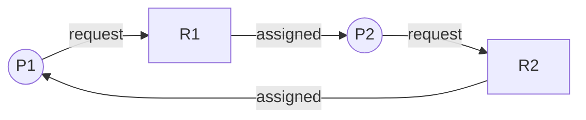

# Deadlock

## Definition

A set of processes is **deadlocked** if each process is waiting for a resource held by another process in the set, forming a circular dependency.

## Coffman Conditions (All 4 Required)

| # | Condition | Meaning |
|---|-----------|---------|
| 1 | **Mutual Exclusion** | At least one resource is non-shareable |
| 2 | **Hold and Wait** | A process holds resources while waiting for others |
| 3 | **No Preemption** | Resources cannot be forcibly taken away |
| 4 | **Circular Wait** | $P_0 \to P_1 \to P_2 \to \cdots \to P_n \to P_0$ |

> Deadlock occurs **if and only if** all four conditions hold simultaneously.

## Resource Allocation Graph (RAG)



| Element | Notation | Meaning |
|---------|----------|---------|
| Process | Circle | Active process |
| Resource | Square (with dots for instances) | Resource type |
| Request edge | Process -> Resource | Process wants resource |
| Assignment edge | Resource -> Process | Resource held by process |

**Deadlock detection from RAG:**
- Single instance per resource type: cycle = deadlock
- Multiple instances: cycle is necessary but not sufficient; use detection algorithm

## Handling Strategies

| Strategy | Approach | Trade-off |
|----------|----------|-----------|
| **Prevention** | Negate one Coffman condition | Restrictive, low utilisation |
| **Avoidance** | Dynamically check if request is safe | Requires advance knowledge |
| **Detection + Recovery** | Allow deadlock, detect and fix | Overhead of detection |
| **Ignore** (Ostrich) | Do nothing | Used in practice (Linux, Windows) |

## Deadlock Prevention

| Condition to Negate | Method | Drawback |
|--------------------|--------|----------|
| Mutual Exclusion | Use shareable resources (e.g., read-only files) | Not always possible |
| Hold and Wait | Request all resources at start; or release all before requesting | Low utilisation, starvation |
| No Preemption | If request denied, release all held resources | Only for save/restore resources (CPU, memory) |
| Circular Wait | Impose total ordering on resources, request in order | Programmer burden |

## Deadlock Avoidance: Banker's Algorithm

The system maintains a **safe state** where there exists at least one sequence in which all processes can complete.

### Data Structures

For $n$ processes and $m$ resource types:

| Structure | Dimensions | Description |
|-----------|-----------|-------------|
| **Available** | $1 \times m$ | Available instances of each resource |
| **Max** | $n \times m$ | Maximum demand of each process |
| **Allocation** | $n \times m$ | Currently allocated to each |
| **Need** | $n \times m$ | $\text{Need}[i] = \text{Max}[i] - \text{Allocation}[i]$ |

### Safety Algorithm

```
1. Work = Available; Finish[i] = false for all i
2. Find i such that Finish[i] == false AND Need[i] <= Work
3. If found: Work = Work + Allocation[i]; Finish[i] = true; goto 2
4. If all Finish[i] == true: SAFE; else UNSAFE
```

### Resource Request Algorithm

When process $P_i$ requests $\text{Request}_i$:
1. If $\text{Request}_i > \text{Need}_i$: error (exceeds max claim)
2. If $\text{Request}_i > \text{Available}$: wait
3. Pretend to allocate:
   - $\text{Available} = \text{Available} - \text{Request}_i$
   - $\text{Allocation}_i = \text{Allocation}_i + \text{Request}_i$
   - $\text{Need}_i = \text{Need}_i - \text{Request}_i$
4. Run safety algorithm. If safe: grant. If unsafe: rollback, make $P_i$ wait.

## Deadlock Detection

### Single Instance (Wait-For Graph)

- Collapse RAG by removing resource nodes
- $P_i \to P_j$ means $P_i$ waits for resource held by $P_j$
- Cycle in wait-for graph = deadlock

### Multiple Instances

Use algorithm similar to Banker's but with current requests instead of max need:

```
1. Work = Available; Finish[i] = false (if Allocation[i] != 0)
2. Find i: Finish[i] == false AND Request[i] <= Work
3. Work = Work + Allocation[i]; Finish[i] = true; goto 2
4. If any Finish[i] == false: those processes are deadlocked
```

## Deadlock Recovery

| Method | Description |
|--------|-------------|
| **Process termination** | Kill all deadlocked processes, or kill one at a time |
| **Resource preemption** | Take resources from a process; rollback that process |
| **Rollback** | Checkpoint processes; rollback to safe state |

Victim selection criteria: priority, resources held, time invested, how much longer needed.

<details>
<summary><strong>Practice: Banker's Algorithm</strong></summary>

**Q:** Given 3 resource types (A=10, B=5, C=7 total):

| Process | Allocation | Max | Need |
|---------|-----------|-----|------|
| P0 | 0,1,0 | 7,5,3 | 7,4,3 |
| P1 | 2,0,0 | 3,2,2 | 1,2,2 |
| P2 | 3,0,2 | 9,0,2 | 6,0,0 |
| P3 | 2,1,1 | 2,2,2 | 0,1,1 |
| P4 | 0,0,2 | 4,3,3 | 4,3,1 |

Available = (10-7, 5-2, 7-5) = (3, 3, 2). Is the system safe?

**A:** Find a safe sequence:
1. Work=(3,3,2). P1 needs (1,2,2) <= (3,3,2). Run P1. Work=(5,3,2).
2. P3 needs (0,1,1) <= (5,3,2). Run P3. Work=(7,4,3).
3. P4 needs (4,3,1) <= (7,4,3). Run P4. Work=(7,4,5).
4. P0 needs (7,4,3) <= (7,4,5). Run P0. Work=(7,5,5).
5. P2 needs (6,0,0) <= (7,5,5). Run P2. Work=(10,5,7).

Safe sequence: P1, P3, P4, P0, P2. **System is SAFE.**

</details>

<details>
<summary><strong>Practice: Identify deadlock from RAG</strong></summary>

**Q:** Given: P1 holds R1, requests R2. P2 holds R2, requests R3. P3 holds R3, requests R1. Is there deadlock?

**A:** Yes. There is a cycle: P1 -> R2 -> P2 -> R3 -> P3 -> R1 -> P1.

All four Coffman conditions hold:
1. Mutual exclusion: each R has 1 instance
2. Hold and wait: each P holds one, waits for another
3. No preemption: resources not forcibly taken
4. Circular wait: P1 -> P2 -> P3 -> P1

</details>
