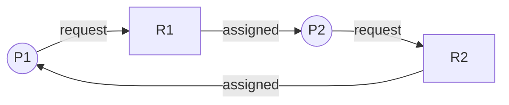

# Deadlock

## Definition

:::eli10

Deadlock is when two or more processes are stuck forever because each is waiting for something the other has. Imagine two kids each holding one half of a toy, both refusing to let go until they get the other half. Neither can finish, and they're stuck forever.

:::

:::eli15

Deadlock occurs when a set of processes form a circular dependency — each holds a resource that another needs, and none can proceed. For example, Process A holds Lock 1 and waits for Lock 2, while Process B holds Lock 2 and waits for Lock 1. Neither can continue, and without intervention, they'll wait forever. This is different from starvation (where a process waits but others make progress) — in deadlock, nobody makes progress.

:::

:::eli20

A set of processes is **deadlocked** if each process is waiting for a resource held by another process in the set, forming a circular dependency.

:::

## Coffman Conditions (All 4 Required)

:::eli10

For deadlock to happen, four things must all be true at the same time: (1) the resource can't be shared, (2) someone is holding one resource while asking for another, (3) you can't take a resource away from someone, and (4) there's a circle of waiting. If you break ANY one of these, deadlock can't happen.

:::

:::eli15

The four Coffman conditions must ALL hold simultaneously for deadlock to occur. Mutual exclusion: at least one resource is non-shareable. Hold and wait: a process holds some resources while requesting additional ones. No preemption: resources can't be forcibly taken. Circular wait: there exists a cycle of processes, each waiting for a resource held by the next. This gives us a clear framework: prevent deadlock by ensuring at least one condition can never hold, or detect deadlock by checking if all four hold.

:::

:::eli20

| # | Condition | Meaning |
|---|-----------|---------|
| 1 | **Mutual Exclusion** | At least one resource is non-shareable |
| 2 | **Hold and Wait** | A process holds resources while waiting for others |
| 3 | **No Preemption** | Resources cannot be forcibly taken away |
| 4 | **Circular Wait** | $P_0 \to P_1 \to P_2 \to \cdots \to P_n \to P_0$ |

> Deadlock occurs **if and only if** all four conditions hold simultaneously.

:::

## Resource Allocation Graph (RAG)

:::eli10

A Resource Allocation Graph is a picture showing who has what and who wants what. Circles are processes, squares are resources. Arrows show "I have this" or "I want this." If you can trace a circle following the arrows, there might be a deadlock — everyone in the circle is stuck waiting.

:::

:::eli15

A Resource Allocation Graph (RAG) visually represents the state of resource allocation. Processes are circles, resources are squares (with dots for multiple instances). Request edges go from process to resource (process wants it); assignment edges go from resource to process (process has it). For single-instance resources, a cycle in the RAG means deadlock exists. For multi-instance resources, a cycle is necessary but not sufficient — you need a more sophisticated detection algorithm.

:::

:::eli20



| Element | Notation | Meaning |
|---------|----------|---------|
| Process | Circle | Active process |
| Resource | Square (with dots for instances) | Resource type |
| Request edge | Process -> Resource | Process wants resource |
| Assignment edge | Resource -> Process | Resource held by process |

**Deadlock detection from RAG:**
- Single instance per resource type: cycle = deadlock
- Multiple instances: cycle is necessary but not sufficient; use detection algorithm

:::

## Handling Strategies

:::eli10

There are four ways to deal with deadlock: prevent it by making it impossible (strict rules), avoid it by being careful with every request (like a careful banker), detect it after it happens and fix it (kill a process or take back resources), or just ignore it and hope it doesn't happen (what most real computers do!).

:::

:::eli15

There are four strategies for handling deadlock. Prevention structurally eliminates one of the four Coffman conditions — safe but restrictive and can waste resources. Avoidance dynamically checks each request against a model of future behaviour (Banker's algorithm) — requires knowing maximum demands in advance. Detection and recovery allows deadlock to occur, periodically checks for it, and then resolves it (by killing processes or preempting resources). Ignoring (the "ostrich algorithm") is actually what most real OS's do — deadlocks are rare enough that the overhead of prevention/avoidance isn't worth it.

:::

:::eli20

| Strategy | Approach | Trade-off |
|----------|----------|-----------|
| **Prevention** | Negate one Coffman condition | Restrictive, low utilisation |
| **Avoidance** | Dynamically check if request is safe | Requires advance knowledge |
| **Detection + Recovery** | Allow deadlock, detect and fix | Overhead of detection |
| **Ignore** (Ostrich) | Do nothing | Used in practice (Linux, Windows) |

:::

## Deadlock Prevention

:::eli10

To prevent deadlock, you break one of the four rules that cause it. For example: make everyone request all their resources at the start (breaks hold-and-wait), or number all resources and always request them in order (breaks circular wait). Each approach has downsides but guarantees deadlock can never happen.

:::

:::eli15

Deadlock prevention works by structurally eliminating at least one Coffman condition. You can eliminate hold-and-wait by requiring processes to request all resources upfront (wastes resources, may cause starvation). You can eliminate no-preemption by forcibly reclaiming resources from waiting processes (only works for resources whose state can be saved, like CPU registers). You can eliminate circular wait by imposing a total ordering on resources and requiring all processes to request in that order (works well but requires discipline from programmers). Mutual exclusion can't always be eliminated since some resources are inherently non-shareable.

:::

:::eli20

| Condition to Negate | Method | Drawback |
|--------------------|--------|----------|
| Mutual Exclusion | Use shareable resources (e.g., read-only files) | Not always possible |
| Hold and Wait | Request all resources at start; or release all before requesting | Low utilisation, starvation |
| No Preemption | If request denied, release all held resources | Only for save/restore resources (CPU, memory) |
| Circular Wait | Impose total ordering on resources, request in order | Programmer burden |

:::

## Deadlock Avoidance: Banker's Algorithm

:::eli10

The Banker's Algorithm is like a careful bank that only lends money if it can guarantee everyone will eventually be paid back. Before giving a resource to a process, the OS pretends to give it and checks: "Can everyone still finish?" If yes, it's safe to grant. If no, the process has to wait. This prevents deadlock without being as restrictive as prevention.

:::

:::eli15

The Banker's Algorithm avoids deadlock by only granting resource requests that keep the system in a "safe state" — one where there exists at least one ordering in which all processes can complete. It maintains matrices tracking allocation, maximum need, and available resources. When a request arrives, it tentatively grants it and runs the safety algorithm: try to find a sequence of processes that can all finish using currently available resources (each finished process releases its resources for others). If such a sequence exists, the request is safe to grant; otherwise, the process must wait.

:::

:::eli20

The system maintains a **safe state** where there exists at least one sequence in which all processes can complete.

### Data Structures

For $n$ processes and $m$ resource types:

| Structure | Dimensions | Description |
|-----------|-----------|-------------|
| **Available** | $1 \times m$ | Available instances of each resource |
| **Max** | $n \times m$ | Maximum demand of each process |
| **Allocation** | $n \times m$ | Currently allocated to each |
| **Need** | $n \times m$ | $\text{Need}[i] = \text{Max}[i] - \text{Allocation}[i]$ |

### Safety Algorithm

```
1. Work = Available; Finish[i] = false for all i
2. Find i such that Finish[i] == false AND Need[i] <= Work
3. If found: Work = Work + Allocation[i]; Finish[i] = true; goto 2
4. If all Finish[i] == true: SAFE; else UNSAFE
```

### Resource Request Algorithm

When process $P_i$ requests $\text{Request}_i$:
1. If $\text{Request}_i > \text{Need}_i$: error (exceeds max claim)
2. If $\text{Request}_i > \text{Available}$: wait
3. Pretend to allocate:
   - $\text{Available} = \text{Available} - \text{Request}_i$
   - $\text{Allocation}_i = \text{Allocation}_i + \text{Request}_i$
   - $\text{Need}_i = \text{Need}_i - \text{Request}_i$
4. Run safety algorithm. If safe: grant. If unsafe: rollback, make $P_i$ wait.

:::

## Deadlock Detection

:::eli10

Instead of preventing or avoiding deadlock, the system can just let it happen and then check for it. For single-instance resources, just look for cycles in the waiting graph. For multiple instances, run an algorithm similar to the Banker's to see if everyone can still finish. If not, some processes are deadlocked.

:::

:::eli15

Deadlock detection runs periodically to check whether deadlock has occurred. For single-instance resources, construct a Wait-For Graph (collapse the RAG by removing resource nodes) — a cycle means deadlock. For multiple instances, an algorithm similar to Banker's checks if all processes can potentially finish with current requests and available resources. Processes that cannot finish are identified as deadlocked. The detection frequency is a trade-off: too often wastes CPU, too rare means deadlocks persist longer.

:::

:::eli20

### Single Instance (Wait-For Graph)

- Collapse RAG by removing resource nodes
- $P_i \to P_j$ means $P_i$ waits for resource held by $P_j$
- Cycle in wait-for graph = deadlock

### Multiple Instances

Use algorithm similar to Banker's but with current requests instead of max need:

```
1. Work = Available; Finish[i] = false (if Allocation[i] != 0)
2. Find i: Finish[i] == false AND Request[i] <= Work
3. Work = Work + Allocation[i]; Finish[i] = true; goto 2
4. If any Finish[i] == false: those processes are deadlocked
```

:::

## Deadlock Recovery

:::eli10

Once deadlock is found, you have to fix it — usually by "sacrificing" one process (killing it and taking back its resources so others can continue). You pick the victim based on which one would cause the least harm to lose. It's like breaking up a traffic jam by asking one car to back up.

:::

:::eli15

After detecting deadlock, recovery options include: terminating all deadlocked processes (guaranteed to work but loses all progress), terminating one at a time until the cycle breaks (less drastic but requires re-running detection), or preempting resources from a victim process (rolling it back to a checkpoint). Victim selection considers factors like priority, how much work would be lost, how many resources the process holds, and how close it is to completion. Care must be taken to avoid starvation — the same process shouldn't always be chosen as the victim.

:::

:::eli20

| Method | Description |
|--------|-------------|
| **Process termination** | Kill all deadlocked processes, or kill one at a time |
| **Resource preemption** | Take resources from a process; rollback that process |
| **Rollback** | Checkpoint processes; rollback to safe state |

Victim selection criteria: priority, resources held, time invested, how much longer needed.

<details>
<summary><strong>Practice: Banker's Algorithm</strong></summary>

**Q:** Given 3 resource types (A=10, B=5, C=7 total):

| Process | Allocation | Max | Need |
|---------|-----------|-----|------|
| P0 | 0,1,0 | 7,5,3 | 7,4,3 |
| P1 | 2,0,0 | 3,2,2 | 1,2,2 |
| P2 | 3,0,2 | 9,0,2 | 6,0,0 |
| P3 | 2,1,1 | 2,2,2 | 0,1,1 |
| P4 | 0,0,2 | 4,3,3 | 4,3,1 |

Available = (10-7, 5-2, 7-5) = (3, 3, 2). Is the system safe?

**A:** Find a safe sequence:
1. Work=(3,3,2). P1 needs (1,2,2) <= (3,3,2). Run P1. Work=(5,3,2).
2. P3 needs (0,1,1) <= (5,3,2). Run P3. Work=(7,4,3).
3. P4 needs (4,3,1) <= (7,4,3). Run P4. Work=(7,4,5).
4. P0 needs (7,4,3) <= (7,4,5). Run P0. Work=(7,5,5).
5. P2 needs (6,0,0) <= (7,5,5). Run P2. Work=(10,5,7).

Safe sequence: P1, P3, P4, P0, P2. **System is SAFE.**

</details>

<details>
<summary><strong>Practice: Identify deadlock from RAG</strong></summary>

**Q:** Given: P1 holds R1, requests R2. P2 holds R2, requests R3. P3 holds R3, requests R1. Is there deadlock?

**A:** Yes. There is a cycle: P1 -> R2 -> P2 -> R3 -> P3 -> R1 -> P1.

All four Coffman conditions hold:
1. Mutual exclusion: each R has 1 instance
2. Hold and wait: each P holds one, waits for another
3. No preemption: resources not forcibly taken
4. Circular wait: P1 -> P2 -> P3 -> P1

</details>

:::
