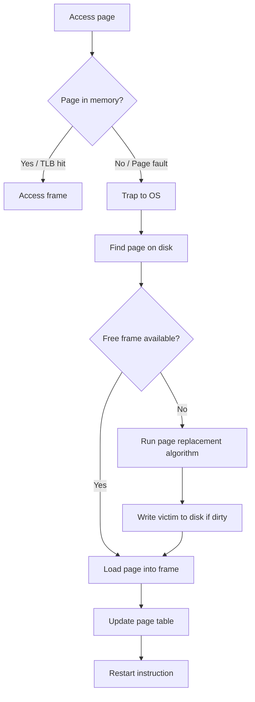

# Memory Management

## Address Binding

:::eli10

When a program is written, it doesn't know where in memory it will end up. Address binding is deciding when to figure that out. It could be decided when the program is compiled (fixed forever), when it's loaded into memory (flexible, but set once), or while it's running (most flexible — the OS can move it around).

:::

:::eli15

Address binding determines when the mapping from symbolic addresses in code to actual physical memory locations is resolved. Compile-time binding hardcodes absolute addresses (only works if the load address is known in advance). Load-time binding resolves addresses when the program is loaded (can go anywhere, but can't be moved afterward). Execution-time binding resolves addresses dynamically using hardware (the MMU), allowing the OS to relocate processes and implement virtual memory.

:::

:::eli20

| Binding Time | When | Flexibility |
|-------------|------|-------------|
| Compile time | Absolute addresses compiled in | None (must know load address) |
| Load time | Addresses resolved when loaded | Can load anywhere |
| Execution time | Addresses resolved at runtime via MMU | Full (can relocate, swap) |

:::

## Logical vs Physical Address

:::eli10

Every program thinks it has its own private memory starting from address 0 — that's the logical (virtual) address. But RAM has real physical addresses shared by everyone. The MMU is a translator that converts between the program's made-up addresses and the real ones, so each program gets its own private view of memory.

:::

:::eli15

Programs generate logical (virtual) addresses — these are the addresses the code works with. The actual hardware RAM uses physical addresses. The Memory Management Unit (MMU) is dedicated hardware that translates logical to physical addresses on every memory access, completely transparent to the program. This separation means each process can have its own address space starting from 0, multiple processes can share physical memory safely, and the OS can provide features like virtual memory and protection.

:::

:::eli20

| Concept | Description |
|---------|-------------|
| Logical (virtual) address | Generated by CPU; what the process "sees" |
| Physical address | Actual address in RAM |
| MMU | Hardware that translates logical -> physical |

:::

## Paging

:::eli10

Paging is like cutting memory into equal-sized cards (pages). The program's memory is split into cards, and RAM is split into card slots (frames). The cards don't have to go into sequential slots — they can be scattered anywhere. A page table is the index card that records which slot each card is in.

:::

:::eli15

Paging divides both logical memory and physical memory into fixed-size blocks — pages on the logical side and frames on the physical side (typically 4KB each). A page table maps each page number to a frame number. The key advantage is that pages can be placed in any available frame, eliminating external fragmentation. To translate an address: split it into page number (used to look up the frame) and offset (kept the same). For a 32-bit address with 4KB pages: the top 20 bits identify the page, and the bottom 12 bits are the offset within the page.

:::

:::eli20

Divides memory into fixed-size blocks:
- **Pages**: logical address space units (process side)
- **Frames**: physical memory units (RAM side)
- Typical page size: 4 KB

### Address Translation

For page size $= 2^n$ bytes and logical address space $= 2^m$:

$$\text{Logical Address} = [\underbrace{\text{Page Number}}_{m - n \text{ bits}}} \ | \ \underbrace{\text{Offset}}_{n \text{ bits}}]$$

$$\text{Physical Address} = [\text{Frame Number} \ | \ \text{Offset}]$$

The **page table** maps page number -> frame number.

### Example

- Logical address: 32 bits, page size: 4 KB ($2^{12}$)
- Page number: $32 - 12 = 20$ bits -> up to $2^{20}$ pages
- Offset: 12 bits

:::

## Page Table Structures

:::eli10

For a big computer with lots of memory, a single flat page table would be enormous. So we use tricks: two-level tables (a table of tables — like a book's table of contents with chapter sub-tables), inverted tables (one entry per physical frame instead of per page), or hash tables to save space.

:::

:::eli15

A single-level page table for a 32-bit address space with 4KB pages has 2^20 entries — manageable. But for 64-bit address spaces, a flat table would be impossibly large. Solutions include hierarchical (multi-level) page tables, which only allocate table pages for address ranges actually in use; inverted page tables, which have one entry per physical frame (saving space but making lookups harder); and hashed page tables for sparse address spaces. Two-level paging splits the page number into two indices: one for the outer table (page directory) and one for the inner table.

:::

:::eli20

| Structure | Description | Use Case |
|-----------|-------------|----------|
| Single-level | One flat table | Small address spaces |
| Two-level (hierarchical) | Table of tables | 32-bit systems |
| Inverted | One entry per frame, indexed by (PID, page) | Large address spaces (saves memory) |
| Hashed | Hash table of page entries | Sparse address spaces |

### Two-Level Page Table

For 32-bit address, 4KB pages:
- Level 1 (page directory): top 10 bits
- Level 2 (page table): middle 10 bits
- Offset: bottom 12 bits

:::

## Translation Lookaside Buffer (TLB)

:::eli10

Looking up the page table in memory for every single memory access would be too slow (it doubles the time!). The TLB is a tiny super-fast memory cache that remembers recent page-to-frame translations. Almost all lookups (99%+) find what they need in the TLB, so memory access stays fast.

:::

:::eli15

The TLB is a small, very fast hardware cache (typically 64-1024 entries) that stores recent page table lookups. Since programs tend to access the same pages repeatedly (locality), the TLB hit rate exceeds 99% in practice. On a hit, translation takes just 1ns (TLB access) versus 100+ns for a page table lookup in main memory. On a miss, the page table must be consulted in memory, adding an extra memory access. The Effective Access Time formula accounts for this: it weights the fast TLB-hit path and the slower miss path by their probabilities.

:::

:::eli20

A **TLB** is a small, fast hardware cache of recent page table entries.

| Property | Value |
|----------|-------|
| Size | 64-1024 entries |
| Access time | ~1 ns (vs ~100 ns for memory) |
| Hit rate | > 99% typical |

### Effective Access Time (EAT)

$$\text{EAT} = h \cdot (T_{\text{TLB}} + T_{\text{mem}}) + (1-h) \cdot (T_{\text{TLB}} + 2 \cdot T_{\text{mem}})$$

Where $h$ = TLB hit rate, and a miss requires one extra memory access for the page table.

With TLB miss and page fault:
$$\text{EAT} = (1-p) \cdot T_{\text{memory access}} + p \cdot T_{\text{page fault}}$$

:::

## Segmentation

:::eli10

Segmentation divides a program's memory into logical pieces: code, data, stack, and heap. Unlike paging (fixed-size pieces), segments can be different sizes — matching how you naturally think about a program's parts. It's like having separate drawers for different types of things rather than one fixed grid.

:::

:::eli15

Segmentation divides the logical address space into variable-sized segments based on logical units (code, data, stack, heap). Each segment has a base address and a limit (size). An address is <segment number, offset>, and the segment table maps each segment to its base and limit in physical memory. Unlike paging, segmentation matches the programmer's view of memory and supports sharing at logical granularity (e.g., share the code segment). The downside is external fragmentation — variable-size segments leave gaps between them in physical memory.

:::

:::eli20

Divides logical address space into **segments** of variable size based on logical units:

| Segment | Content |
|---------|---------|
| Code | Program instructions |
| Data | Global variables |
| Stack | Function call frames |
| Heap | Dynamic allocations |

Address: `<segment number, offset>`

**Segment table**: maps segment -> (base, limit)

### Paging vs Segmentation

| Aspect | Paging | Segmentation |
|--------|--------|--------------|
| Unit size | Fixed | Variable |
| Fragmentation | Internal | External |
| Visible to programmer | No | Yes (logical divisions) |
| Sharing | At page granularity | At segment granularity |

:::

## Virtual Memory

:::eli10

Virtual memory is a trick that lets programs use more memory than the computer actually has. Instead of loading the entire program into RAM, it only loads the parts currently being used. Unused parts stay on the hard drive and get loaded when needed (causing a "page fault" — like fetching a book from a library shelf when you need it).

:::

:::eli15

Virtual memory allows processes to use more memory than physically available by keeping only actively-used pages in RAM and storing the rest on disk. Demand paging loads pages only when they're first accessed (lazy loading). When a process accesses a page not in memory, a page fault occurs: the OS traps, finds the page on disk, loads it into a free frame (or evicts another page to make room), updates the page table, and restarts the instruction. Page table entries include bits for validity (in memory?), dirty (modified?), and referenced (recently used?) to support these decisions.

:::

:::eli20

Allows execution of processes not entirely in memory.

**Key idea:** Only load pages when needed (**demand paging**).

### Page Fault Handling

### Page Table Entry (PTE) Bits

| Bit | Purpose |
|-----|---------|
| Valid/Present | Page in physical memory? |
| Dirty (Modified) | Page written to since loaded? |
| Referenced (Access) | Page accessed recently? |
| Protection | Read/Write/Execute permissions |
| Frame number | Physical frame location |

:::

## Page Replacement Algorithms

:::eli10

When RAM is full and a new page needs to come in, one existing page must leave — like musical chairs. The question is: which page should you kick out? The best strategy (Optimal) would be to kick out the one you won't need for the longest time, but you'd need to see the future. LRU (Least Recently Used) is practical — kick out the one you haven't used in the longest time, betting you won't need it again soon.

:::

:::eli15

When a page fault occurs and no free frame exists, the OS must choose a victim page to evict. Optimal (OPT) replaces the page that won't be used for the longest time — theoretically best but impossible (requires future knowledge; used as a benchmark). FIFO replaces the oldest page — simple but can suffer from Belady's anomaly (more frames sometimes cause more faults). LRU replaces the page unused for the longest time — good approximation of optimal and never exhibits Belady's anomaly, but expensive to implement exactly. Clock (Second Chance) approximates LRU cheaply using a reference bit and circular scan.

:::

:::eli20

| Algorithm | Description | Belady's Anomaly? |
|-----------|-------------|:-----------------:|
| **Optimal (OPT)** | Replace page not used for longest time in future | No |
| **FIFO** | Replace oldest page | Yes |
| **LRU** | Replace least recently used page | No |
| **Clock (Second Chance)** | FIFO with reference bit check | Yes (variant) |
| **LFU** | Replace least frequently used | No |

### FIFO Example

Reference string: 7, 0, 1, 2, 0, 3, 0, 4, 2, 3 (3 frames)

| Ref | Frame 1 | Frame 2 | Frame 3 | Fault? |
|-----|---------|---------|---------|:------:|
| 7 | 7 | - | - | F |
| 0 | 7 | 0 | - | F |
| 1 | 7 | 0 | 1 | F |
| 2 | 2 | 0 | 1 | F |
| 0 | 2 | 0 | 1 | - |
| 3 | 2 | 3 | 1 | F |
| 0 | 2 | 3 | 0 | F |
| 4 | 4 | 3 | 0 | F |
| 2 | 4 | 2 | 0 | F |
| 3 | 4 | 2 | 3 | F |

Total faults: 9

### LRU Example (same string, 3 frames)

| Ref | Frame 1 | Frame 2 | Frame 3 | Fault? |
|-----|---------|---------|---------|:------:|
| 7 | 7 | - | - | F |
| 0 | 7 | 0 | - | F |
| 1 | 7 | 0 | 1 | F |
| 2 | 2 | 0 | 1 | F |
| 0 | 2 | 0 | 1 | - |
| 3 | 2 | 0 | 3 | F |
| 0 | 2 | 0 | 3 | - |
| 4 | 4 | 0 | 3 | F |
| 2 | 4 | 0 | 2 | F |
| 3 | 4 | 3 | 2 | F |

Total faults: 8

### Belady's Anomaly

> With FIFO, increasing frames can **increase** page faults. Example: reference string 1,2,3,4,1,2,5,1,2,3,4,5 has more faults with 4 frames than 3.

**Stack algorithms** (LRU, OPT) never exhibit Belady's anomaly.

:::

## Thrashing

:::eli10

Thrashing is when the computer spends almost all its time loading and unloading pages instead of doing actual work — like constantly running to the bookshelf and never sitting down to read. It happens when too many programs are fighting over too little RAM. The fix is to make sure each program gets enough frames to hold its "working set" of actively-used pages.

:::

:::eli15

Thrashing occurs when the system spends more time handling page faults than executing useful instructions. This happens when processes don't have enough frames to hold their working set (the pages they're actively using). The CPU appears idle, so the OS admits more processes, which makes thrashing worse — a vicious cycle. The solution is the Working Set Model: track which pages each process has referenced in the last delta time units (its working set), and ensure it has at least that many frames. If the total working sets exceed available memory, suspend some processes.

:::

:::eli20

When a process spends more time paging than executing:
- Cause: too many processes, not enough frames per process
- Solution: **Working Set Model** -- keep enough frames to cover the working set

$$\text{Working Set } W(t, \Delta) = \text{pages referenced in last } \Delta \text{ time units}$$

<strong>Practice: EAT calculation</strong>

**Q:** TLB hit rate = 98%, TLB access = 2ns, memory access = 100ns. What is the EAT?

**A:**
$$\text{EAT} = 0.98 \times (2 + 100) + 0.02 \times (2 + 100 + 100)$$
$$= 0.98 \times 102 + 0.02 \times 202$$
$$= 99.96 + 4.04 = 104 \text{ ns}$$

Without TLB: 200 ns. Speedup factor: $200/104 \approx 1.92\times$

<strong>Practice: Optimal page replacement</strong>

**Q:** Reference string: 1, 2, 3, 4, 1, 2, 5, 1, 2, 3, 4, 5. Frames = 3. How many faults with OPT?

**A:** Trace:
| Ref | Frames | Fault? | Victim (why) |
|-----|--------|:------:|------|
| 1 | {1} | F | - |
| 2 | {1,2} | F | - |
| 3 | {1,2,3} | F | - |
| 4 | {1,2,4} | F | Replace 3 (not used until position 10) |
| 1 | {1,2,4} | - | - |
| 2 | {1,2,4} | - | - |
| 5 | {1,2,5} | F | Replace 4 (not used until position 11) |
| 1 | {1,2,5} | - | - |
| 2 | {1,2,5} | - | - |
| 3 | {1,3,5} | F | Replace 2 (not used again? Actually check...) let's recalculate |

Actually let me redo carefully looking forward from each point:
- Position 4 (ref=4): frames={1,2,3}. Future: 1@5,2@6,3@10. Evict 3 (furthest). Frames={1,2,4}
- Position 7 (ref=5): frames={1,2,4}. Future: 1@8,2@9,4@11. Evict 4. Frames={1,2,5}
- Position 10 (ref=3): frames={1,2,5}. Future: 1=none,2=none,5@12. Evict 1 or 2. Frames={2,3,5}
- Position 11 (ref=4): frames={2,3,5}. Future: 2=none,3=none,5@12. Evict 2 or 3. Frames={3,4,5}

Total faults: 7

:::
