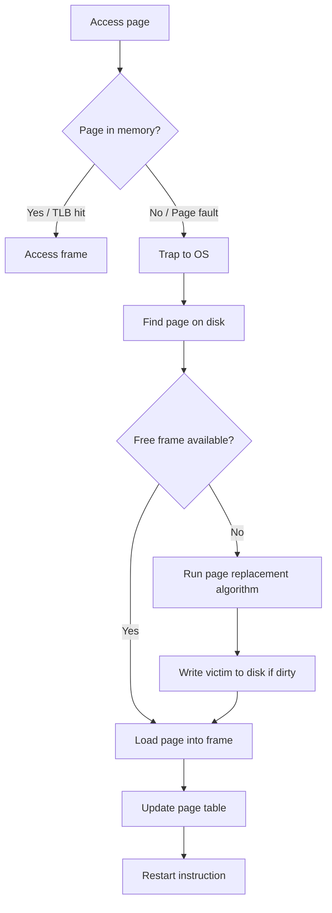

# Memory Management

## Address Binding

| Binding Time | When | Flexibility |
|-------------|------|-------------|
| Compile time | Absolute addresses compiled in | None (must know load address) |
| Load time | Addresses resolved when loaded | Can load anywhere |
| Execution time | Addresses resolved at runtime via MMU | Full (can relocate, swap) |

## Logical vs Physical Address

| Concept | Description |
|---------|-------------|
| Logical (virtual) address | Generated by CPU; what the process "sees" |
| Physical address | Actual address in RAM |
| MMU | Hardware that translates logical -> physical |

## Paging

Divides memory into fixed-size blocks:
- **Pages**: logical address space units (process side)
- **Frames**: physical memory units (RAM side)
- Typical page size: 4 KB

### Address Translation

For page size $= 2^n$ bytes and logical address space $= 2^m$:

$$\text{Logical Address} = [\underbrace{\text{Page Number}}_{m - n \text{ bits}}} \ | \ \underbrace{\text{Offset}}_{n \text{ bits}}]$$

$$\text{Physical Address} = [\text{Frame Number} \ | \ \text{Offset}]$$

The **page table** maps page number -> frame number.

### Example

- Logical address: 32 bits, page size: 4 KB ($2^{12}$)
- Page number: $32 - 12 = 20$ bits -> up to $2^{20}$ pages
- Offset: 12 bits

## Page Table Structures

| Structure | Description | Use Case |
|-----------|-------------|----------|
| Single-level | One flat table | Small address spaces |
| Two-level (hierarchical) | Table of tables | 32-bit systems |
| Inverted | One entry per frame, indexed by (PID, page) | Large address spaces (saves memory) |
| Hashed | Hash table of page entries | Sparse address spaces |

### Two-Level Page Table

For 32-bit address, 4KB pages:
- Level 1 (page directory): top 10 bits
- Level 2 (page table): middle 10 bits
- Offset: bottom 12 bits

## Translation Lookaside Buffer (TLB)

A **TLB** is a small, fast hardware cache of recent page table entries.

| Property | Value |
|----------|-------|
| Size | 64-1024 entries |
| Access time | ~1 ns (vs ~100 ns for memory) |
| Hit rate | > 99% typical |

### Effective Access Time (EAT)

$$\text{EAT} = h \cdot (T_{\text{TLB}} + T_{\text{mem}}) + (1-h) \cdot (T_{\text{TLB}} + 2 \cdot T_{\text{mem}})$$

Where $h$ = TLB hit rate, and a miss requires one extra memory access for the page table.

With TLB miss and page fault:
$$\text{EAT} = (1-p) \cdot T_{\text{memory access}} + p \cdot T_{\text{page fault}}$$

## Segmentation

Divides logical address space into **segments** of variable size based on logical units:

| Segment | Content |
|---------|---------|
| Code | Program instructions |
| Data | Global variables |
| Stack | Function call frames |
| Heap | Dynamic allocations |

Address: `<segment number, offset>`

**Segment table**: maps segment -> (base, limit)

### Paging vs Segmentation

| Aspect | Paging | Segmentation |
|--------|--------|--------------|
| Unit size | Fixed | Variable |
| Fragmentation | Internal | External |
| Visible to programmer | No | Yes (logical divisions) |
| Sharing | At page granularity | At segment granularity |

## Virtual Memory

Allows execution of processes not entirely in memory.

**Key idea:** Only load pages when needed (**demand paging**).

### Page Fault Handling

### Page Table Entry (PTE) Bits

| Bit | Purpose |
|-----|---------|
| Valid/Present | Page in physical memory? |
| Dirty (Modified) | Page written to since loaded? |
| Referenced (Access) | Page accessed recently? |
| Protection | Read/Write/Execute permissions |
| Frame number | Physical frame location |

## Page Replacement Algorithms

| Algorithm | Description | Belady's Anomaly? |
|-----------|-------------|:-----------------:|
| **Optimal (OPT)** | Replace page not used for longest time in future | No |
| **FIFO** | Replace oldest page | Yes |
| **LRU** | Replace least recently used page | No |
| **Clock (Second Chance)** | FIFO with reference bit check | Yes (variant) |
| **LFU** | Replace least frequently used | No |

### FIFO Example

Reference string: 7, 0, 1, 2, 0, 3, 0, 4, 2, 3 (3 frames)

| Ref | Frame 1 | Frame 2 | Frame 3 | Fault? |
|-----|---------|---------|---------|:------:|
| 7 | 7 | - | - | F |
| 0 | 7 | 0 | - | F |
| 1 | 7 | 0 | 1 | F |
| 2 | 2 | 0 | 1 | F |
| 0 | 2 | 0 | 1 | - |
| 3 | 2 | 3 | 1 | F |
| 0 | 2 | 3 | 0 | F |
| 4 | 4 | 3 | 0 | F |
| 2 | 4 | 2 | 0 | F |
| 3 | 4 | 2 | 3 | F |

Total faults: 9

### LRU Example (same string, 3 frames)

| Ref | Frame 1 | Frame 2 | Frame 3 | Fault? |
|-----|---------|---------|---------|:------:|
| 7 | 7 | - | - | F |
| 0 | 7 | 0 | - | F |
| 1 | 7 | 0 | 1 | F |
| 2 | 2 | 0 | 1 | F |
| 0 | 2 | 0 | 1 | - |
| 3 | 2 | 0 | 3 | F |
| 0 | 2 | 0 | 3 | - |
| 4 | 4 | 0 | 3 | F |
| 2 | 4 | 0 | 2 | F |
| 3 | 4 | 3 | 2 | F |

Total faults: 8

### Belady's Anomaly

> With FIFO, increasing frames can **increase** page faults. Example: reference string 1,2,3,4,1,2,5,1,2,3,4,5 has more faults with 4 frames than 3.

**Stack algorithms** (LRU, OPT) never exhibit Belady's anomaly.

## Thrashing

When a process spends more time paging than executing:
- Cause: too many processes, not enough frames per process
- Solution: **Working Set Model** -- keep enough frames to cover the working set

$$\text{Working Set } W(t, \Delta) = \text{pages referenced in last } \Delta \text{ time units}$$

<strong>Practice: EAT calculation</strong>

**Q:** TLB hit rate = 98%, TLB access = 2ns, memory access = 100ns. What is the EAT?

**A:**
$$\text{EAT} = 0.98 \times (2 + 100) + 0.02 \times (2 + 100 + 100)$$
$$= 0.98 \times 102 + 0.02 \times 202$$
$$= 99.96 + 4.04 = 104 \text{ ns}$$

Without TLB: 200 ns. Speedup factor: $200/104 \approx 1.92\times$

<strong>Practice: Optimal page replacement</strong>

**Q:** Reference string: 1, 2, 3, 4, 1, 2, 5, 1, 2, 3, 4, 5. Frames = 3. How many faults with OPT?

**A:** Trace:
| Ref | Frames | Fault? | Victim (why) |
|-----|--------|:------:|------|
| 1 | {1} | F | - |
| 2 | {1,2} | F | - |
| 3 | {1,2,3} | F | - |
| 4 | {1,2,4} | F | Replace 3 (not used until position 10) |
| 1 | {1,2,4} | - | - |
| 2 | {1,2,4} | - | - |
| 5 | {1,2,5} | F | Replace 4 (not used until position 11) |
| 1 | {1,2,5} | - | - |
| 2 | {1,2,5} | - | - |
| 3 | {1,3,5} | F | Replace 2 (not used again? Actually check...) let's recalculate |

Actually let me redo carefully looking forward from each point:
- Position 4 (ref=4): frames={1,2,3}. Future: 1@5,2@6,3@10. Evict 3 (furthest). Frames={1,2,4}
- Position 7 (ref=5): frames={1,2,4}. Future: 1@8,2@9,4@11. Evict 4. Frames={1,2,5}
- Position 10 (ref=3): frames={1,2,5}. Future: 1=none,2=none,5@12. Evict 1 or 2. Frames={2,3,5}
- Position 11 (ref=4): frames={2,3,5}. Future: 2=none,3=none,5@12. Evict 2 or 3. Frames={3,4,5}

Total faults: 7

