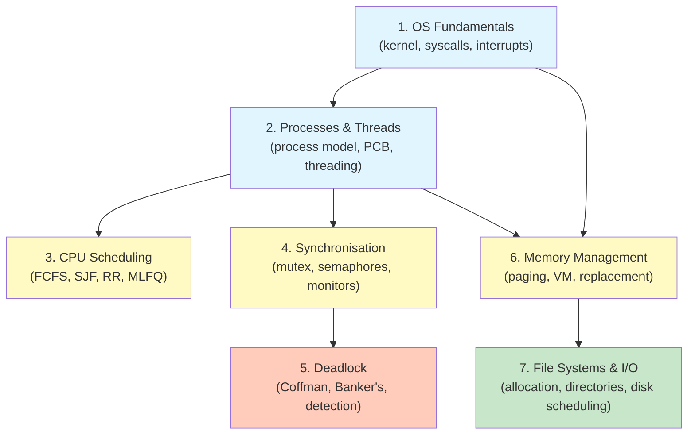

# Study Order

## Dependency Graph

## Recommended Study Plan

### Phase 1: Foundations (Days 1-2)

| Topic | Focus | Time |
|-------|-------|------|
| OS Fundamentals | Kernel vs user mode, system call mechanism, interrupt flow | 2-3 hours |
| Processes & Threads | Process states, PCB, fork(), thread models | 3-4 hours |

### Phase 2: CPU Management (Days 3-4)

| Topic | Focus | Time |
|-------|-------|------|
| Scheduling | Practice Gantt charts for all algorithms. Do 5+ numerical problems. | 4-5 hours |
| Synchronisation | Understand producer-consumer, readers-writers. Code semaphore solutions. | 4-5 hours |

### Phase 3: Advanced Concurrency (Day 5)

| Topic | Focus | Time |
|-------|-------|------|
| Deadlock | Banker's algorithm (do 3+ full examples), RAG cycles | 3-4 hours |

### Phase 4: Memory & Storage (Days 6-7)

| Topic | Focus | Time |
|-------|-------|------|
| Memory Management | Page table calculations, EAT, page replacement traces | 4-5 hours |
| File Systems & I/O | inode math, disk scheduling traces | 2-3 hours |

### Phase 5: Integration (Day 8)

| Activity | Time |
|----------|------|
| Practice past papers | 3-4 hours |
| Review exam traps & quick reference | 1 hour |
| Redo any weak areas | 2 hours |

## Topic Connections

Understanding how topics relate helps with exam questions that span multiple areas:

| Connection | Example |
|-----------|---------|
| Scheduling + Synchronisation | Priority inversion: low-priority thread holds lock needed by high-priority thread |
| Memory + Processes | `fork()` uses copy-on-write paging; context switch may flush TLB |
| Deadlock + Synchronisation | Improper semaphore ordering causes deadlock |
| File Systems + Memory | Memory-mapped files (mmap) bridge both; page cache |
| Scheduling + Memory | Thrashing detection uses CPU utilisation; working set affects scheduling |

## Self-Assessment Checklist

Before the exam, ensure you can:

- [ ] Draw the 5-state process diagram from memory
- [ ] Construct a Gantt chart for any scheduling algorithm
- [ ] Solve a Banker's algorithm problem in under 5 minutes
- [ ] Write semaphore solutions for producer-consumer and readers-writers
- [ ] Calculate EAT given TLB hit rate and page fault rate
- [ ] Trace FIFO, LRU, and OPT page replacement for a reference string
- [ ] Calculate max file size from inode structure
- [ ] Identify all four Coffman conditions in a scenario
- [ ] Explain why Mesa semantics requires `while` not `if`
- [ ] Calculate total seek distance for SCAN, C-SCAN, SSTF
