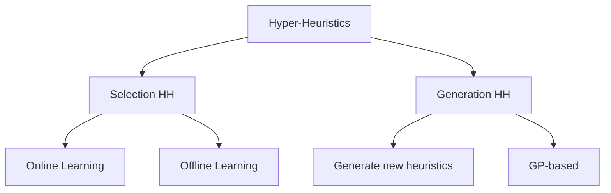

## What are Hyper-Heuristics?

:::eli10

A hyper-heuristic is like a manager that decides which tool to use for each step of a job, rather than doing the job itself. Instead of searching for the best solution directly, it searches for the best strategy (which heuristics to use and when). It's a "heuristic for choosing heuristics" — one level above the actual problem-solving tools.

:::

:::eli15

A hyper-heuristic operates at a higher level than a metaheuristic — instead of searching the solution space directly, it searches the space of heuristics to find the best strategy for solving a problem. Given a set of low-level heuristics (e.g., 2-opt, swap, insert), the hyper-heuristic decides which one to apply at each step based on their recent performance. The key motivation is generality: the same hyper-heuristic framework can work across completely different problem domains without redesign, because it only sees fitness changes, not problem details. This reduces the expertise needed to solve new problems.

:::

:::eli20

A hyper-heuristic is a **heuristic to choose heuristics** — it operates in the heuristic space rather than directly in the solution space.

### Key Distinction

| Level | Operates on | Example |
|-------|------------|---------|
| Low-level heuristic | Solutions | 2-opt, bit-flip, swap |
| Hyper-heuristic | Heuristics | Choose which low-level heuristic to apply |

### Motivation

| Problem | With manual algorithm design | With hyper-heuristics |
|---------|------------------------------|---------------------|
| New problem arrives | Design new algorithm from scratch | Reuse framework, provide heuristic set |
| Generality | Algorithm tuned to specific instance | Adapts across instances |
| Expertise needed | High | Lower |

:::

## Classification

:::eli10

There are two main types of hyper-heuristics. Selection hyper-heuristics choose which existing tool to use (like picking from a toolbox). Generation hyper-heuristics actually create brand new tools that never existed before (like inventing a new wrench using building blocks). Generation ones often use genetic programming to evolve new heuristics from basic operations.

:::

:::eli15

Hyper-heuristics are classified into two main types. Selection hyper-heuristics choose from a fixed set of existing heuristics at each step — the challenge is learning which heuristic works best in different search states. They can learn online (during a single run) or offline (from training data). Generation hyper-heuristics create entirely new heuristics, typically using genetic programming to evolve programs from primitive operations. Generation HHs can discover novel strategies humans haven't considered, though they require more computational investment upfront.

:::

:::eli20



| Type | What it does | Example |
|------|-------------|---------|
| Selection HH | Choose from existing heuristics | Pick best operator at each step |
| Generation HH | Create new heuristics | GP evolves new operators |

:::

## Selection Hyper-Heuristics

:::eli10

A selection hyper-heuristic works in a loop: pick a tool from the toolbox, try it, see if it helped, and learn from the result. Simple approaches pick randomly; smarter ones track which tools have been working well recently (like the Choice Function) or treat it as a gambler's problem — balancing trying new things versus sticking with what works (Multi-Armed Bandit).

:::

:::eli15

Selection hyper-heuristics repeatedly make two decisions: which heuristic to apply, and whether to accept the result. Simple approaches include random selection (baseline with no learning), greedy (try all heuristics and keep the best result — thorough but expensive), and random descent (random choice, accept only improvements). Adaptive approaches include the Choice Function (scores each heuristic based on recent individual performance, pair performance, and time since last use), reinforcement learning (reward/punish heuristics based on outcomes), and Multi-Armed Bandit methods (UCB1 formula balances exploitation of good heuristics with exploration of under-tested ones).

:::

:::eli20

### Framework

```
1. Initialise solution s
2. Repeat until stopping condition:
   a. SELECTION: Choose heuristic h from set H
   b. APPLY: s' ← h(s)
   c. ACCEPTANCE: Decide whether to accept s'
   d. UPDATE: Learn from outcome
3. Return best solution found
```

Two key decisions: **which heuristic** and **whether to accept**.

### Heuristic Selection Methods

| Method | Mechanism | Properties |
|--------|-----------|------------|
| Simple Random | Uniform random choice | No learning; baseline |
| Random Descent | Random choice; accept only improvements | Simple; gets stuck |
| Random Permutation | Cycle through heuristics in random order | Fair; no adaptation |
| Greedy | Apply all; keep best result | Expensive; exploitative |
| Choice Function (CF) | Score based on recent performance | Adaptive; balances operators |
| Reinforcement Learning | Reward/punish based on outcome | Learns over time |
| Multi-Armed Bandit | Explore/exploit trade-off | UCB, epsilon-greedy |

### Choice Function

Score for heuristic $h_i$:

$$CF(h_i) = \alpha \cdot f_1(h_i) + \beta \cdot f_2(h_i, h_j) + \gamma \cdot f_3(h_i)$$

| Component | Measures |
|-----------|----------|
| $f_1(h_i)$ | Recent individual performance of $h_i$ |
| $f_2(h_i, h_j)$ | Performance of pair $(h_j, h_i)$ — sequence effect |
| $f_3(h_i)$ | Time since $h_i$ was last called (diversity) |

Parameters $\alpha, \beta, \gamma$ adapt during search.

### Reinforcement Learning Approach

| Event | Action |
|-------|--------|
| Heuristic improves solution | Increase its score/weight |
| Heuristic worsens solution | Decrease its score/weight |
| Selection | Choose proportional to scores |

### Multi-Armed Bandit

Each heuristic = one arm. Balance exploration (try less-used heuristics) vs exploitation (use best-performing).

**UCB1** score for heuristic $i$:

$$\text{UCB}_i = \bar{x}_i + C\sqrt{\frac{\ln N}{n_i}}$$

where $\bar{x}_i$ = average reward, $N$ = total plays, $n_i$ = plays of arm $i$.

:::

## Move Acceptance in Hyper-Heuristics

:::eli10

After a hyper-heuristic applies a chosen tool, it still needs to decide whether to keep the result — using the same acceptance methods as regular metaheuristics (like SA-based acceptance, Great Deluge, or LAHC). This acceptance decision is separate from the heuristic selection decision.

:::

:::eli15

The acceptance component of a hyper-heuristic decides whether to keep the result of applying the chosen heuristic. The same acceptance methods from single-point search apply: only improving (conservative, gets stuck), all moves (explores aggressively), SA-based (most common balanced choice), Great Deluge (few parameters), or LAHC (simple and effective). The acceptance method and selection method work together — a permissive acceptance can compensate for a conservative selection strategy and vice versa.

:::

:::eli20

Same acceptance methods apply:

| Method | Use case |
|--------|----------|
| Only Improving | Conservative; gets stuck |
| All Moves | Aggressive exploration |
| SA-based | Balanced; most common |
| Great Deluge | Parameter-light alternative |
| LAHC | Simple; effective |

:::

## Generation Hyper-Heuristics

:::eli10

Instead of choosing from existing tools, generation hyper-heuristics build entirely new tools from scratch. Genetic programming evolves small programs by combining basic building blocks (like swap, reverse, if-then). After many generations of evolution, the result is a brand-new heuristic that might work better than anything a human designed.

:::

:::eli15

Generation hyper-heuristics use techniques like genetic programming (GP) to automatically create new heuristics from primitive operations. The terminal set provides basic moves (swap, insert, reverse), the function set provides control structures (if-then, loops, sequences), and GP evolves program trees that combine these into novel heuristics. Each evolved heuristic is evaluated by its performance on training problem instances. This can produce heuristics that outperform hand-designed ones and discover approaches humans wouldn't have considered — though it requires significant computational resources for the evolutionary training phase.

:::

:::eli20

Instead of selecting from fixed heuristics, **generate new ones**.

### Genetic Programming (GP) for HH

| Component | How GP uses it |
|-----------|---------------|
| Terminal set | Basic operations (swap, insert, reverse) |
| Function set | Control flow (if-then, loop, sequence) |
| Fitness | Performance of generated heuristic on training instances |
| Output | A new heuristic (program) |

### Advantages of Generation HH

| Advantage | Explanation |
|-----------|-------------|
| Novelty | Can discover heuristics humans haven't thought of |
| Automation | Minimal human design effort |
| Specialisation | Generated heuristics may outperform general ones |

:::

## The Heuristic Space

:::eli10

Just as a regular algorithm searches through possible solutions, a hyper-heuristic searches through possible strategies (heuristics). The "heuristic space" is all the possible combinations and sequences of tools you could use. The goal shifts from "find the best solution" to "find the best way to search for solutions."

:::

:::eli15

The heuristic space is the landscape that a hyper-heuristic searches — analogous to how a metaheuristic searches the solution space. Points are heuristics (or heuristic sequences), evaluation is based on performance across problem instances (not a single objective value), neighbourhood means similar heuristics, and the goal is finding the best heuristic or set of heuristics. This abstraction is what enables cross-domain applicability — the hyper-heuristic's "landscape" is defined the same way regardless of whether the underlying problem is TSP, scheduling, or satisfiability.

:::

:::eli20

| Property | Solution Space | Heuristic Space |
|----------|---------------|-----------------|
| Points | Candidate solutions | Heuristics/operators |
| Evaluation | Objective function | Performance over instances |
| Neighbourhood | Move operator | Similar heuristics |
| Goal | Best solution | Best heuristic (or set) |

:::

## Cross-Domain Heuristic Search

:::eli10

The dream of hyper-heuristics is to build one system that works on many different problems without changes. You provide problem-specific tools (like 2-opt for TSP or first-fit for bin packing), and the hyper-heuristic figures out how to use them — without knowing anything about the problem itself. The HyFlex benchmark tests this by throwing multiple completely different problems at the same algorithm.

:::

:::eli15

A key goal of hyper-heuristics is cross-domain generality: the same framework solves different problems (TSP, SAT, bin packing, scheduling) by swapping only the low-level heuristic set. The HyFlex benchmark standardises this with a common interface where the hyper-heuristic can only apply heuristics and observe fitness changes — it cannot access solution representations or problem constraints (the "domain barrier"). This enforces generality but means the HH cannot exploit problem-specific knowledge. It only knows: which heuristics are available, and whether applying one improved or worsened the fitness.

:::

:::eli20

Hyper-heuristics aim for **generality** — the same framework works across different problems (e.g., HyFlex benchmark).

| Domain | Low-level heuristics provided |
|--------|-------------------------------|
| SAT | Flip variable, walksat, novelty |
| TSP | 2-opt, or-opt, relocate |
| Bin Packing | First fit, best fit, swap |
| Personnel Scheduling | Shift swap, reassign, ejection |

The hyper-heuristic does not know problem details — it only observes fitness changes.

<details><summary>Practice: Why is Simple Random a useful baseline?</summary>

Simple Random selects heuristics uniformly at random with no learning. It provides a **lower bound** on performance — any intelligent selection method should outperform it.

If a learning-based HH does not beat Simple Random, the learning mechanism is not working or the heuristic set is poorly designed.

</details>

<details><summary>Practice: Difference between hyper-heuristic and metaheuristic?</summary>

| Feature | Metaheuristic | Hyper-heuristic |
|---------|---------------|-----------------|
| Operates on | Solution space | Heuristic space |
| Searches for | Good solutions | Good heuristics/sequences |
| Problem knowledge | Often encoded in operator | Barrier between HH and problem |
| Generality | Problem-specific tuning needed | Cross-domain potential |
| Example | SA solving TSP | Choosing between SA, HC, mutation for TSP |

A hyper-heuristic may use a metaheuristic as one of its low-level heuristics.

</details>

<details><summary>Practice: What is the "domain barrier" in hyper-heuristics?</summary>

The domain barrier separates the hyper-heuristic (high-level strategy) from the problem domain (low-level heuristics and solution representation).

The HH only sees:
- A set of heuristics to call
- The fitness value before/after applying a heuristic

It does NOT see: solution representation, problem constraints, or how heuristics work internally.

This enforces generality but limits the HH's ability to exploit problem structure.

</details>

:::
