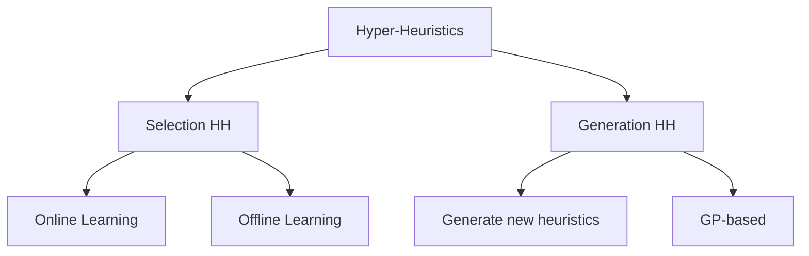

## What are Hyper-Heuristics?

A hyper-heuristic is a **heuristic to choose heuristics** — it operates in the heuristic space rather than directly in the solution space.

### Key Distinction

| Level | Operates on | Example |
|-------|------------|---------|
| Low-level heuristic | Solutions | 2-opt, bit-flip, swap |
| Hyper-heuristic | Heuristics | Choose which low-level heuristic to apply |

### Motivation

| Problem | With manual algorithm design | With hyper-heuristics |
|---------|------------------------------|---------------------|
| New problem arrives | Design new algorithm from scratch | Reuse framework, provide heuristic set |
| Generality | Algorithm tuned to specific instance | Adapts across instances |
| Expertise needed | High | Lower |

## Classification



| Type | What it does | Example |
|------|-------------|---------|
| Selection HH | Choose from existing heuristics | Pick best operator at each step |
| Generation HH | Create new heuristics | GP evolves new operators |

## Selection Hyper-Heuristics

### Framework

```
1. Initialise solution s
2. Repeat until stopping condition:
   a. SELECTION: Choose heuristic h from set H
   b. APPLY: s' ← h(s)
   c. ACCEPTANCE: Decide whether to accept s'
   d. UPDATE: Learn from outcome
3. Return best solution found
```

Two key decisions: **which heuristic** and **whether to accept**.

### Heuristic Selection Methods

| Method | Mechanism | Properties |
|--------|-----------|------------|
| Simple Random | Uniform random choice | No learning; baseline |
| Random Descent | Random choice; accept only improvements | Simple; gets stuck |
| Random Permutation | Cycle through heuristics in random order | Fair; no adaptation |
| Greedy | Apply all; keep best result | Expensive; exploitative |
| Choice Function (CF) | Score based on recent performance | Adaptive; balances operators |
| Reinforcement Learning | Reward/punish based on outcome | Learns over time |
| Multi-Armed Bandit | Explore/exploit trade-off | UCB, epsilon-greedy |

### Choice Function

Score for heuristic $h_i$:

$$CF(h_i) = \alpha \cdot f_1(h_i) + \beta \cdot f_2(h_i, h_j) + \gamma \cdot f_3(h_i)$$

| Component | Measures |
|-----------|----------|
| $f_1(h_i)$ | Recent individual performance of $h_i$ |
| $f_2(h_i, h_j)$ | Performance of pair $(h_j, h_i)$ — sequence effect |
| $f_3(h_i)$ | Time since $h_i$ was last called (diversity) |

Parameters $\alpha, \beta, \gamma$ adapt during search.

### Reinforcement Learning Approach

| Event | Action |
|-------|--------|
| Heuristic improves solution | Increase its score/weight |
| Heuristic worsens solution | Decrease its score/weight |
| Selection | Choose proportional to scores |

### Multi-Armed Bandit

Each heuristic = one arm. Balance exploration (try less-used heuristics) vs exploitation (use best-performing).

**UCB1** score for heuristic $i$:

$$\text{UCB}_i = \bar{x}_i + C\sqrt{\frac{\ln N}{n_i}}$$

where $\bar{x}_i$ = average reward, $N$ = total plays, $n_i$ = plays of arm $i$.

## Move Acceptance in Hyper-Heuristics

Same acceptance methods apply:

| Method | Use case |
|--------|----------|
| Only Improving | Conservative; gets stuck |
| All Moves | Aggressive exploration |
| SA-based | Balanced; most common |
| Great Deluge | Parameter-light alternative |
| LAHC | Simple; effective |

## Generation Hyper-Heuristics

Instead of selecting from fixed heuristics, **generate new ones**.

### Genetic Programming (GP) for HH

| Component | How GP uses it |
|-----------|---------------|
| Terminal set | Basic operations (swap, insert, reverse) |
| Function set | Control flow (if-then, loop, sequence) |
| Fitness | Performance of generated heuristic on training instances |
| Output | A new heuristic (program) |

### Advantages of Generation HH

| Advantage | Explanation |
|-----------|-------------|
| Novelty | Can discover heuristics humans haven't thought of |
| Automation | Minimal human design effort |
| Specialisation | Generated heuristics may outperform general ones |

## The Heuristic Space

| Property | Solution Space | Heuristic Space |
|----------|---------------|-----------------|
| Points | Candidate solutions | Heuristics/operators |
| Evaluation | Objective function | Performance over instances |
| Neighbourhood | Move operator | Similar heuristics |
| Goal | Best solution | Best heuristic (or set) |

## Cross-Domain Heuristic Search

Hyper-heuristics aim for **generality** — the same framework works across different problems (e.g., HyFlex benchmark).

| Domain | Low-level heuristics provided |
|--------|-------------------------------|
| SAT | Flip variable, walksat, novelty |
| TSP | 2-opt, or-opt, relocate |
| Bin Packing | First fit, best fit, swap |
| Personnel Scheduling | Shift swap, reassign, ejection |

The hyper-heuristic does not know problem details — it only observes fitness changes.

<details><summary>Practice: Why is Simple Random a useful baseline?</summary>

Simple Random selects heuristics uniformly at random with no learning. It provides a **lower bound** on performance — any intelligent selection method should outperform it.

If a learning-based HH does not beat Simple Random, the learning mechanism is not working or the heuristic set is poorly designed.

</details>

<details><summary>Practice: Difference between hyper-heuristic and metaheuristic?</summary>

| Feature | Metaheuristic | Hyper-heuristic |
|---------|---------------|-----------------|
| Operates on | Solution space | Heuristic space |
| Searches for | Good solutions | Good heuristics/sequences |
| Problem knowledge | Often encoded in operator | Barrier between HH and problem |
| Generality | Problem-specific tuning needed | Cross-domain potential |
| Example | SA solving TSP | Choosing between SA, HC, mutation for TSP |

A hyper-heuristic may use a metaheuristic as one of its low-level heuristics.

</details>

<details><summary>Practice: What is the "domain barrier" in hyper-heuristics?</summary>

The domain barrier separates the hyper-heuristic (high-level strategy) from the problem domain (low-level heuristics and solution representation).

The HH only sees:
- A set of heuristics to call
- The fitness value before/after applying a heuristic

It does NOT see: solution representation, problem constraints, or how heuristics work internally.

This enforces generality but limits the HH's ability to exploit problem structure.

</details>
