## Topic Dependency Graph

```mermaid
graph TD
    A[01 Introduction & Search] --> B[02 Hill Climbing]
    B --> C[03 Metaheuristics]
    B --> D[04 Move Acceptance]
    C --> D
    A --> E[05 Evolutionary Algorithms I]
    E --> F[06 Evolutionary Algorithms II]
    C --> G[07 Hyper-Heuristics]
    D --> G
    E --> G
    A --> H[08 Knowledge & Reasoning]
    
    style A fill:#1a1a2e,stroke:#e94560
    style B fill:#1a1a2e,stroke:#e94560
    style C fill:#16213e,stroke:#0f3460
    style D fill:#16213e,stroke:#0f3460
    style E fill:#0f3460,stroke:#533483
    style F fill:#0f3460,stroke:#533483
    style G fill:#533483,stroke:#e94560
    style H fill:#1a1a2e,stroke:#0f3460
```

## Study Phases

### Phase 1: Foundations (Days 1-2)

| Topic | Focus | Time |
|-------|-------|------|
| 01 Introduction | Optimisation types, P/NP, search paradigms | 1.5h |
| 02 Hill Climbing | Representation, evaluation, neighbourhood, HC variants | 2h |

**Checkpoint**: Can you explain why HC gets stuck? Can you define neighbourhood for binary and permutation representations?

### Phase 2: Single-Solution Methods (Days 3-4)

| Topic | Focus | Time |
|-------|-------|------|
| 03 Metaheuristics | SA algorithm, cooling, tabu list, ILS | 2.5h |
| 04 Move Acceptance | All acceptance methods, parameter setting | 2h |

**Checkpoint**: Can you trace SA on a small example? Can you compare all acceptance methods?

### Phase 3: Population Methods (Days 5-6)

| Topic | Focus | Time |
|-------|-------|------|
| 05 EA I | GA framework, selection, crossover, mutation | 3h |
| 06 EA II | Multi-objective, Pareto, fitness landscapes | 2h |

**Checkpoint**: Can you design a GA for TSP (representation, operators, selection)? Can you determine Pareto dominance?

### Phase 4: Advanced & Synthesis (Days 7-8)

| Topic | Focus | Time |
|-------|-------|------|
| 07 Hyper-Heuristics | Selection vs generation, choice function | 2h |
| 08 Knowledge & Reasoning | KR types, logic, LLMs | 1.5h |

**Checkpoint**: Can you explain the domain barrier? Can you compare hyper-heuristic to metaheuristic?

### Phase 5: Revision (Days 9-10)

| Activity | Time |
|----------|------|
| Quick Reference review | 1h |
| Exam Traps review | 1h |
| Practice questions (all topics) | 3h |
| Mock exam under timed conditions | 2h |
| Weak topic reinforcement | 2h |

## Priority Ranking (Exam Weight Estimate)

| Priority | Topic | Likely exam coverage |
|----------|-------|---------------------|
| 1 (Critical) | Hill Climbing & Metaheuristics | Core of module; always examined |
| 2 (High) | Evolutionary Algorithms | Major topic; selection/crossover detail |
| 3 (High) | Move Acceptance | Comparison questions common |
| 4 (Medium) | Hyper-Heuristics | Unique to this module; likely tested |
| 5 (Medium) | Introduction/Complexity | Background; definitions tested |
| 6 (Lower) | Knowledge/Reasoning | May appear as shorter question |

## Key Connections Between Topics

| Connection | Topics | Why it matters |
|-----------|--------|----------------|
| Exploration vs exploitation | All | Central trade-off in every method |
| Neighbourhood structure | HC, SA, TS, ILS | Same concept, different escape mechanisms |
| Acceptance methods | SA, TA, GDA, LAHC | Same framework, different criteria |
| Selection pressure | GA selection, HH selection | Analogous concepts |
| Parameters | All | Tuning affects all algorithms |
| Representation | HC, GA, all | Determines valid operators |

## Suggested Practice Strategy

| Type | Method |
|------|--------|
| Trace algorithms | Walk through SA/GA on small examples by hand |
| Compare methods | Make tables contrasting 2-3 algorithms |
| Design exercises | "Design a GA for problem X" — choose all components |
| Calculate | SA acceptance probability, roulette wheel probabilities |
| Analyse | "Why would method X fail on problem Y?" |
| Critique | "What's wrong with this algorithm description?" |
