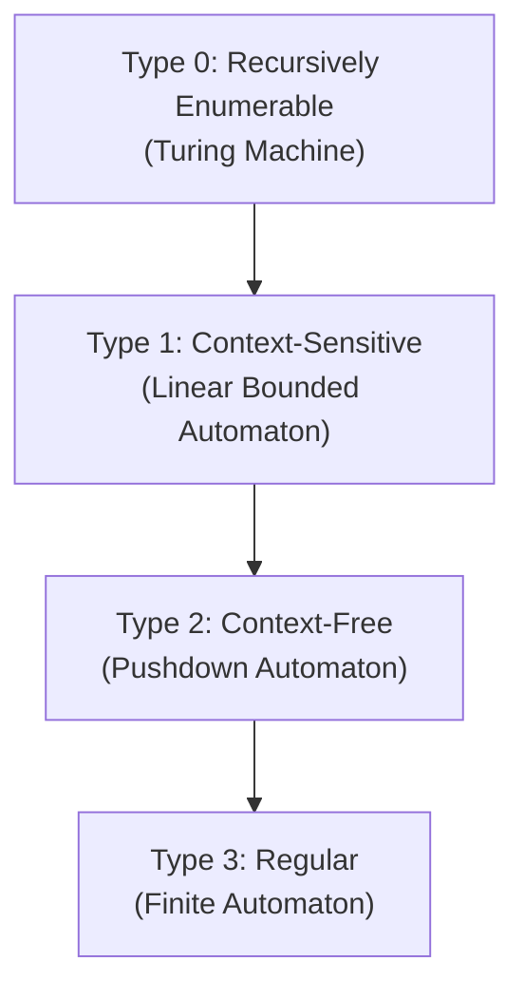

## Fundamental Definitions

| Concept | Definition | Example |
|---------|-----------|---------|
| Symbol | Atomic element | $a, b, 0, 1$ |
| Alphabet ($\Sigma$) | Finite non-empty set of symbols | $\Sigma = \{0, 1\}$ |
| Word (string) | Finite sequence of symbols from $\Sigma$ | $w = 0110$ |
| Empty word ($\varepsilon$) | Word of length 0 | $|\varepsilon| = 0$ |
| $\Sigma^*$ | Set of all words over $\Sigma$ (including $\varepsilon$) | $\{0,1\}^* = \{\varepsilon, 0, 1, 00, 01, \ldots\}$ |
| $\Sigma^+$ | $\Sigma^* \setminus \{\varepsilon\}$ (all non-empty words) | |
| Language ($L$) | Any subset of $\Sigma^*$ | $L = \{0^n1^n \mid n \geq 0\}$ |

## Operations on Words

| Operation | Notation | Example |
|-----------|----------|---------|
| Concatenation | $w_1 \cdot w_2$ | $ab \cdot cd = abcd$ |
| Length | $|w|$ | $|abc| = 3$ |
| Reversal | $w^R$ | $(abc)^R = cba$ |
| Power | $w^n$ | $a^3 = aaa$ |

**Properties**: Concatenation is associative but NOT commutative. $\varepsilon$ is the identity: $w \cdot \varepsilon = \varepsilon \cdot w = w$.

## Operations on Languages

| Operation | Notation | Definition |
|-----------|----------|------------|
| Union | $L_1 \cup L_2$ | $\{w \mid w \in L_1 \text{ or } w \in L_2\}$ |
| Concatenation | $L_1 \cdot L_2$ | $\{w_1 w_2 \mid w_1 \in L_1, w_2 \in L_2\}$ |
| Kleene star | $L^*$ | $\bigcup_{i=0}^{\infty} L^i$ (where $L^0 = \{\varepsilon\}$) |
| Complement | $\overline{L}$ | $\Sigma^* \setminus L$ |
| Intersection | $L_1 \cap L_2$ | $\{w \mid w \in L_1 \text{ and } w \in L_2\}$ |

## The Chomsky Hierarchy

| Type | Grammar Restriction | Recogniser | Example Language |
|------|-------------------|-----------|-----------------|
| 3 (Regular) | $A \to aB$ or $A \to a$ | DFA/NFA | $a^*b^*$ |
| 2 (Context-Free) | $A \to \gamma$ ($A$ single non-terminal) | PDA | $\{a^nb^n\}$ |
| 1 (Context-Sensitive) | $|\alpha| \leq |\beta|$ | LBA | $\{a^nb^nc^n\}$ |
| 0 (Unrestricted) | No restriction | Turing Machine | Halting problem complement |

Practice: Is {ε, ab, aabb, aaabbb} a language? Over what alphabet?

Yes — it's a finite subset of $\{a, b\}^*$. Specifically, it's the finite set $\{a^nb^n \mid 0 \leq n \leq 3\}$. Any subset of $\Sigma^*$ is a language.

Practice: What is {a, b}² ?

$\{a, b\}^2 = \{a, b\} \cdot \{a, b\} = \{aa, ab, ba, bb\}$ — all words of length 2 over the alphabet.

