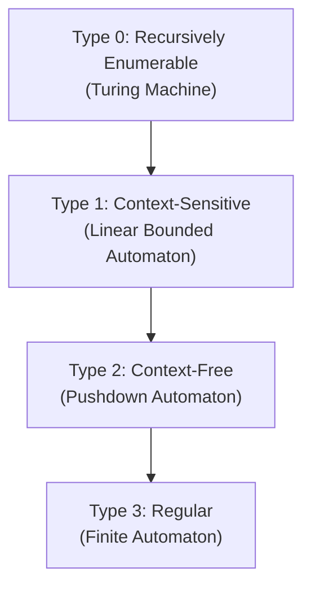

## Fundamental Definitions

:::eli10

Think of an alphabet like the letters in a Scrabble bag -- a fixed set of pieces you can use. Words are made by lining up pieces in a row, and a language is just a club that decides which words are allowed in. Some clubs accept every possible arrangement, others are very picky about who gets in.

:::

:::eli15

An alphabet is a finite set of symbols (like {0, 1} for binary). A word (or string) is any finite sequence of those symbols, including the empty sequence. A language is any collection of words you choose from all possible words -- it could be finite or infinite, and the rules for membership can be simple or extremely complex.

:::

:::eli20

| Concept | Definition | Example |
|---------|-----------|---------|
| Symbol | Atomic element | $a, b, 0, 1$ |
| Alphabet ($\Sigma$) | Finite non-empty set of symbols | $\Sigma = \{0, 1\}$ |
| Word (string) | Finite sequence of symbols from $\Sigma$ | $w = 0110$ |
| Empty word ($\varepsilon$) | Word of length 0 | $|\varepsilon| = 0$ |
| $\Sigma^*$ | Set of all words over $\Sigma$ (including $\varepsilon$) | $\{0,1\}^* = \{\varepsilon, 0, 1, 00, 01, \ldots\}$ |
| $\Sigma^+$ | $\Sigma^* \setminus \{\varepsilon\}$ (all non-empty words) | |
| Language ($L$) | Any subset of $\Sigma^*$ | $L = \{0^n1^n \mid n \geq 0\}$ |

:::

## Operations on Words

:::eli10

You can do things with words like gluing them together (concatenation), flipping them backwards (reversal), or repeating them. It is like playing with toy train carriages -- you can link them, count them, or reverse their order.

:::

:::eli15

Operations on words include concatenation (joining two words end-to-end), measuring length, reversing the symbol order, and raising a word to a power (repeating it multiple times). Concatenation is associative (grouping does not matter) but not commutative (order matters: "ab" is not "ba").

:::

:::eli20

| Operation | Notation | Example |
|-----------|----------|---------|
| Concatenation | $w_1 \cdot w_2$ | $ab \cdot cd = abcd$ |
| Length | $|w|$ | $|abc| = 3$ |
| Reversal | $w^R$ | $(abc)^R = cba$ |
| Power | $w^n$ | $a^3 = aaa$ |

**Properties**: Concatenation is associative but NOT commutative. $\varepsilon$ is the identity: $w \cdot \varepsilon = \varepsilon \cdot w = w$.

:::

## Operations on Languages

:::eli10

Just like you can combine groups of friends (union), find who is in both groups (intersection), or make a list of everyone NOT in a group (complement), you can do the same with languages. The Kleene star is like saying "repeat words from this language as many times as you want, including zero times."

:::

:::eli15

Languages can be combined using set operations: union (words in either language), intersection (words in both), complement (all words NOT in the language), concatenation (pairing one word from each language), and Kleene star (zero or more concatenations from the same language). These operations let you build complex languages from simple ones.

:::

:::eli20

| Operation | Notation | Definition |
|-----------|----------|------------|
| Union | $L_1 \cup L_2$ | $\{w \mid w \in L_1 \text{ or } w \in L_2\}$ |
| Concatenation | $L_1 \cdot L_2$ | $\{w_1 w_2 \mid w_1 \in L_1, w_2 \in L_2\}$ |
| Kleene star | $L^*$ | $\bigcup_{i=0}^{\infty} L^i$ (where $L^0 = \{\varepsilon\}$) |
| Complement | $\overline{L}$ | $\Sigma^* \setminus L$ |
| Intersection | $L_1 \cap L_2$ | $\{w \mid w \in L_1 \text{ and } w \in L_2\}$ |

:::

## The Chomsky Hierarchy

:::eli10

Imagine four levels of puzzle difficulty. Level 3 (easiest) are simple pattern-matching puzzles. Level 2 needs you to keep a stack of papers to remember things. Level 1 needs a bounded notepad. Level 0 (hardest) needs an unlimited notebook. Each higher level can solve everything the levels below it can, plus harder puzzles.

:::

:::eli15

The Chomsky Hierarchy classifies languages into four types based on the complexity of the grammar needed to generate them and the machine needed to recognise them. Regular languages (Type 3) are the simplest, recognised by finite automata. Context-free (Type 2) need a stack. Context-sensitive (Type 1) need bounded memory. Unrestricted (Type 0) need a full Turing machine. Each level strictly contains the ones below it.

:::

:::eli20

| Type | Grammar Restriction | Recogniser | Example Language |
|------|-------------------|-----------|-----------------|
| 3 (Regular) | $A \to aB$ or $A \to a$ | DFA/NFA | $a^*b^*$ |
| 2 (Context-Free) | $A \to \gamma$ ($A$ single non-terminal) | PDA | $\{a^nb^n\}$ |
| 1 (Context-Sensitive) | $|\alpha| \leq |\beta|$ | LBA | $\{a^nb^nc^n\}$ |
| 0 (Unrestricted) | No restriction | Turing Machine | Halting problem complement |

Practice: Is {ε, ab, aabb, aaabbb} a language? Over what alphabet?

Yes — it's a finite subset of $\{a, b\}^*$. Specifically, it's the finite set $\{a^nb^n \mid 0 \leq n \leq 3\}$. Any subset of $\Sigma^*$ is a language.

Practice: What is {a, b}² ?

$\{a, b\}^2 = \{a, b\} \cdot \{a, b\} = \{aa, ab, ba, bb\}$ — all words of length 2 over the alphabet.

:::
