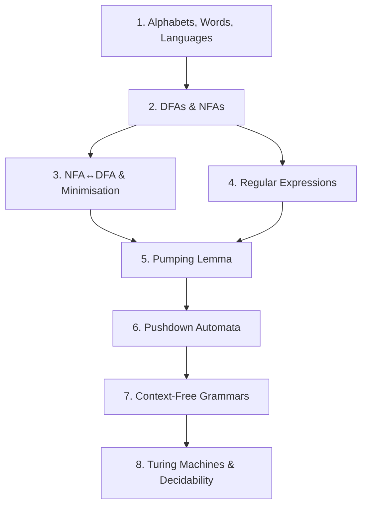

## Topic Dependency Map

## Recommended Study Order

| Phase | Topics | Why |
|-------|--------|-----|
| 1 — Foundations | 1 | All notation and definitions used everywhere |
| 2 — Regular Languages | 2, 3, 4 | DFA/NFA/RE are the bread and butter; most exam questions |
| 3 — Non-Regular Proofs | 5 | Pumping lemma questions appear every year |
| 4 — Beyond Regular | 6, 7 | PDA and CFG extend the framework; many computational questions |
| 5 — Big Picture | 8 | Turing machines, decidability, P vs NP (conceptual) |

## Time Allocation (Revision)

| Topic | Suggested Time | Priority |
|-------|---------------|----------|
| DFA construction & tracing | 2h | High |
| NFA → DFA (subset construction) | 2h | High |
| DFA minimisation (table-filling) | 1.5h | High |
| Regular expressions | 1.5h | High |
| RE ↔ NFA conversion | 1h | Medium |
| Pumping lemma proofs | 2h | High |
| PDA construction & tracing | 2h | High |
| CFG derivations & parse trees | 1.5h | Medium-High |
| Turing machines & decidability | 1h | Medium (more conceptual) |
