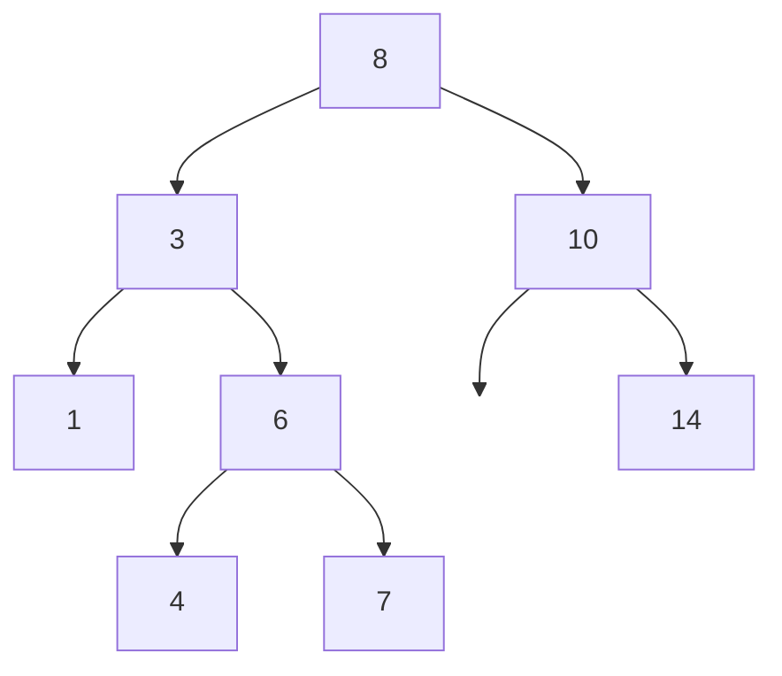

## Tree Terminology

| Term | Definition |
|------|-----------|
| Root | Node with no parent |
| Leaf | Node with no children |
| Internal node | Node with at least one child |
| Depth | Number of edges from root to node |
| Height | Number of edges on longest path from node to leaf |
| Degree | Number of children of a node |
| Subtree | Tree rooted at a given node |
| Level | Set of nodes at same depth |
| Ancestor | Node on path from root to node |
| Descendant | Node in subtree rooted at node |

## Binary Trees

A tree where each node has **at most 2 children** (left and right).

### Types

| Type | Property |
|------|----------|
| Full | Every node has 0 or 2 children |
| Complete | All levels full except possibly last (filled left-to-right) |
| Perfect | All internal nodes have 2 children, all leaves same depth |
| Balanced | Height = $O(\log n)$ |
| Degenerate | Every internal node has 1 child (linked list) |

### Properties

| Property | Formula |
|----------|---------|
| Max nodes at level $l$ | $2^l$ |
| Max nodes in tree of height $h$ | $2^{h+1} - 1$ |
| Min height for $n$ nodes | $\lfloor \log_2 n \rfloor$ |
| Leaves in full binary tree with $n$ internal nodes | $n + 1$ |
| Edges | $n - 1$ (for $n$ nodes) |

## Binary Search Tree (BST)

A binary tree satisfying the **BST property**:

> For every node $x$: all keys in left subtree $<$ $x$.key $<$ all keys in right subtree.

### Operations Complexity

| Operation | Average | Worst (unbalanced) |
|-----------|---------|-------------------|
| Search | $O(\log n)$ | $O(n)$ |
| Insert | $O(\log n)$ | $O(n)$ |
| Delete | $O(\log n)$ | $O(n)$ |
| Min/Max | $O(\log n)$ | $O(n)$ |
| Successor | $O(\log n)$ | $O(n)$ |

### Search

```
search(node, key):
    if node is null or node.key == key:
        return node
    if key < node.key:
        return search(node.left, key)
    else:
        return search(node.right, key)
```

### Insert

```
insert(node, key):
    if node is null:
        return new Node(key)
    if key < node.key:
        node.left = insert(node.left, key)
    else if key > node.key:
        node.right = insert(node.right, key)
    return node
```

### Delete

Three cases:

| Case | Action |
|------|--------|
| Leaf (no children) | Simply remove |
| One child | Replace node with its child |
| Two children | Replace with in-order successor (or predecessor), then delete successor |

```
delete(node, key):
    if node is null: return null
    if key < node.key:
        node.left = delete(node.left, key)
    else if key > node.key:
        node.right = delete(node.right, key)
    else:
        if node.left is null: return node.right
        if node.right is null: return node.left
        // Two children: find in-order successor
        succ = findMin(node.right)
        node.key = succ.key
        node.right = delete(node.right, succ.key)
    return node
```

### Finding Min/Max

```
findMin(node):                findMax(node):
    while node.left:              while node.right:
        node = node.left              node = node.right
    return node                   return node
```

### In-Order Successor

- If node has right subtree: successor = leftmost node in right subtree
- Otherwise: successor = lowest ancestor for which node is in left subtree

## Tree Traversals

| Traversal | Order | Use Case |
|-----------|-------|----------|
| In-order | Left, Root, Right | Sorted output from BST |
| Pre-order | Root, Left, Right | Copy/serialise tree |
| Post-order | Left, Right, Root | Delete tree, evaluate expressions |
| Level-order | BFS by depth | Print by level |

### Pseudocode

```
inorder(node):               preorder(node):             postorder(node):
    if node != null:             if node != null:            if node != null:
        inorder(left)                visit(node)                 postorder(left)
        visit(node)                  preorder(left)              postorder(right)
        inorder(right)               preorder(right)             visit(node)
```

### Level-Order (BFS)

```
levelOrder(root):
    queue = [root]
    while queue not empty:
        node = dequeue()
        visit(node)
        if node.left: enqueue(node.left)
        if node.right: enqueue(node.right)
```

### Example



| Traversal | Output |
|-----------|--------|
| In-order | 1, 3, 4, 6, 7, 8, 10, 14 |
| Pre-order | 8, 3, 1, 6, 4, 7, 10, 14 |
| Post-order | 1, 4, 7, 6, 3, 14, 10, 8 |
| Level-order | 8, 3, 10, 1, 6, 14, 4, 7 |

<details>
<summary><strong>Practice: Build BST from Insertions</strong></summary>

**Insert sequence**: 5, 3, 7, 1, 4, 6, 8

Step by step:
1. Insert 5 (root)
2. Insert 3 (left of 5)
3. Insert 7 (right of 5)
4. Insert 1 (left of 3)
5. Insert 4 (right of 3)
6. Insert 6 (left of 7)
7. Insert 8 (right of 7)

Result:
```
        5
       / \
      3   7
     / \ / \
    1  4 6  8
```

In-order traversal: 1, 3, 4, 5, 6, 7, 8 (sorted!)

</details>

<details>
<summary><strong>Practice: Delete Node with Two Children</strong></summary>

Delete **3** from:
```
        5
       / \
      3   7
     / \
    1   4
```

1. Node 3 has two children
2. Find in-order successor: 4 (leftmost in right subtree)
3. Replace 3's key with 4
4. Delete original 4 (leaf -- simple removal)

Result:
```
        5
       / \
      4   7
     /
    1
```

</details>

<details>
<summary><strong>Practice: Reconstruct Tree from Traversals</strong></summary>

Given:
- Pre-order: `A B D E C F`
- In-order: `D B E A F C`

**Step 1**: First element of pre-order = root = A

**Step 2**: In in-order, everything left of A is left subtree: `D B E`; right subtree: `F C`

**Step 3**: Next in pre-order for left subtree: B (root of left). In `D B E`: left=D, right=E

**Step 4**: Next for right subtree: C (root of right). In `F C`: left=F, right=none

Result:
```
        A
       / \
      B   C
     / \ /
    D  E F
```

</details>
