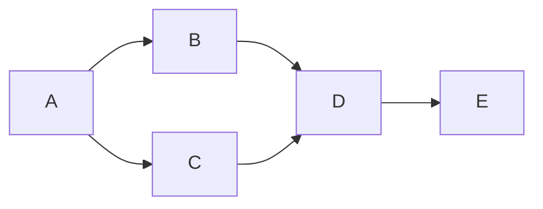

## Graph Terminology

| Term | Definition |
|------|-----------|
| Graph $G = (V, E)$ | Set of vertices $V$ and edges $E$ |
| Directed (digraph) | Edges have direction: $(u, v) \neq (v, u)$ |
| Undirected | Edges have no direction: $\{u, v\}$ |
| Weighted | Edges have associated costs/weights |
| Adjacent | Two vertices connected by an edge |
| Degree | Number of edges incident to a vertex |
| In-degree / Out-degree | Incoming / outgoing edges (directed) |
| Path | Sequence of vertices connected by edges |
| Cycle | Path that starts and ends at same vertex |
| Connected | Path exists between every pair of vertices |
| DAG | Directed Acyclic Graph |
| Sparse | $|E| \ll |V|^2$ |
| Dense | $|E| \approx |V|^2$ |

### Edge Counts

| Graph Type | Max Edges |
|-----------|-----------|
| Undirected | $\frac{|V|(|V|-1)}{2}$ |
| Directed | $|V|(|V|-1)$ |
| Tree | $|V| - 1$ |

## Representations

| Representation | Space | Edge Query | All Neighbours | Add Edge |
|---------------|-------|-----------|----------------|----------|
| Adjacency Matrix | $O(V^2)$ | $O(1)$ | $O(V)$ | $O(1)$ |
| Adjacency List | $O(V + E)$ | $O(\deg(v))$ | $O(\deg(v))$ | $O(1)$ |

### When to Use

| Scenario | Best Choice |
|----------|-------------|
| Dense graph | Adjacency matrix |
| Sparse graph | Adjacency list |
| Need fast edge lookup | Matrix |
| Memory constrained | List |
| Most algorithms | List |

### Adjacency Matrix

```
    A  B  C  D
A [ 0, 1, 1, 0 ]
B [ 1, 0, 0, 1 ]
C [ 1, 0, 0, 1 ]
D [ 0, 1, 1, 0 ]
```

### Adjacency List

```
A -> [B, C]
B -> [A, D]
C -> [A, D]
D -> [B, C]
```

## Breadth-First Search (BFS)

Explores all vertices at distance $d$ before distance $d+1$. Uses a **queue**.

```
BFS(G, source):
    for each v in V:
        v.colour = WHITE
        v.dist = INF
        v.parent = null
    source.colour = GREY
    source.dist = 0
    Q = Queue([source])
    while Q not empty:
        u = Q.dequeue()
        for each v in adj[u]:
            if v.colour == WHITE:
                v.colour = GREY
                v.dist = u.dist + 1
                v.parent = u
                Q.enqueue(v)
        u.colour = BLACK
```

| Property | Value |
|----------|-------|
| Time | $O(V + E)$ |
| Space | $O(V)$ |
| Finds | Shortest path (unweighted) |
| Produces | BFS tree, distance from source |

### Applications

- Shortest path in unweighted graph
- Level-order traversal
- Connected components
- Bipartiteness check

## Depth-First Search (DFS)

Explores as deep as possible before backtracking. Uses a **stack** (or recursion).

```
DFS(G):
    for each v in V:
        v.colour = WHITE
        v.parent = null
    time = 0
    for each v in V:
        if v.colour == WHITE:
            DFS-Visit(v)

DFS-Visit(u):
    time += 1
    u.discover = time
    u.colour = GREY
    for each v in adj[u]:
        if v.colour == WHITE:
            v.parent = u
            DFS-Visit(v)
    u.colour = BLACK
    time += 1
    u.finish = time
```

| Property | Value |
|----------|-------|
| Time | $O(V + E)$ |
| Space | $O(V)$ |
| Produces | DFS forest, discovery/finish times |

### Edge Classification (Directed Graphs)

| Edge $(u, v)$ | Condition | Meaning |
|--------------|-----------|---------|
| Tree edge | $v$ is WHITE when discovered | Part of DFS tree |
| Back edge | $v$ is GREY | Indicates a **cycle** |
| Forward edge | $v$ is BLACK, $u.d < v.d$ | Ancestor to descendant (not tree) |
| Cross edge | $v$ is BLACK, $u.d > v.d$ | Between unrelated subtrees |

**Cycle detection**: A directed graph has a cycle $\iff$ DFS finds a back edge.

## Topological Sort

Linear ordering of vertices in a DAG such that for every edge $(u, v)$, $u$ appears before $v$.

### DFS-based Algorithm

```
topologicalSort(G):
    Run DFS(G) to compute finish times
    Return vertices in reverse order of finish time
```

### Kahn's Algorithm (BFS-based)

```
kahnSort(G):
    Compute in-degree for all vertices
    Q = Queue(all vertices with in-degree 0)
    result = []
    while Q not empty:
        u = Q.dequeue()
        result.append(u)
        for each v in adj[u]:
            in-degree[v] -= 1
            if in-degree[v] == 0:
                Q.enqueue(v)
    if len(result) != |V|: "cycle exists"
    return result
```

| Property | Value |
|----------|-------|
| Time | $O(V + E)$ |
| Applications | Task scheduling, build systems, course prerequisites |

## Dijkstra's Algorithm

Finds shortest paths from a single source in a graph with **non-negative** weights.

```
dijkstra(G, source):
    for each v in V:
        v.dist = INF
        v.parent = null
    source.dist = 0
    PQ = MinPriorityQueue(all vertices by dist)
    while PQ not empty:
        u = PQ.extractMin()
        for each v in adj[u]:
            if u.dist + w(u,v) < v.dist:
                v.dist = u.dist + w(u,v)
                v.parent = u
                PQ.decreaseKey(v, v.dist)
```

| Property | Value |
|----------|-------|
| Time (binary heap) | $O((V + E) \log V)$ |
| Time (Fibonacci heap) | $O(V \log V + E)$ |
| Time (array, no PQ) | $O(V^2)$ |
| Requirement | All edge weights $\geq 0$ |
| Type | Greedy |

### Why Non-Negative Weights?

Dijkstra assumes that once a vertex is extracted from PQ, its shortest distance is final. Negative edges can invalidate already-finalised distances.

## Bellman-Ford Algorithm

Handles graphs with **negative** edge weights. Detects negative cycles.

```
bellmanFord(G, source):
    for each v in V:
        v.dist = INF
    source.dist = 0
    for i = 1 to |V| - 1:       // relax all edges V-1 times
        for each edge (u, v, w) in E:
            if u.dist + w < v.dist:
                v.dist = u.dist + w
                v.parent = u
    // Check for negative cycles
    for each edge (u, v, w) in E:
        if u.dist + w < v.dist:
            return "negative cycle exists"
```

| Property | Value |
|----------|-------|
| Time | $O(VE)$ |
| Handles | Negative weights |
| Detects | Negative-weight cycles |
| Type | Dynamic programming |

## Shortest Path Comparison

| Algorithm | Time | Negative Weights | Negative Cycles |
|-----------|------|-----------------|-----------------|
| BFS | $O(V+E)$ | N/A (unweighted) | N/A |
| Dijkstra (binary heap) | $O((V+E)\log V)$ | No | No |
| Bellman-Ford | $O(VE)$ | Yes | Detects |
| Floyd-Warshall | $O(V^3)$ | Yes | Detects |
| DAG relaxation | $O(V+E)$ | Yes | N/A (no cycles) |

## Minimum Spanning Tree (MST)

A spanning tree of minimum total edge weight connecting all vertices.

**Cut property**: For any cut of the graph, the lightest crossing edge is in some MST.

### Prim's Algorithm

Grows MST from a single vertex, always adding cheapest edge to tree.

```
prim(G, source):
    for each v in V:
        v.key = INF
        v.parent = null
    source.key = 0
    PQ = MinPriorityQueue(all vertices by key)
    while PQ not empty:
        u = PQ.extractMin()
        for each v in adj[u]:
            if v in PQ and w(u,v) < v.key:
                v.parent = u
                v.key = w(u,v)
                PQ.decreaseKey(v, v.key)
```

| Property | Value |
|----------|-------|
| Time (binary heap) | $O((V + E) \log V)$ |
| Time (array) | $O(V^2)$ |
| Best for | Dense graphs (with array) |
| Type | Greedy |

### Kruskal's Algorithm

Sort all edges by weight; add edges that don't create a cycle (using Union-Find).

```
kruskal(G):
    MST = []
    Sort edges by weight
    for each vertex v: makeSet(v)
    for each edge (u, v, w) in sorted order:
        if find(u) != find(v):
            MST.append((u, v, w))
            union(u, v)
    return MST
```

| Property | Value |
|----------|-------|
| Time | $O(E \log E)$ = $O(E \log V)$ |
| Data structure | Union-Find (disjoint sets) |
| Best for | Sparse graphs |
| Type | Greedy |

### MST Comparison

| | Prim's | Kruskal's |
|--|--------|-----------|
| Approach | Grow from vertex | Add cheapest edge globally |
| Data structure | Priority queue | Union-Find |
| Best for | Dense graphs | Sparse graphs |
| Time (binary heap) | $O((V+E)\log V)$ | $O(E \log V)$ |

<details>
<summary><strong>Practice: Dijkstra Trace</strong></summary>

Graph:
```
A --1-- B --2-- D
|       |       |
4       3       1
|       |       |
C --5-- E --2-- F
```

Source: A

| Step | Extracted | Updated Distances |
|------|-----------|-------------------|
| Init | - | A=0, B=$\infty$, C=$\infty$, D=$\infty$, E=$\infty$, F=$\infty$ |
| 1 | A (0) | B=1, C=4 |
| 2 | B (1) | D=3, E=4 |
| 3 | D (3) | F=4 |
| 4 | C (4) | E=4 (no improvement via C) |
| 5 | E (4) | F=4 (no improvement) |
| 6 | F (4) | done |

Shortest paths from A: A=0, B=1, C=4, D=3, E=4, F=4

</details>

<details>
<summary><strong>Practice: BFS vs DFS</strong></summary>

Graph:
```
    A
   / \
  B   C
 / \   \
D   E   F
```

**BFS from A**: A, B, C, D, E, F (level by level)

**DFS from A** (left first): A, B, D, E, C, F (deep then backtrack)

Key differences:
- BFS finds shortest path (unweighted)
- DFS uses less memory for deep graphs
- DFS detects cycles (back edges)
- BFS explores uniformly outward

</details>

<details>
<summary><strong>Practice: Kruskal's MST</strong></summary>

Edges (sorted): (A,B,1), (D,F,1), (A,C,2), (B,D,2), (E,F,2), (B,E,3), (C,E,5)

| Edge | Weight | Action | Components |
|------|--------|--------|-----------|
| (A,B) | 1 | Add | {A,B}, {C}, {D}, {E}, {F} |
| (D,F) | 1 | Add | {A,B}, {C}, {D,F}, {E} |
| (A,C) | 2 | Add | {A,B,C}, {D,F}, {E} |
| (B,D) | 2 | Add | {A,B,C,D,F}, {E} |
| (E,F) | 2 | Add | {A,B,C,D,E,F} |

MST edges: (A,B), (D,F), (A,C), (B,D), (E,F). Total weight = 8.

Stopped after 5 edges ($V-1 = 6-1 = 5$).

</details>

<details>
<summary><strong>Practice: Topological Sort</strong></summary>

DAG with edges: A->B, A->C, B->D, C->D, D->E



Valid topological orderings:
- A, B, C, D, E
- A, C, B, D, E

Invalid: any order where D comes before B or C, or E before D.

</details>
