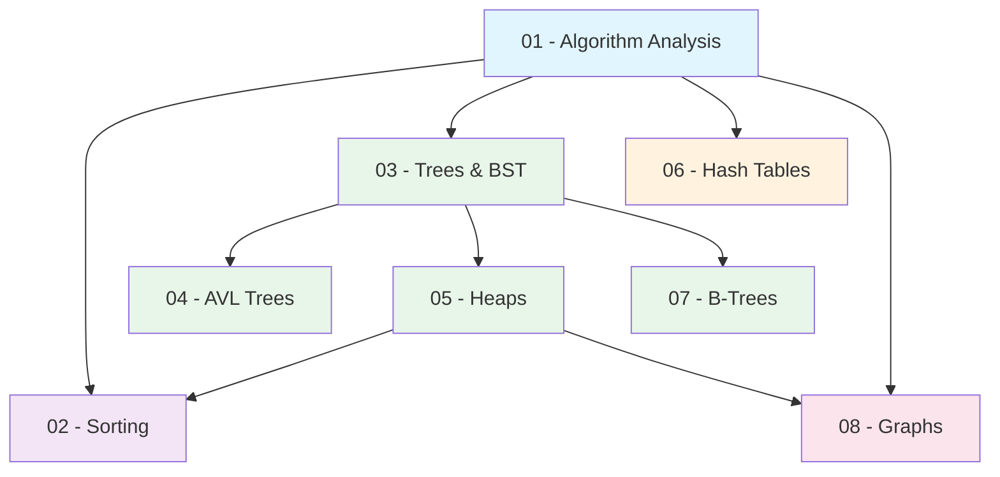

## Topic Dependency Graph

## Recommended Study Order

| Phase | Topics | Rationale |
|-------|--------|-----------|
| 1 | Algorithm Analysis | Foundation for analysing everything else |
| 2 | Trees & BST | Core tree concepts used by AVL, heaps, B-trees |
| 3 | AVL Trees | Extends BST with balancing |
| 4 | Heaps | Tree-based, needed for heap sort and Dijkstra |
| 5 | Sorting | Uses heap knowledge; analysis applies throughout |
| 6 | Hash Tables | Standalone topic; uses analysis skills |
| 7 | B-Trees | Extends tree concepts to multiway |
| 8 | Graphs | Most complex; uses heaps (priority queues) and analysis |

## Prerequisites per Topic

| Topic | You Must Know First |
|-------|-------------------|
| Algorithm Analysis | Basic maths (logarithms, summations) |
| Sorting | Big-O notation, comparison concept |
| Trees & BST | Recursion, Big-O |
| AVL Trees | BST operations, tree height |
| Heaps | Complete binary trees, array indexing |
| Hash Tables | Modular arithmetic, Big-O |
| B-Trees | BST concept, disk I/O motivation |
| Graphs | Queues, stacks, priority queues (heaps) |

## Study Strategy

### Week-by-Week Plan (4 weeks)

| Week | Focus | Activities |
|------|-------|-----------|
| 1 | Analysis + Trees | Master Big-O, solve recurrences, code BST |
| 2 | AVL + Heaps | Practice rotations by hand, implement priority queue |
| 3 | Sorting + Hash Tables | Compare sorts, trace partition, hash exercises |
| 4 | B-Trees + Graphs | Trace BFS/DFS/Dijkstra, MST problems |

### Active Recall Techniques

| Technique | Application |
|-----------|-------------|
| Trace by hand | Sort algorithms, tree insertions, Dijkstra |
| Complexity flash cards | Data structure -> operation -> Big-O |
| Draw diagrams | Tree rotations, graph traversals |
| Explain to rubber duck | Why Dijkstra fails with negative weights? |
| Past papers | Time yourself, mark strictly |

### High-Yield Exam Topics

Based on typical exam patterns:

| Priority | Topic | Why |
|----------|-------|-----|
| Critical | AVL rotations | Always tested; easy to get wrong |
| Critical | Dijkstra trace | Multi-step; partial credit available |
| Critical | Master theorem | Quick marks if you know the formula |
| High | Heap operations | Build-heap, extract, insert |
| High | Hash collision resolution | Trace probe sequences |
| High | BST delete (two children) | Common source of errors |
| Medium | B-tree insert/split | Less common but high mark questions |
| Medium | Kruskal's/Prim's trace | MST construction step-by-step |
| Medium | Sorting stability | Definition + identify which are stable |
