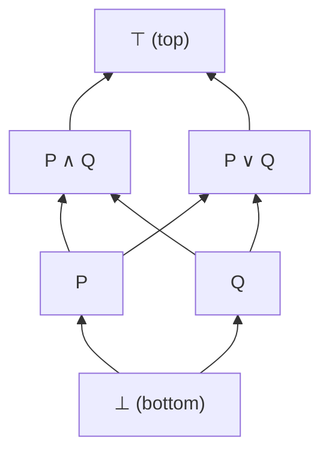

## Boolean Algebra Laws

:::eli10

Boolean algebra is a set of rules for working with AND, OR, and NOT — like a rulebook for simplifying logic expressions. For example, "P AND true" is just P (the identity rule), and "P AND NOT P" is always false (the complement rule). These rules let you simplify complicated logical statements step by step.

:::

:::eli15

Boolean algebra gives us laws for manipulating logical expressions — much like algebraic rules for numbers. Key categories:

- **Identity**: Combining with true ($\top$) or false ($\bot$) in a neutral way
- **Complement**: A thing AND its negation is false; A thing OR its negation is true
- **Distributive**: AND distributes over OR (and vice versa — unlike arithmetic!)
- **Absorption**: $P \land (P \lor Q) = P$ — if you already have P, adding "or Q" changes nothing
- **De Morgan**: Negation swaps AND/OR

These laws are the foundation for simplifying circuits, logical formulas, and proofs.

:::

:::eli20

| Law | $\land$ form | $\lor$ form |
|-----|-------------|-------------|
| Identity | $P \land \top \equiv P$ | $P \lor \bot \equiv P$ |
| Domination | $P \land \bot \equiv \bot$ | $P \lor \top \equiv \top$ |
| Idempotent | $P \land P \equiv P$ | $P \lor P \equiv P$ |
| Complement | $P \land \neg P \equiv \bot$ | $P \lor \neg P \equiv \top$ |
| Commutative | $P \land Q \equiv Q \land P$ | $P \lor Q \equiv Q \lor P$ |
| Associative | $(P \land Q) \land R \equiv P \land (Q \land R)$ | $(P \lor Q) \lor R \equiv P \lor (Q \lor R)$ |
| Distributive | $P \land (Q \lor R) \equiv (P \land Q) \lor (P \land R)$ | $P \lor (Q \land R) \equiv (P \lor Q) \land (P \lor R)$ |
| Absorption | $P \land (P \lor Q) \equiv P$ | $P \lor (P \land Q) \equiv P$ |
| Double Negation | $\neg\neg P \equiv P$ | (classical only) |

:::

## De Morgan's Laws

:::eli10

De Morgan's Laws tell you how to push a NOT through an AND or OR: NOT (A AND B) becomes (NOT A) OR (NOT B), and NOT (A OR B) becomes (NOT A) AND (NOT B). Basically, negation flips AND to OR and OR to AND.

:::

:::eli15

**De Morgan's Laws** describe how negation interacts with conjunction and disjunction:

- $\neg(P \land Q) \equiv \neg P \lor \neg Q$ — "not both" means "at least one is false"
- $\neg(P \lor Q) \equiv \neg P \land \neg Q$ — "neither" means "both are false"

Important subtlety in constructive logic: $\neg(P \land Q) \to \neg P \lor \neg Q$ is **not** constructively provable — it requires the Law of Excluded Middle. The other three directions are all constructively valid.

:::

:::eli20

$$\neg(P \land Q) \equiv \neg P \lor \neg Q$$
$$\neg(P \lor Q) \equiv \neg P \land \neg Q$$

**Generalised** (for $n$ propositions):

$$\neg\bigwedge_{i=1}^{n} P_i \equiv \bigvee_{i=1}^{n} \neg P_i$$

### Constructive status

| Direction | Provable constructively? |
|-----------|------------------------|
| $\neg P \lor \neg Q \to \neg(P \land Q)$ | Yes |
| $\neg(P \land Q) \to \neg P \lor \neg Q$ | **No** (requires LEM) |
| $\neg P \land \neg Q \to \neg(P \lor Q)$ | Yes |
| $\neg(P \lor Q) \to \neg P \land \neg Q$ | Yes |

:::

## Lattice Structure

:::eli10

A lattice is like a ladder of truth values. At the bottom is "false" (the weakest statement) and at the top is "true" (the strongest). AND moves you down (toward false) and OR moves you up (toward true). Every pair of statements has a "meet" (their AND) and a "join" (their OR) somewhere on this ladder.

:::

:::eli15

The logical connectives form a mathematical structure called a **lattice**:

- **Meet** ($\land$): Greatest lower bound — the strongest thing implied by both
- **Join** ($\lor$): Least upper bound — the weakest thing implying both
- **Bottom** ($\bot$): False — implies everything
- **Top** ($\top$): True — implied by everything

More refined structures:
- **Heyting algebra**: Adds implication ($\to$) — models intuitionistic logic
- **Boolean algebra**: Adds complement (negation that satisfies $P \lor \neg P = \top$) — models classical logic

:::

:::eli20

Propositions under $\land$ and $\lor$ form a **bounded distributive lattice**:

| Structure | Operation | Identity | Order |
|-----------|-----------|----------|-------|
| Meet semilattice | $\land$ | $\top$ | $P \leq Q$ iff $P \land Q = P$ |
| Join semilattice | $\lor$ | $\bot$ | $P \leq Q$ iff $P \lor Q = Q$ |
| Bounded lattice | Both | $\top, \bot$ | Combined |
| Heyting algebra | + $\to$ | — | Intuitionistic logic |
| Boolean algebra | + complement | — | Classical logic |

:::

## Duality Principle

:::eli10

The duality principle says that any true statement about AND and OR stays true if you swap AND with OR, and true with false, everywhere. It's like a mirror — every rule has a "twin" rule you get by swapping things.

:::

:::eli15

The **duality principle** states: any valid Boolean algebra identity remains valid if you simultaneously swap:
- $\land$ with $\lor$ (and vice versa)
- $\top$ with $\bot$ (and vice versa)

This means every law comes in pairs. For instance, the dual of "identity: $P \land \top = P$" is "$P \lor \bot = P$." You get two theorems for the price of one proof.

:::

:::eli20

Every theorem remains valid if you simultaneously swap:
- $\land \leftrightarrow \lor$
- $\top \leftrightarrow \bot$

Example: dual of absorption $P \land (P \lor Q) = P$ is $P \lor (P \land Q) = P$.

:::

## Algebraic Proofs

:::eli10

Algebraic proofs are like showing your working in maths. You start with one expression and use the Boolean algebra rules to transform it step by step until you reach what you want to prove. Each step must be justified by naming the rule used.

:::

:::eli15

To prove that two logical expressions are equivalent, you can transform one into the other using the Boolean algebra laws, justifying each step:

1. Start with the expression on one side
2. Apply a law (identity, distributive, absorption, etc.) to rewrite it
3. Repeat until you reach the other side

This is a rigorous alternative to truth tables — and unlike truth tables, it works for infinite/parametric cases and gives insight into *why* the equivalence holds.

:::

:::eli20

To prove equivalences algebraically, apply laws step by step:

**Example**: Prove $P \lor (P \land Q) \equiv P$

| Step | Justification |
|------|---------------|
| $P \lor (P \land Q)$ | Given |
| $(P \land \top) \lor (P \land Q)$ | Identity: $P = P \land \top$ |
| $P \land (\top \lor Q)$ | Distributive (factor $P$) |
| $P \land \top$ | Domination: $\top \lor Q = \top$ |
| $P$ | Identity |

Practice: Prove $P \land (P \lor Q) \equiv P$ algebraically

| Step | Justification |
|------|---------------|
| $P \land (P \lor Q)$ | Given |
| $(P \lor \bot) \land (P \lor Q)$ | Identity: $P = P \lor \bot$ |
| $P \lor (\bot \land Q)$ | Distributive (factor $P$) |
| $P \lor \bot$ | Domination: $\bot \land Q = \bot$ |
| $P$ | Identity |

Practice: Simplify $\neg(\neg P \land Q) \land P$

| Step | Justification |
|------|---------------|
| $\neg(\neg P \land Q) \land P$ | Given |
| $(P \lor \neg Q) \land P$ | De Morgan + double negation |
| $P$ | Absorption: $X \land (X \lor Y) = X$ with $X = P$ |

Wait — check: absorption says $P \land (P \lor \neg Q) = P$. Here we have $(P \lor \neg Q) \land P = P \land (P \lor \neg Q) = P$ by commutativity then absorption.

Practice: Is $P \to Q$ the same as $\neg P \lor Q$ constructively?

**No.** While classically equivalent, constructively:
- $\neg P \lor Q \to (P \to Q)$: **provable** (case split: if $\neg P$, derive $\bot$ from $P$, then use ex falso; if $Q$, return $Q$)
- $(P \to Q) \to \neg P \lor Q$: **not provable** without LEM

This is because $\neg P \lor Q$ requires we *decide* which disjunct holds, which is not always constructively possible.

:::
