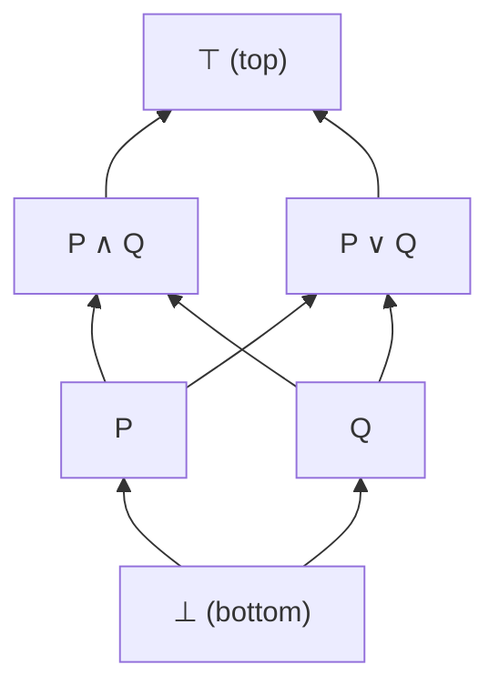

## Boolean Algebra Laws

| Law | $\land$ form | $\lor$ form |
|-----|-------------|-------------|
| Identity | $P \land \top \equiv P$ | $P \lor \bot \equiv P$ |
| Domination | $P \land \bot \equiv \bot$ | $P \lor \top \equiv \top$ |
| Idempotent | $P \land P \equiv P$ | $P \lor P \equiv P$ |
| Complement | $P \land \neg P \equiv \bot$ | $P \lor \neg P \equiv \top$ |
| Commutative | $P \land Q \equiv Q \land P$ | $P \lor Q \equiv Q \lor P$ |
| Associative | $(P \land Q) \land R \equiv P \land (Q \land R)$ | $(P \lor Q) \lor R \equiv P \lor (Q \lor R)$ |
| Distributive | $P \land (Q \lor R) \equiv (P \land Q) \lor (P \land R)$ | $P \lor (Q \land R) \equiv (P \lor Q) \land (P \lor R)$ |
| Absorption | $P \land (P \lor Q) \equiv P$ | $P \lor (P \land Q) \equiv P$ |
| Double Negation | $\neg\neg P \equiv P$ | (classical only) |

## De Morgan's Laws

$$\neg(P \land Q) \equiv \neg P \lor \neg Q$$
$$\neg(P \lor Q) \equiv \neg P \land \neg Q$$

**Generalised** (for $n$ propositions):

$$\neg\bigwedge_{i=1}^{n} P_i \equiv \bigvee_{i=1}^{n} \neg P_i$$

### Constructive status

| Direction | Provable constructively? |
|-----------|------------------------|
| $\neg P \lor \neg Q \to \neg(P \land Q)$ | Yes |
| $\neg(P \land Q) \to \neg P \lor \neg Q$ | **No** (requires LEM) |
| $\neg P \land \neg Q \to \neg(P \lor Q)$ | Yes |
| $\neg(P \lor Q) \to \neg P \land \neg Q$ | Yes |

## Lattice Structure

Propositions under $\land$ and $\lor$ form a **bounded distributive lattice**:

| Structure | Operation | Identity | Order |
|-----------|-----------|----------|-------|
| Meet semilattice | $\land$ | $\top$ | $P \leq Q$ iff $P \land Q = P$ |
| Join semilattice | $\lor$ | $\bot$ | $P \leq Q$ iff $P \lor Q = Q$ |
| Bounded lattice | Both | $\top, \bot$ | Combined |
| Heyting algebra | + $\to$ | — | Intuitionistic logic |
| Boolean algebra | + complement | — | Classical logic |

## Duality Principle

Every theorem remains valid if you simultaneously swap:
- $\land \leftrightarrow \lor$
- $\top \leftrightarrow \bot$

Example: dual of absorption $P \land (P \lor Q) = P$ is $P \lor (P \land Q) = P$.

## Algebraic Proofs

To prove equivalences algebraically, apply laws step by step:

**Example**: Prove $P \lor (P \land Q) \equiv P$

| Step | Justification |
|------|---------------|
| $P \lor (P \land Q)$ | Given |
| $(P \land \top) \lor (P \land Q)$ | Identity: $P = P \land \top$ |
| $P \land (\top \lor Q)$ | Distributive (factor $P$) |
| $P \land \top$ | Domination: $\top \lor Q = \top$ |
| $P$ | Identity |

Practice: Prove $P \land (P \lor Q) \equiv P$ algebraically

| Step | Justification |
|------|---------------|
| $P \land (P \lor Q)$ | Given |
| $(P \lor \bot) \land (P \lor Q)$ | Identity: $P = P \lor \bot$ |
| $P \lor (\bot \land Q)$ | Distributive (factor $P$) |
| $P \lor \bot$ | Domination: $\bot \land Q = \bot$ |
| $P$ | Identity |

Practice: Simplify $\neg(\neg P \land Q) \land P$

| Step | Justification |
|------|---------------|
| $\neg(\neg P \land Q) \land P$ | Given |
| $(P \lor \neg Q) \land P$ | De Morgan + double negation |
| $P$ | Absorption: $X \land (X \lor Y) = X$ with $X = P$ |

Wait — check: absorption says $P \land (P \lor \neg Q) = P$. Here we have $(P \lor \neg Q) \land P = P \land (P \lor \neg Q) = P$ by commutativity then absorption.

Practice: Is $P \to Q$ the same as $\neg P \lor Q$ constructively?

**No.** While classically equivalent, constructively:
- $\neg P \lor Q \to (P \to Q)$: **provable** (case split: if $\neg P$, derive $\bot$ from $P$, then use ex falso; if $Q$, return $Q$)
- $(P \to Q) \to \neg P \lor Q$: **not provable** without LEM

This is because $\neg P \lor Q$ requires we *decide* which disjunct holds, which is not always constructively possible.

