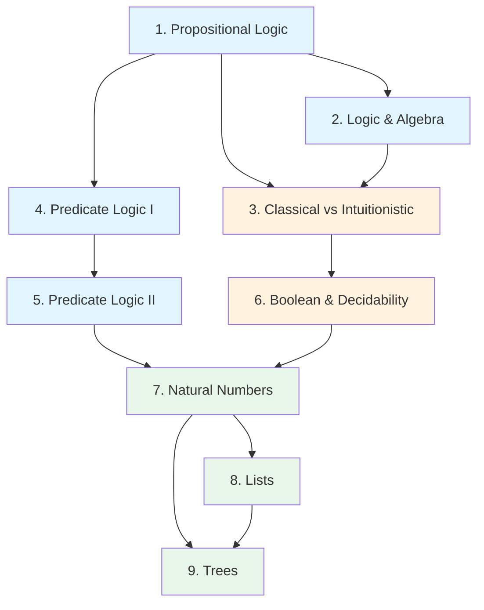

## Topic Dependency Graph



**Legend**: Blue = foundations, Orange = theory, Green = data types & proofs

## Recommended Study Phases

### Phase 1: Logical Foundations (Topics 1-3)

| Order | Topic | Focus | Time |
|-------|-------|-------|------|
| 1st | Propositional Logic | Connectives, truth tables, ND rules | 2-3 hrs |
| 2nd | Logic & Algebra | Laws, simplification, duality | 1-2 hrs |
| 3rd | Classical vs Intuitionistic | What is/isn't constructive, BHK | 2 hrs |

**Checkpoint**: Can you identify which equivalences need LEM?

### Phase 2: Predicate Logic (Topics 4-5)

| Order | Topic | Focus | Time |
|-------|-------|-------|------|
| 4th | Predicate Logic I | Quantifiers, translation, scope | 2 hrs |
| 5th | Predicate Logic II | Proofs with quantifiers, restrictions | 2 hrs |

**Checkpoint**: Can you correctly translate English sentences and prove quantifier statements?

### Phase 3: Type Theory & Proofs (Topics 6-9)

| Order | Topic | Focus | Time |
|-------|-------|-------|------|
| 6th | Boolean & Decidability | Bool vs Prop, Dec, reflection | 1-2 hrs |
| 7th | Natural Numbers | Induction, key arithmetic proofs | 3 hrs |
| 8th | Lists | List induction, append/map proofs | 2-3 hrs |
| 9th | Trees | Two-IH induction, mirror proofs | 2 hrs |

**Checkpoint**: Can you write and explain an inductive proof from scratch?

## Key Skills Per Phase

```mermaid
graph LR
    subgraph Phase 1
        A[Write truth tables]
        B[Apply ND rules]
        C[Spot classical axioms]
    end
    subgraph Phase 2
        D[Translate to/from logic]
        E[Negate quantified statements]
        F[Prove with ∀-I, ∃-E]
    end
    subgraph Phase 3
        G[Define recursive functions]
        H[Write inductive proofs]
        I[Use cong/trans/sym]
    end
    
    Phase 1 --> Phase 2 --> Phase 3
```

## Revision Priority (Exam Focus)

| Priority | Topic | Why |
|----------|-------|-----|
| High | Inductive proofs (ℕ, List, Tree) | Most likely proof questions |
| High | Classical vs Constructive distinctions | Conceptual questions |
| High | Natural deduction | Proof construction |
| Medium | Predicate logic translation | Translation exercises |
| Medium | Boolean algebra simplification | Algebraic manipulation |
| Medium | Agda syntax/types | Reading & writing Agda |
| Lower | Truth tables | Straightforward, less likely at exam level |

## Practice Strategy

1. **First pass**: Read notes, understand definitions
2. **Second pass**: Attempt all `<details>` practice problems without looking
3. **Third pass**: Write proofs from scratch on paper (exam conditions)
4. **Final pass**: Review exam traps, do timed practice
